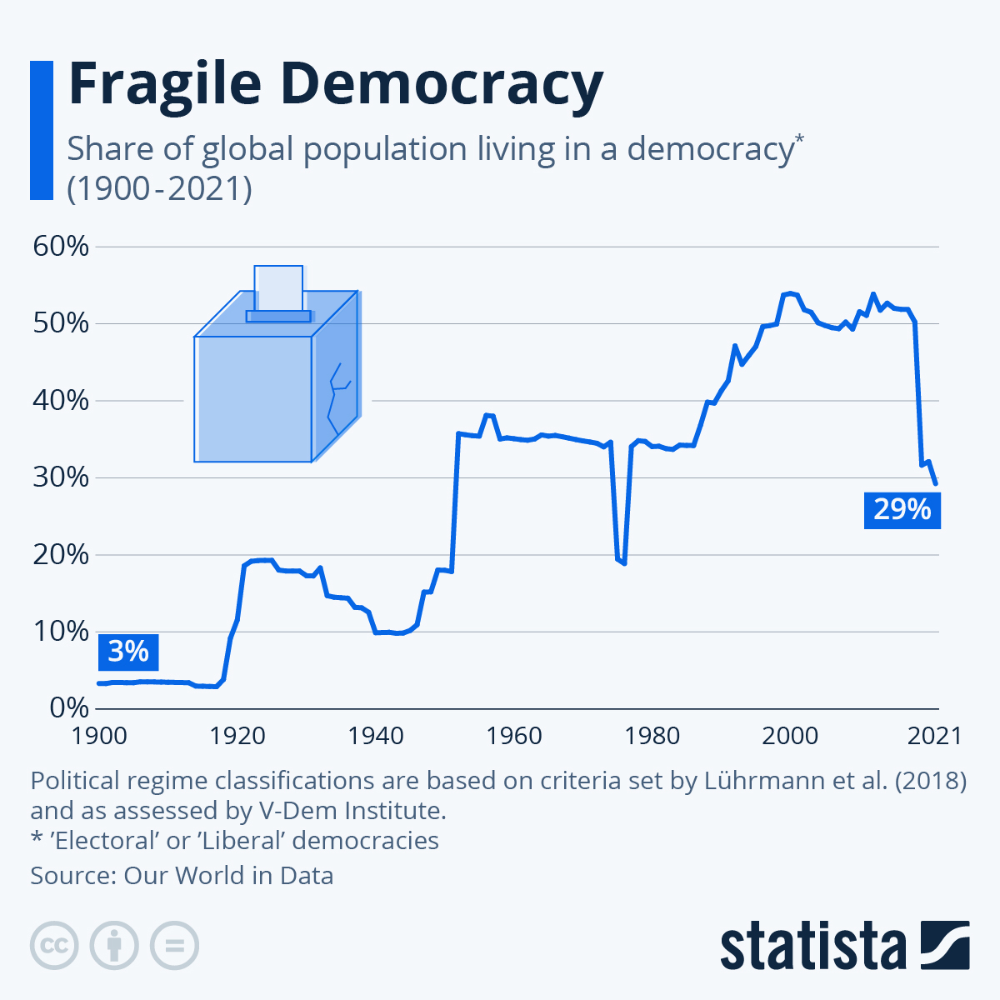

```{r setup, include=FALSE}
knitr::opts_chunk$set(echo = TRUE)
```

## Question II

World-wide, democracy has generally been on the ascend, but has experienced some periods of regression. In the plot below, we see the share of the world population that lives in a democracy. 



“Times, Places, and Manner”

Even though the U.S. Constitution doesn’t contain an explicit right to vote, almost all state constitutions do.

Write a song about voting rights.