```{r setup, include=FALSE}
knitr::opts_chunk$set(echo = FALSE)
## rmarkdown::render('/Users/cervas/Library/CloudStorage/GoogleDrive-jcervas@uci.edu/My Drive/GitHub/teaching/classes/2023 - Spring/class-cmu-84-352/lecture-slides/Streb/Streb-Rethinking Democracy.rmd', output_format = 'all')
```

## Starting with an in-class exercise

## 

Think about the term "represent". What does it mean to you? In which situations in life do we find ourselves represented?


## Question I

Thinking broadly (i.e., not just in terms of politics), who best represents you (including people or groups)?

1. 	

2. 	

3. 	

## Question II

Thinking in this same way, who do you represent?

1. 	

2. 	

3. 	

## Question III

Name three general categories where you need representation.

1. 	

2. 	

3. 	

## 

What qualities compelled you to include them. Is there anything special about their (your) identity? In what ways does having representation make life better?


## Some dictionary definitions of the term include:

- to substitute in some capacity for : act the part of, in place of, or for (as another person) usually by legal right: as
- to serve especially in a legislative body by delegated authority usually resulting from an election
- to provide legal representation to as a lawyer
- to act as the representative of in a class action
- to describe as having a specified character or quality


## Rethinking American Electoral Democracy

## Chapter 1 - Creating a Model Electoral Democracy

## Positive view of democracy
-American widely view democracy as a good thing


## Declining trust and confidence

- But American's trust and confidence in the wisdom of other Americans to make political decisions is in decline


## Democracy in trouble?

- A majority (52%) of young Americans believe that our democracy is either “in trouble,” or “failing”[^1]
- On American Exceptionalism, less than one-third believe that "America is the greatest country in the world"
- Young Americans place the chances that they will see a second civil war in their lifetime at 35%; chances that at least one state secedes at 25%
 + Nearly half (46%) of young Republicans place the chances of a second civil war at 50% or higher, compared to 32% of Democrats

[^1]: The Harvard Youth Poll, 2,109 18 to 29-year-old U.S. residents conducted between Oct. 26 and Nov. 8, 2021. https://iop.harvard.edu/youth-poll/fall-2021-harvard-youth-poll

## Global Share of the Population living in a democracy


## Public is split on how well democracy is working


## 


##


## 


## Basic Facts


## Countries with more democratic systems, greater wealth show more widespread commitment to representative democracy


## Assuming Democracy is good...

**Assuming democracy is good**:

- How much and what kind of democracy should we have?

 + Should we have direct democracy where everyone votes on the internet?
 
 + Should this happen for all levels of government, from city issues to federal issues?
 
 + What offices should be elected, and which appointed?
 
 + Who should appoint, and who should confirm? Can the public recall?
 
## Criteria for a Model Electoral Democracy
- "In every democratic country a substantial gap exists between actual and ideal democracy. That gap offers us a challenge: can we find ways to make ‘democratic’ countries more democratic?"[^2] 

[^2]: Dahl, R.A., Dahl, and Yale University Press. 1998. On Democracy. Yale University Press.

- One Person, One Vote
- Competitive Elections
- Transparency
- Rules that are not burdensome

## Chapter 2 - Factors that Influence Voter Turnout

**Chapter 2 - Factors that Influence Voter Turnout**


```{r, fig.width=3, fig.height=7, eval=FALSE}
## Voter Registration
reg <- read.csv("https://raw.githubusercontent.com/jcervas/Data/master/Elections/vote-reg-deadlines.csv")
reg <- reg[! reg$deadline %in% c("-",NA),]
reg <- reg[! reg$deadline %in% c("VI", "PR"),]
reg <- reg[order(reg$deadline),]
reg_days <- table(reg$deadline)

barplot(as.numeric(reg$deadline), 
	 main="Voter Registration Deadlines", 
	 xlab="Number of Days Prior to Election",
	 horiz=TRUE,
	 names.arg=reg$abv,
	 las=1,
	 cex.names = 0.5)
```

## Cost of Voting

Cost of Voting

## 

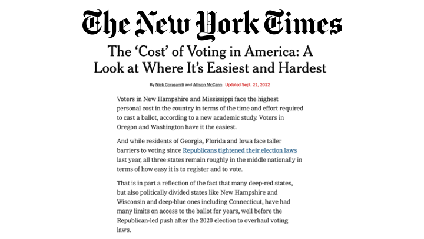

##

Cost of Voting (https://www.nytimes.com/interactive/2022/09/20/us/politics/cost-of-voting.html)

## 

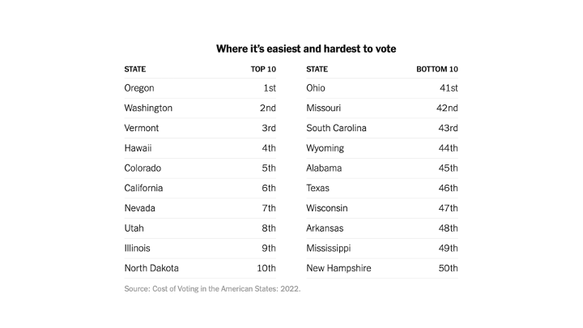

## 


## 

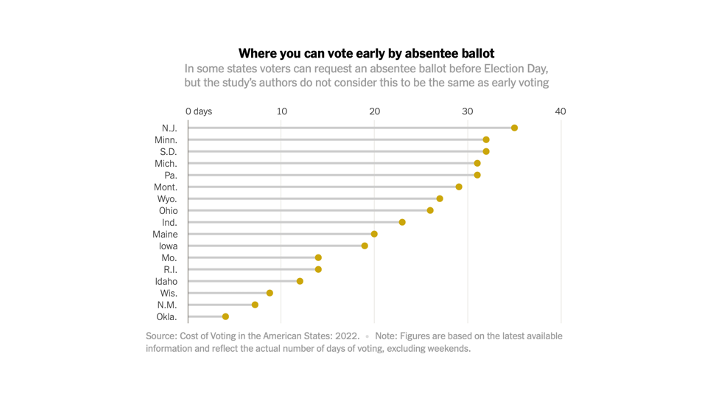

## 

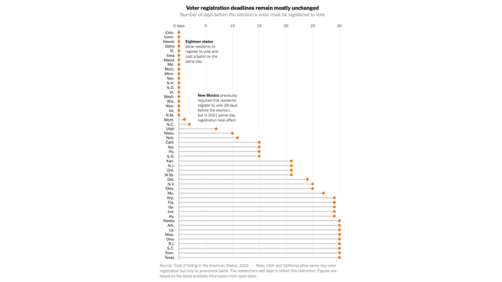

##

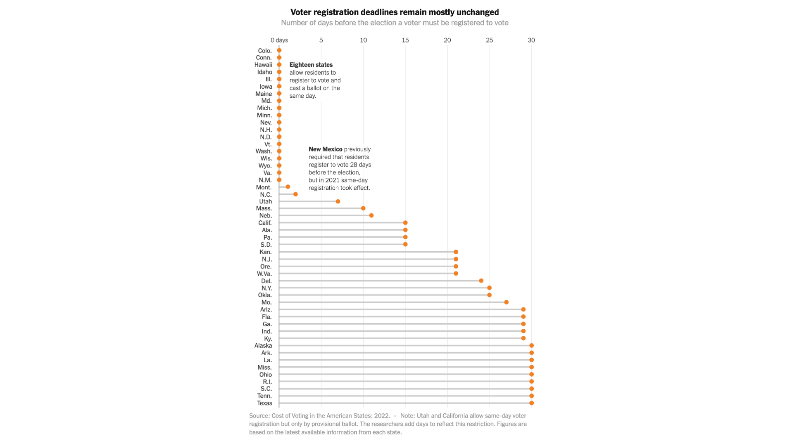

## Factors that Influence Voter Turnout

>- “Didn’t We Just Vote?”
>- Voter Registration and Election-Day Registration
>- No-Excuse Absentee Voting and Early In-Person Voting
>- Photo Identification
>- Times and Dates of Elections
>- Felon Voting
>- Compulsory Voting

## Chapter 3 - The Offices We Elect

**Chapter 3 - The Offices We Elect**

## 

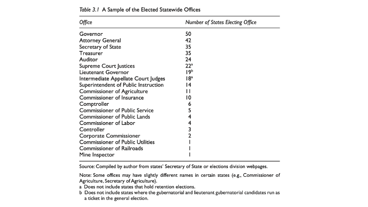

## Judicial Elections

>- Why Do We Have Judicial Elections?
>- Justice for Sale?
>- The Problem with Judicial Accountability
>- Potential compromise solutions
>	+ "Drafting" judges
>	+ Missouri Plan
>	+ Term-limits

##

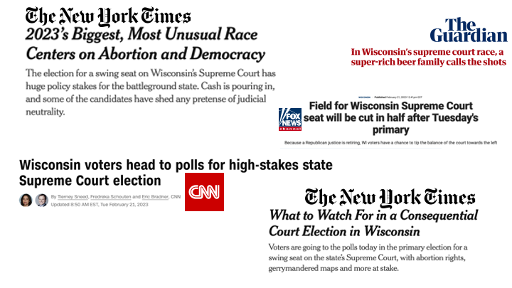

## Discusion Questions

> 1. In what ways do judges represent the public, and how does this differ from governor and legislators?

> 2. Can judges remain impartial if they are relying on campaign funds for re-election?

> 3. Should we elect judges, and if so, which judges?

> 4. Should we elect _Supreme Court_ justices?

##

What alternative to electing judges make the most sense?

 1. Merit with retention election?
 2. Lottery?
 3. Elected by judges and lawyers?
 
## Bonus Question

Should we elect judges for state Supreme Court statewide or in regional districts?


## Chapter 4 - Direct Democracy

**Chapter 4 - Direct Democracy**

##
>- **Initiatives and Referenda**
>- **Initiatives** are placed on the ballot by obtaining signatures and then voted on directly by the people, bypassing the legislature altogether
>- **Referenda** are passed by the legislature and then presented to the people for a “yes” or “no” vote
>- The initiative emerged around the turn of the twentieth century
>- During the early 1900s, large amounts of money entered the political process and the common belief was that politicians were beholden to special interests
>- While this view is still popular among some people today, concern about corruption was even worse then because campaign contributions were unregulated
>- The initiative was first passed in South Dakota in 1898
>- Mississippi was the last state to adopt initiative in 1992

##

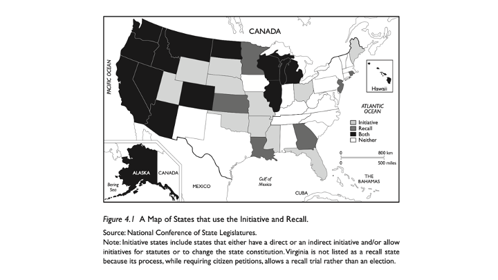

## Support for Initiative
- Residents of all 50 states support the initiative process by a two-to-one margin
- A poll of Californians found that 59 percent thought that public policy decisions made through the initiative process are “probably better” than decisions made by the governor or state legislature
- 55 percent were either “very satisfied” or “somewhat satisfied” with the way the initiative process was working

##

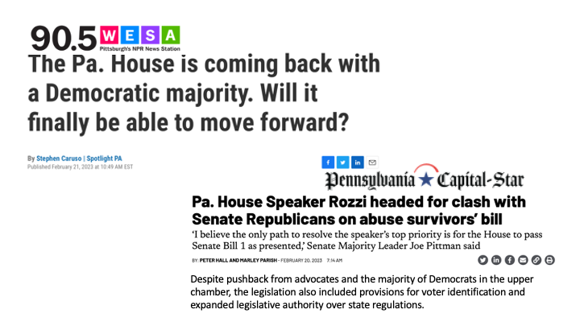


## The Role of Big Money
>- Empirical evidence indicates that money is not a significant predictor of whether an initiative passes
>	+ money spent by opponents of initiatives is likely to keep an initiative from passing while money spent in support has a limited effect
>	+ the side that spends the most only a 25 percent success rate in promoting ballot issues, but a 75 percent rate in stopping ballot initiatives
>- However, without money there is no chance of getting an initiative placed on the ballot
>	+ It generally costs about $1 million, sometimes more, to get a measure put before voters

## Voters are Ignorant
>- Interest in initiative campaigns is generally much lower than for candidate races at the top of the ballot
>- "Direct legislation is a political process best understood and utilized by those voters who are better educated or better-off financially.” - Danial Maglby
>- Voting for ballot measures is complex

## Violating the Rights of the Minority?

>- The initiative inherently means that a majority will win at the expense of a minority

## Why the Initiative can be problematic
>- While large interest groups have a limited ability to pass legislation that the public does not agree with, they _do_ have the ability to keep initiatives that the public supports from passing
>	+ the immense costs of simply getting an initiative on the ballot, much less passed, it is difficult for many grassroots organizations to have a voice come voting time
>- It is not apparent that the public cares about the issues on which they are voting
>	+ Very few voters can spontaneously name any particular issues on which they would like to see the public vote
>	+ Those issues that do appear on the ballot are typically not the same issues that voters list as the most important problems facing their state or the nation

## Why the Public Supports the Initiative
>- The initiative process allows the public to act when legislators evade tough issues
>- Direct democracy forces legislators to act on issues that are salient to the public and because, if legislatures do not do so, people can bring the issue to a vote
>- The process potentially raises people’s political efficacy, make citizens more knowledgeable about politics, and increase voter turnout

## The Problems with the Initiative

>- The initiative process is not conducive to good lawmaking
>	+ there is no opportunity for compromise or deliberation
>	+ citizens have no choice but to vote an initiative up or down
>- Direct democracy poses a threat because it undermines the courts
>	+ State judiciaries often are forced to invalidate initiatives because the measures are unconstitutional
>	+ their ruling goes against the wishes of the majority of the state’s voters—and exacerbates many of the problems discussed in the previous chapter regarding judicial independence
>	+ Judges who are forced to make unpopular rulings to uphold the rights of minorities may be targeted when they come up for reelection or retention


## Paradox

Tax cuts are very popular with the public

Social spending is very popular with the public

## Recall Elections

>- Recall Election: An election to remove an elected official from office during the middle 
of her term
>- The main argument in favor of the recall is simple: it provides a continuous 
opportunity for voters to hold elected officials accountable
>	+ incompetent, corrupt, or unresponsive politicians can be removed from office 
without the public having to wait for them to come up for reelection
>- Opponents argue the recall could keep politicians from making tough choices for fear of being removed from office early
>	+ The recall also undermines the notion of trustee representation, the view that elected officials who may have access to information that the general public does not should exercise their own judgment on issues that come before them
>	+ they promote divisiveness and conflict

## Recall Election History

>- The recall device began in the United States in Los Angeles in 1903
>- in 1908, Michigan and Oregon were the first states to adopt recall procedures for state officials
>- Minnesota (1996) and New Jersey (1993) were the most recent
>- Historically, recall attempts at the state level have been largely unsuccessful. 
>	+ The recall is used much more often, and with more success, at the local level.

## Governor Recalls
- There have been many attempts to recall governors throughout U.S. history, but only four have gathered enough petition signatures to trigger recall elections
	+ In 2021, California Governor Gavin Newsom survived a recall election. 
	+ In 2012, Wisconsin Governor Scott Walker survived a recall election. 
	+ In 2003, California voters successfully recalled Governor Gray Davis, 
	+ In North Dakota in 1921, voters successfully recalled not only Governor Lynn J. Frazier, but also the attorney general and the commissioner of agriculture. 
	+ In 1988, Arizona voters submitted enough signatures to trigger a recall election for Governor Evan Mecham, but he was impeached by the state's House of Representatives before the scheduled recall election.

## Specific Grounds for Recall

Specific grounds for recall are required in only eight states:

Alaska:  Lack of fitness, incompetence, neglect of duties or corruption (AS §15.45.510)

##
Georgia:  Act of malfeasance or misconduct while in office; violation of oath of office; failure to perform duties prescribed by law; willfully misused, converted, or misappropriated, without authority, public property or public funds entrusted to or associated with the elective office to which the official has been elected or appointed. Discretionary performance of a lawful act or a prescribed duty shall not constitute a ground for recall of an elected public official. (Ga. Code §21-4-3(7) and 21-4-4(c))

## 
Kansas: Conviction for a felony, misconduct in office, incompetence, or failure to perform duties prescribed by law. No recall submitted to the voters shall be held void because of the insufficiency of the grounds, application, or petition by which the submission was procured. (KS Stat. §25-4301)

##
Minnesota:  Serious malfeasance or nonfeasance during the term of office in the performance of the duties of the office or conviction during the term of office of a serious crime (Const. Art. VIII §6)

##
Montana:  Physical or mental lack of fitness, incompetence, violation of oath of office, official misconduct, conviction of certain felony offenses (enumerated in Title 45). No person may be recalled for performing a mandatory duty of the office he holds or for not performing any act that, if performed, would subject him to prosecution for official misconduct. (Mont. Code §2-16-603)

##
Rhode Island:  Authorized in the case of a general officer who has been indicted or informed against for a felony, convicted of a misdemeanor, or against whom a finding of probable cause of violation of the code of ethics has been made by the ethics commission (Const. Art. IV §1)

##
Virginia:  Neglect of duty, misuse of office, or incompetence in the performance of duties when that neglect of duty, misuse of office, or incompetence in the performance of duties has a material adverse effect upon the conduct of the office, or upon conviction of a drug-related misdemeanor or a misdemeanor involving a "hate crime" (§24.2-233)

##
Washington:  Commission of some act or acts of malfeasance or misfeasance while in office, or who has violation of oath of office (Const. Art. I §33)

Source: National Conference of State Legislatures, May 2019

## The Recall Election

In seven states, the election for a successor is held simultaneously with the recall election.

In California and Colorado, the ballot includes two questions. The first question is whether the official should be recalled. Voters are then asked to vote for a candidate for the office. The official who is the subject of the recall may not be among the listed candidates. If a majority votes "yes" on the recall question, then the incumbent is recalled and the successor is elected via the second part of the ballot. If a majority votes "no" on the recall question, the incumbent remains in office and the second portion of the ballot is moot.

In the other states using the simultaneous model (Arizona, Michigan, Nevada, North Dakota and Wisconsin), the submission and certification of the recall petition essentially triggers a special election for the office, and the recall ballot consists of a list of candidates for the office. The name of the official who is the subject of the recall may appear on the ballot along with other nominees. In fact, in Arizona, Michigan, North Dakota and Wisconsin, the name of the official being recalled is automatically placed on the recall ballot for reelection unless the official resigns from office.

In the remaining 12 states, the recall ballot contains only the question of whether the official should be recalled. If the majority votes for recall, the office is declared vacant and is filled at a special election or as otherwise provided by law, which in some states is by appointment for the remainder of the term. The chart below details how the recall election is conducted in each state.

## Discussion Questions

> 1. How do direct democracy and indirect democracy differ? What are the benefits or downfalls to either?

> 2. What is the difference between a referendum and an initiative?

> 3. What kinds of initiative questions should be left to the public to decide?

> 4. What threshold should be used to determine if a question gets on the ballot?

> 5. Does direct democracy stymie negotiation and compromise that debate in legislatures foster, leading to worse public policy?

> 6. Should we allow unlimited spending on advocacy for initiative questions?

## Broader Questions about Democracy

> 1. How much knowledge about a subject or about candidates/issues should voters know in order to effectively participate?
> 2. Should we restrict voting to only informed citizens?
> 3. How much democracy does an ideal society have?

## Rethinking the Mechanics of Voting

Streb, Part II: **Rethinking the Mechanics of Voting**

## Chapter 5 – Ballot laws

>- **Once in the voting booth, new questions arise**
>	+ Who should be on the ballot?
>	+ What should their order be?
>	+ Party affiliation or other information?

## Getting on the Ballot

>- If you want to run for office, you must qualify
>- Even for federal elections, each state have their own requirements for a party or individual to be placed on the ballot

## 

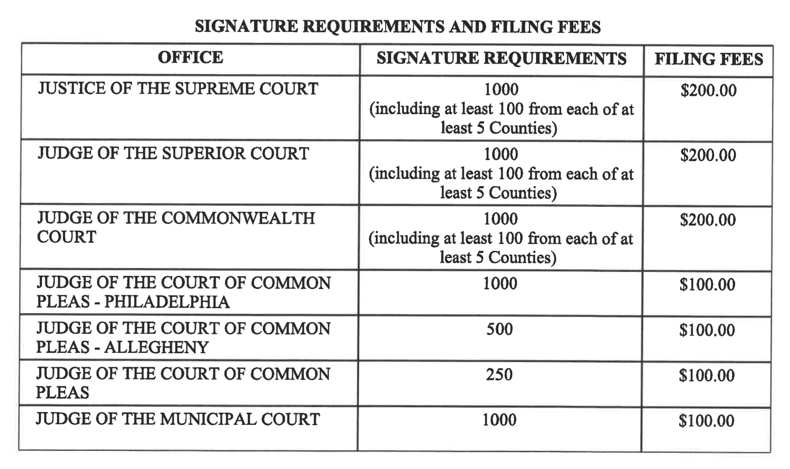

## Who does these restrictive ballot-access rules hurt?

>- Who does these restrictive ballot-access rules hurt?
>	+ Third parties
>	+ Candidates with less resources
>	+ Non-incumbents

## Why might they be good?

>- Why might they be good?
>	+ Limit the number of candidates
>	+ Make it easier for voters
>	+ Reduce spoilers

## What about number of candidates

- California recall in early 2000s:
	+ 134 candidates on ballot
	+ Candidates needed 65 signatures and a $3,500 filing fee or 10,000 signatures and no filing fee

##

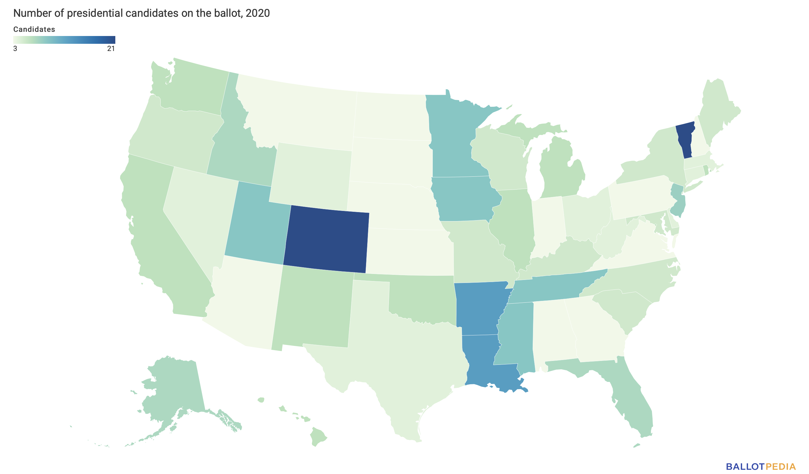

## Candidate Information on the Ballot

>- Americans vote for a large number of offices
>	+ Most of these elections receive virtually no media coverage, making information about the contests difficult to come by
>	+ in low-information elections voters often rely on a candidate’s race or gender when determining their vote
>	+ simply recognizing a candidate’s name is enough to convince a person to vote for that candidate

##
>- Perhaps the most useful cue to voters is partisan affiliation
>	+ Always on the ballot for federal elections
>	+ Majority of local, and many statewide and judicial elections are non-partisan
>- Nonpartisan elections originated with the progressive movement around the turn of the twentieth century
>	+ Progressives believed that if party politics were removed from the local level, then it would limit the power of the party machines and make government more responsive to the people
>	+ Might keep the divisive influence of national parties out of local government
>	+ progressives felt that people should choose the best leaders and managers to make government run effectively, not the person who was most political

## 
>- Removing party affiliation from the ballot would force people to seek out information that was more relevant to the election than party affiliation
>	+ The problem is that there is no empirical evidence that people actually do so
>- In fact, most of the research on nonpartisan elections indicates that people either skip the election altogether, rely on less reliable cues than partisanship, or simply guess when deciding for whom to vote.

##
>- Nonpartisan elections have the potential to undermine representation
>	+ they advantage the minority party in an area, because they hide a reliable cue from voters
>- The notion that partisanship does not matter at the local level is shortsighted
>	+ There may not be a Democratic or Republican way to fill a pothole, but there are certainly differences of opinion between the two parties on how many and whose potholes are going to be filled

##
>- Other types of information that might appear on the ballot:
>	+ Incumbent or not
>	+ Occupation
>	+ Hometown
>- Research indicates that voters do indeed use cues, such as the candidates’ occupations or hometowns, or whether they are the incumbent.

## Order of Candidate Names
>- Research finds that candidates who are listed on the ballot first do better than those who are not
>	+ Anywhere from 2.5% to 25%
>- “Primacy effect”
>	+ the primacy effect may have allowed Bush to win the 2000 presidential election since he was listed first on the ballot in the state of Florida where he beat Vice President Al Gore by only 537 votes

## 
>- The solution to this problem is simple: mandatory rotation of names 
>	+ With the mandatory rotation of names the candidate listed first would vary by precinct or, potentially, county or assembly district
>	+ major arguments against mandatory rotation of candidate names include voter confusion, cost, and difficulty counting ballots

## Ballot Design
- Because of federalism, there are numerous formats of ballots

_"The probable errors caused by the infamous ‘butterfly ballot were enough to swing the outcome in the county, state, and Electoral College from one candidate to another."_ Political scientists Richard Niemi and Paul Herrnson

##
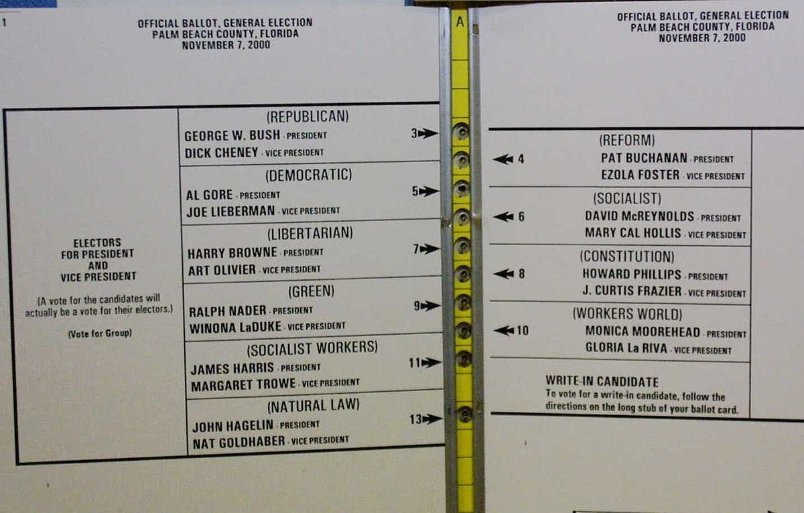

## Butterfly Ballot
>- Analysis suggests that between 2,000 and 3,000 people in Palm Beach County voted for Buchanan by mistake, along with uncommonly large numbers, thousands, of other problems[^3]: 
>	+ overvotes (people voting for more than one candidate for the same office, such as both Buchanan and Gore)
>	+ undervotes (people who voted for other offices but not for president)
>	+ problems with chads

[^3]: https://ischool.uw.edu/podcasts/dtctw/palm-beach-county-butterfly-ballot

##
>- Clutter is another reason why it makes sense only to include a candidate’s party affiliation on the ballot
>- The straight-ticket option makes voting easier and reduces voter rolloff
>	+ But what about non-partisan offices?

## Chapter 6 – Voting Machines
**Chapter 6 – Voting Machines**

## Voting Machines
_"The methods used to cast and count ballots are surely one of the most mundane aspects of elections"_ - Stephen Ansolabehere and Charles Stewart III

- All voting machines are not equal

## Types of Voting Equipment

>- Types of Voting Equipment
>	+ Hand-counted paper ballot
>	+ Mechanical lever machine
>	+ Punch cards
>	+ Optical scan
>	+ Electronic voting machine
>	+ Mixed voting systems

## Residual Voting Rate

>- **Residual Voting Rate**: The percentage of all ballots cast in a geographical unit that did not record a vote for a certain elected office or initiative
>	+ Overvotes always indicate an error (vote for two or more candidates)
>	+ Undervotes are more complicated since sometimes people choose not to vote for an office

## Hanging Chads

>- The word itself, of uncertain origin, traces back to the late 1950s and refers to the little bits that get punched out of early computer storage technologies like cards and paper tape. Basically confetti.[^4]
>- A good solid punch hole is made, chad falls away, everybody’s happy
>- But a half-hearted, uncertain, hurried, indifferent punch, and you can get one of (not kidding here) 6 different kinds of problematic chad: dangling, dimpled, hanging, pierced, pregnant and swinging.

[^4]: https://ischool.uw.edu/podcasts/dtctw/palm-beach-county-butterfly-ballot

##

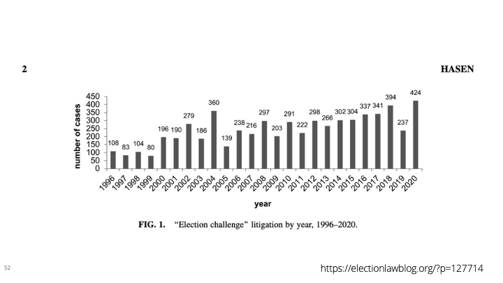


