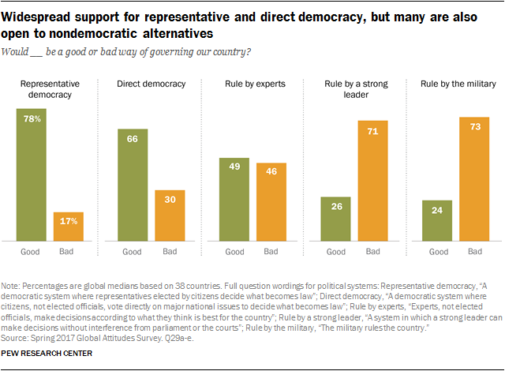
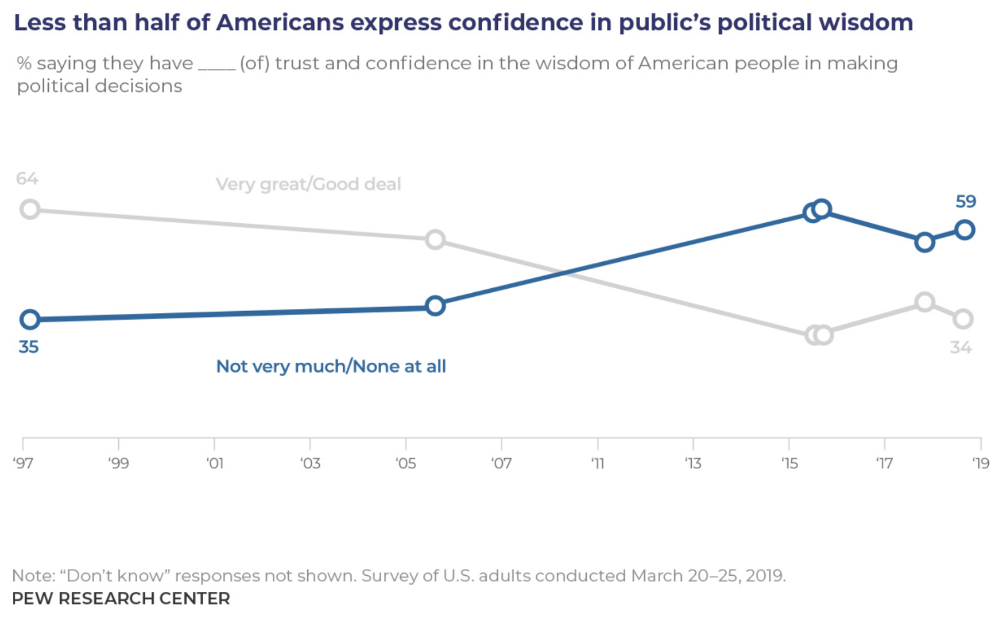
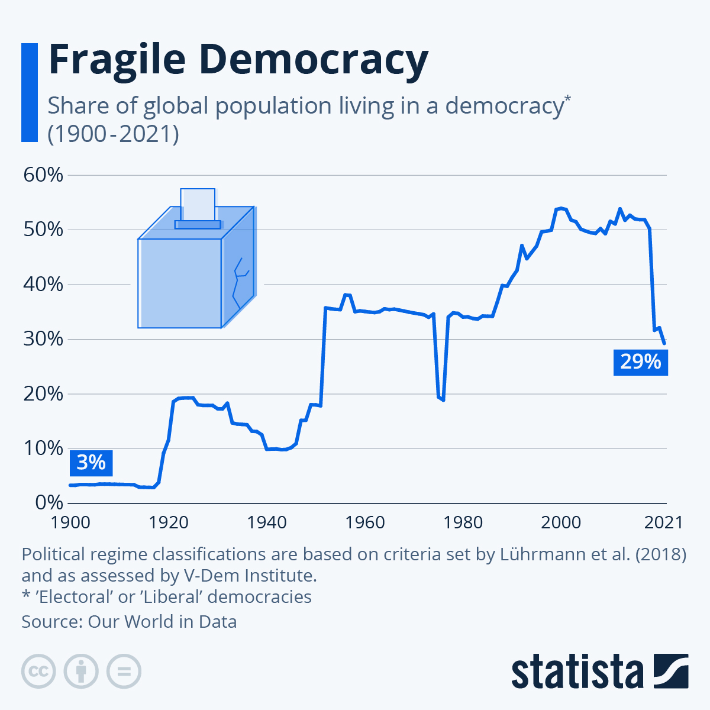
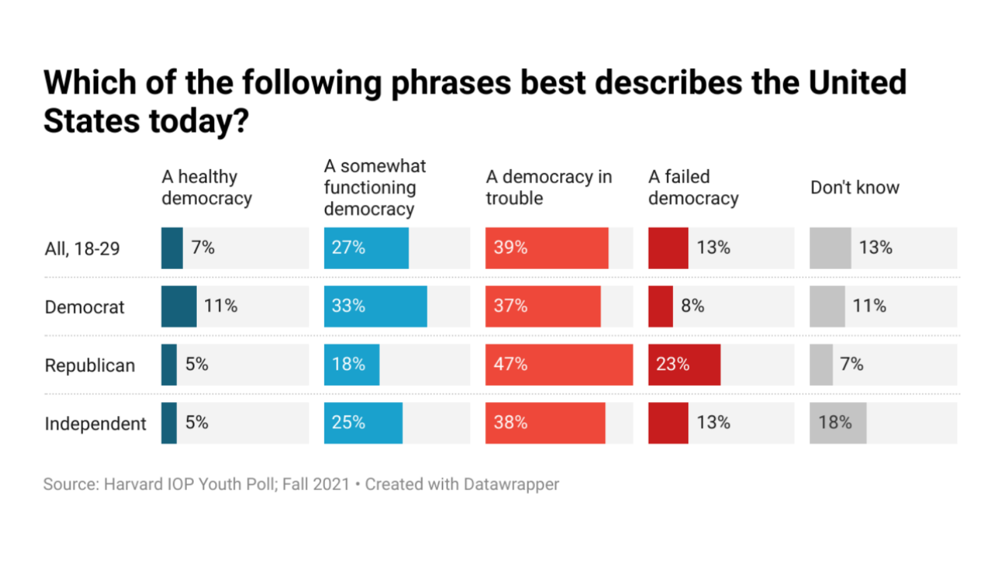
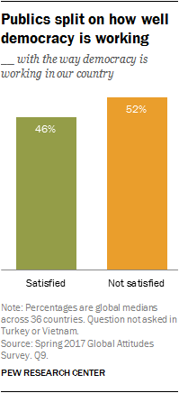
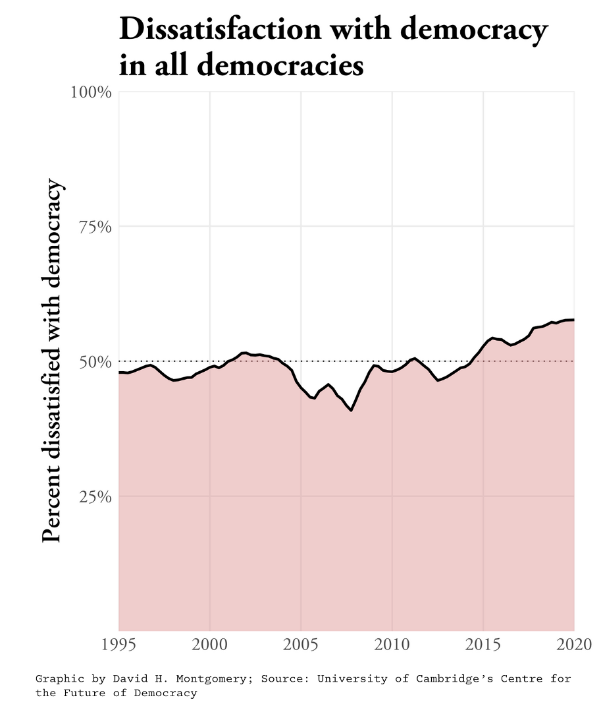
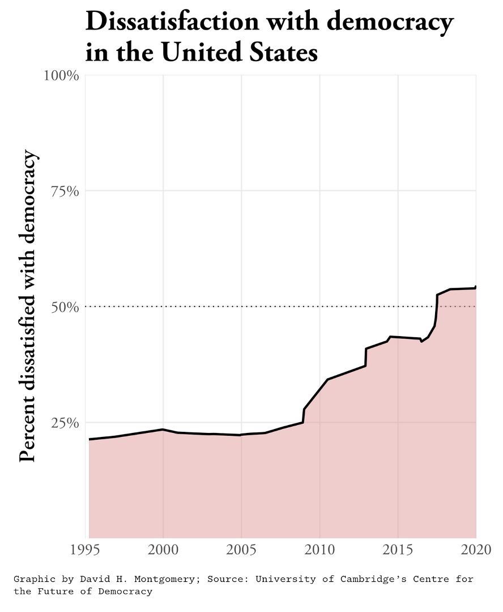
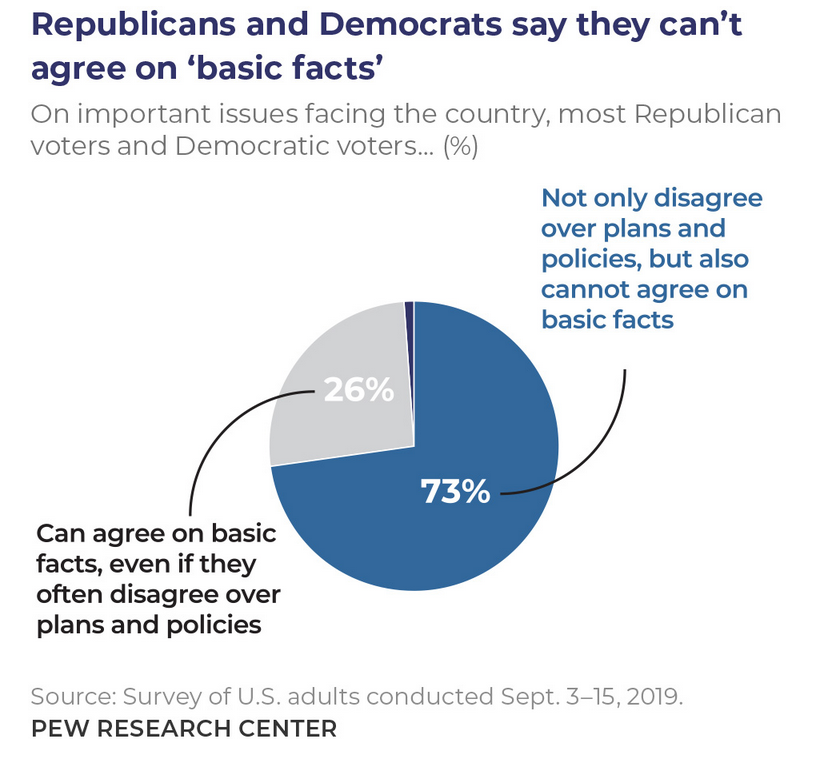
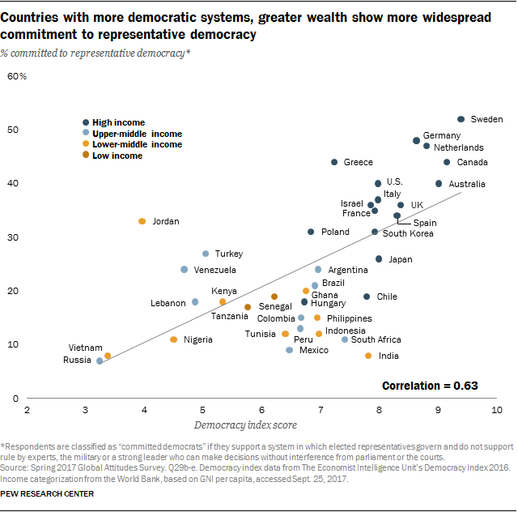

```{r setup, include=FALSE}
knitr::opts_chunk$set(echo = FALSE)
## rmarkdown::render('/Users/cervas/My Drive/GitHub/teaching/classes/2023 - Spring/class-cmu-84-352/lecture-slides/Streb/Streb-Rethinking Democracy.rmd', output_format = 'all')
```

## Starting with an in-class exercise

## 

Think about the term "represent". What does it mean to you? In which situations in life do we find ourselves represented?


## Question I

Thinking broadly (i.e., not just in terms of politics), who best represents you (including people or groups)?

1. 	

2. 	

3. 	

## Question II

Thinking in this same way, who do you represent?

1. 	

2. 	

3. 	

## Question III

Name three general categories where you need representation.

1. 	

2. 	

3. 	

## 

What qualities compelled you to include them. Is there anything special about their (your) identity? In what ways does having representation make life better?


## Some dictionary definitions of the term include:

- to substitute in some capacity for : act the part of, in place of, or for (as another person) usually by legal right: as
- to serve especially in a legislative body by delegated authority usually resulting from an election
- to provide legal representation to as a lawyer
- to act as the representative of in a class action
- to describe as having a specified character or quality


## Rethinking American Electoral Democracy

## Chapter 1 - Creating a Model Electoral Democracy

## Positive view of democracy
-American widely view democracy as a good thing



## Declining trust and confidence

- But American's trust and confidence in the wisdom of other Americans to make political decisions is in decline



## Democracy in trouble?

- A majority (52%) of young Americans believe that our democracy is either “in trouble,” or “failing”[^1]
- On American Exceptionalism, less than one-third believe that "America is the greatest country in the world"
- Young Americans place the chances that they will see a second civil war in their lifetime at 35%; chances that at least one state secedes at 25%
  + Nearly half (46%) of young Republicans place the chances of a second civil war at 50% or higher, compared to 32% of Democrats

[^1]: The Harvard Youth Poll, 2,109 18 to 29-year-old U.S. residents conducted between Oct. 26 and Nov. 8, 2021. https://iop.harvard.edu/youth-poll/fall-2021-harvard-youth-poll

## Global Share of the Population living in a democracy



## Public is split on how well democracy is working


## 



##



## 



## Basic Facts



## Countries with more democratic systems, greater wealth show more widespread commitment to representative democracy



## Assuming Democracy is good...

**Assuming democracy is good**:

- How much and what kind of democracy should we have?

  + Should we have direct democracy where everyone votes on the internet?
  
  + Should this happen for all levels of government, from city issues to federal issues?
  
  + What offices should be elected, and which appointed?
  
  + Who should appoint, and who should confirm? Can the public recall?
  
## Criteria for a Model Electoral Democracy
- "In every democratic country a substantial gap exists between actual and ideal democracy. That gap offers us a challenge: can we find ways to make ‘democratic’ countries more democratic?"[^2] 

[^2]: Dahl, R.A., Dahl, and Yale University Press. 1998. On Democracy. Yale University Press.

- One Person, One Vote
- Competitive Elections
- Transparency
- Rules that are not burdensome

## Chapter 2 - Factors that Influence Voter Turnout

**Chapter 2 - Factors that Influence Voter Turnout**

## Voter Registration

```{r, fig.width=3, fig.height=7}
reg <- read.csv("https://raw.githubusercontent.com/jcervas/Data/master/Elections/vote-reg-deadlines.csv")
reg <- reg[! reg$deadline %in% c("-",NA),]
reg <- reg[! reg$deadline %in% c("VI", "PR"),]
reg <- reg[order(reg$deadline),]
reg_days <- table(reg$deadline)

barplot(as.numeric(reg$deadline), 
        main="Voter Registration Deadlines", 
        xlab="Number of Days Prior to Election",
        horiz=TRUE,
        names.arg=reg$abv,
        las=1,
        cex.names = 0.5)
```
  