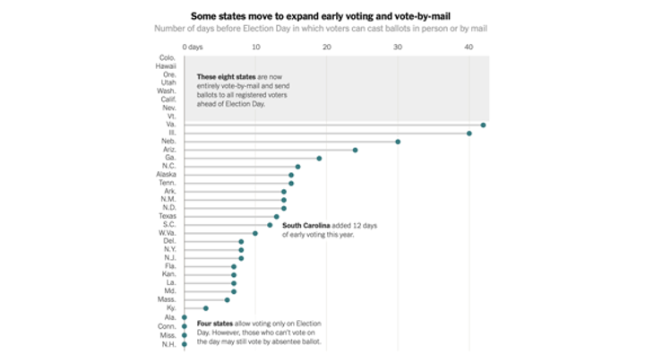

```{r setup, include=FALSE}
knitr::opts_chunk$set(echo = FALSE)
## rmarkdown::render('/Users/cervas/Library/CloudStorage/GoogleDrive-jcervas@uci.edu/My Drive/GitHub/teaching/classes/2023 - Spring/class-cmu-84-352/lecture-slides/Streb/Streb-Rethinking Democracy.rmd', output_format = 'all')
```

## Starting with an in-class exercise

## 

Think about the term "represent". What does it mean to you? In which situations in life do we find ourselves represented?


## Question I

Thinking broadly (i.e., not just in terms of politics), who best represents you (including people or groups)?

1. 	

2. 	

3. 	

## Question II

Thinking in this same way, who do you represent?

1. 	

2. 	

3. 	

## Question III

Name three general categories where you need representation.

1. 	

2. 	

3. 	

## 

What qualities compelled you to include them. Is there anything special about their (your) identity? In what ways does having representation make life better?


## Some dictionary definitions of the term include:

- to substitute in some capacity for : act the part of, in place of, or for (as another person) usually by legal right: as
- to serve especially in a legislative body by delegated authority usually resulting from an election
- to provide legal representation to as a lawyer
- to act as the representative of in a class action
- to describe as having a specified character or quality


## Rethinking American Electoral Democracy

## Chapter 1 - Creating a Model Electoral Democracy

## Positive view of democracy
-American widely view democracy as a good thing


## Declining trust and confidence

- But American's trust and confidence in the wisdom of other Americans to make political decisions is in decline


## Democracy in trouble?

- A majority (52%) of young Americans believe that our democracy is either “in trouble,” or “failing”[^1]
- On American Exceptionalism, less than one-third believe that "America is the greatest country in the world"
- Young Americans place the chances that they will see a second civil war in their lifetime at 35%; chances that at least one state secedes at 25%
 + Nearly half (46%) of young Republicans place the chances of a second civil war at 50% or higher, compared to 32% of Democrats

[^1]: The Harvard Youth Poll, 2,109 18 to 29-year-old U.S. residents conducted between Oct. 26 and Nov. 8, 2021. https://iop.harvard.edu/youth-poll/fall-2021-harvard-youth-poll

## Global Share of the Population living in a democracy


## Public is split on how well democracy is working


## 


##


## 


## Basic Facts


## Countries with more democratic systems, greater wealth show more widespread commitment to representative democracy


## Assuming Democracy is good...

**Assuming democracy is good**:

- How much and what kind of democracy should we have?

 + Should we have direct democracy where everyone votes on the internet?
 
 + Should this happen for all levels of government, from city issues to federal issues?
 
 + What offices should be elected, and which appointed?
 
 + Who should appoint, and who should confirm? Can the public recall?
 
## Criteria for a Model Electoral Democracy
- "In every democratic country a substantial gap exists between actual and ideal democracy. That gap offers us a challenge: can we find ways to make ‘democratic’ countries more democratic?"[^2] 

[^2]: Dahl, R.A., Dahl, and Yale University Press. 1998. On Democracy. Yale University Press.

- One Person, One Vote
- Competitive Elections
- Transparency
- Rules that are not burdensome

## Chapter 2 - Factors that Influence Voter Turnout

**Chapter 2 - Factors that Influence Voter Turnout**


```{r, fig.width=3, fig.height=7, eval=FALSE}
## Voter Registration
reg <- read.csv("https://raw.githubusercontent.com/jcervas/Data/master/Elections/vote-reg-deadlines.csv")
reg <- reg[! reg$deadline %in% c("-",NA),]
reg <- reg[! reg$deadline %in% c("VI", "PR"),]
reg <- reg[order(reg$deadline),]
reg_days <- table(reg$deadline)

barplot(as.numeric(reg$deadline), 
	 main="Voter Registration Deadlines", 
	 xlab="Number of Days Prior to Election",
	 horiz=TRUE,
	 names.arg=reg$abv,
	 las=1,
	 cex.names = 0.5)
```

## Cost of Voting

Cost of Voting

## 


##

Cost of Voting (https://www.nytimes.com/interactive/2022/09/20/us/politics/cost-of-voting.html)

## 


## 



## 


## 


##


## Factors that Influence Voter Turnout

>- “Didn’t We Just Vote?”
>- Voter Registration and Election-Day Registration
>- No-Excuse Absentee Voting and Early In-Person Voting
>- Photo Identification
>- Times and Dates of Elections
>- Felon Voting
>- Compulsory Voting

## Chapter 3 - The Offices We Elect

**Chapter 3 - The Offices We Elect**

## 


## Judicial Elections

>- Why Do We Have Judicial Elections?
>- Justice for Sale?
>- The Problem with Judicial Accountability
>- Potential compromise solutions
>	+ "Drafting" judges
>	+ Missouri Plan
>	+ Term-limits

##


## Discusion Questions

> 1. In what ways do judges represent the public, and how does this differ from governor and legislators?

> 2. Can judges remain impartial if they are relying on campaign funds for re-election?

> 3. Should we elect judges, and if so, which judges?

> 4. Should we elect _Supreme Court_ justices?

##

What alternative to electing judges make the most sense?

 1. Merit with retention election?
 2. Lottery?
 3. Elected by judges and lawyers?
 
## Bonus Question

Should we elect judges for state Supreme Court statewide or in regional districts?


## Chapter 4 - Direct Democracy

**Chapter 4 - Direct Democracy**

##

What is the Initiative and How Does it Work?

>- Initiatives are placed on the ballot by obtaining signatures and then voted on directly by the people, bypassing the legislature altogether, referenda are passed by the legislature and then presented to the people for a “yes” or “no” vote

>- The initiative emerged around the turn of the twentieth century

>- During the early 1900s, large amounts of money entered the political process and the common belief was that politicians were beholden to special interests

>- While this view is still popular among some people today, concern about corruption was even worse then because campaign contributions were unregulated

>- The initiative was first passed in South Dakota in 1898

>- Mississippi was the last state to adopt initiative in 1992

##


## Support for Initiative

- Residents of all 50 states support the initiative process by a two-to-one margin

- A poll of Californians found that 59 percent thought that public policy decisions made through the initiative process are “probably better” than decisions made by the governor or state legislature

- 55 percent were either “very satisfied” or “somewhat satisfied” with the way the initiative process was working

##


## The Role of Big Money

>- Empirical evidence indicates that money is not a significant predictor of whether an initiative passes

>	+ money spent by opponents of initiatives is likely to keep an initiative from passing while money spent in support has a limited effect

>	+ the side that spends the most only a 25 percent success rate in promoting ballot issues, but a 75 percent rate in stopping ballot initiatives

>- However, without money there is no chance of getting an initiative placed on the ballot

>	+ It generally costs about $1 million, sometimes more, to get a measure put before voters

## Voters are Ignorant

>- Interest in initiative campaigns is generally much lower than for candidate races at the top of the ballot

>- "Direct legislation is a political process best understood and utilized by those voters who are better educated or better-off financially.” - Danial Maglby

>- Voting for ballot measures is complex

## Violating the Rights of the Minority?

>- The initiative inherently means that a majority will win at the expense of a minority

## Why the Public Supports the Initiative

>- While large interest groups have a limited ability to pass legislation that the public does not agree with, as I said, they _do_ have the ability to keep initiatives that the public supports from passing
>	+ the immense costs of simply getting an initiative on the ballot, much less passed, it is difficult for many grassroots organizations to have a voice come voting time
>- It is not apparent that the public cares about the issues on which they are voting
>	+ Very few voters can spontaneously name any particular issues on which they would like to see the public vote
>	+ Those issues that do appear on the ballot are typically not the same issues that voters list as the most important problems facing their state or the nation
>- The initiative process allows the public to act when legislators evade tough issues
>- Direct democracy forces legislators to act on issues that are salient to the public and because, if legislatures do not do so, people can bring the issue to a vote
>- The process will raise people’s political efficacy, make citizens more knowledgeable about politics, and increase voter turnout

## The Problems with the Initiative

>- The initiative process is not conducive to good lawmaking
>	+ there is no opportunity for compromise or deliberation
>	+ citizens have no choice but to vote an initiative up or down
>- Direct democracy poses a threat because it undermines the courts
>	+ State judiciaries often are forced to invalidate initiatives because the measures are unconstitutional
>	+ their ruling goes against the wishes of the majority of the state’s voters—and exacerbates many of the problems discussed in the previous chapter regarding judicial independence
>	+ Judges who are forced to make unpopular rulings to uphold the rights of minorities may be targeted when they come up for reelection or retention


## Paradox

Tax cuts are very popular with the public

Social spending is very popular with the public

## Recall Elections

>- Recall Election: An election to remove an elected official from office during the middle 
of her term
>- The main argument in favor of the recall is simple: it provides a continuous 
opportunity for voters to hold elected officials accountable
>	+ incompetent, corrupt, or unresponsive politicians can be removed from office 
without the public having to wait for them to come up for reelection
>- Opponents argue the recall could keep politicians from making tough choices for fear of being removed from office early
>	+ The recall also undermines the notion of trustee representation, the view that elected officials who may have access to information that the general public does not should exercise their own judgment on issues that come before them
>	+ they promote divisiveness and conflict


## Discussion Questions

> 1. How do direct democracy and indirect democracy differ? What are the benefits or downfalls to either?

> 2. What is the difference between a referendum and an initiative?

> 3. What kinds of initiative questions should be left to the public to decide?

> 4. What threshold should be used to determine if a question gets on the ballot?

> 5. Does direct democracy stymie negotiation and compromise that debate in legislatures foster, leading to worse public policy?

> 6. Should we allow unlimited spending on advocacy for initiative questions?


