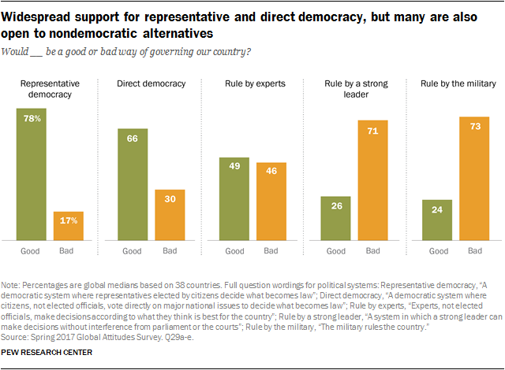
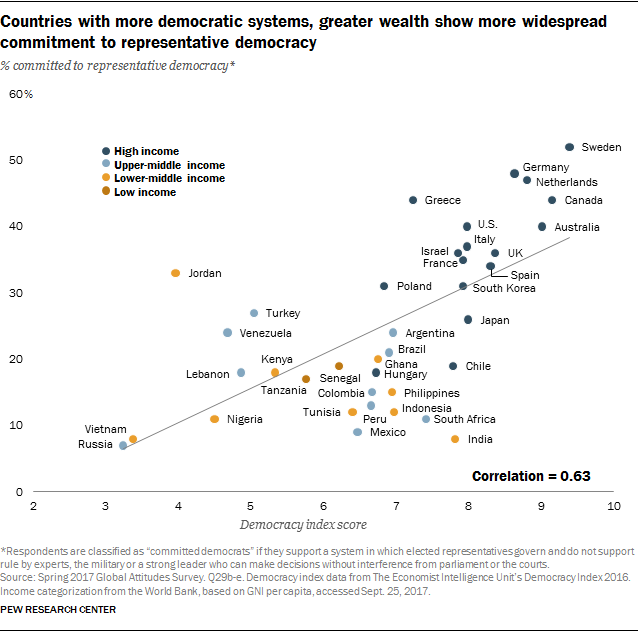

## Rethinking American Electoral Democracy

## Chapter 1 - Creating a Model Electoral Democracy

## Positive view of democracy
-American widely view democracy as a good thing

## Declining trust and confidence

- But American's trust and confidence in the wisdom of other Americans to make political decisions is in decline

## Democracy in trouble?

- A majority (52%) of young Americans believe that our democracy is either “in trouble,” or “failing”[^1]
- On American Exceptionalism, less than one-third believe that "America is the greatest country in the world"
- Young Americans place the chances that they will see a second civil war in their lifetime at 35%; chances that at least one state secedes at 25%
  + Nearly half (46%) of young Republicans place the chances of a second civil war at 50% or higher, compared to 32% of Democrats

[^1]: The Harvard Youth Poll, 2,109 18 to 29-year-old U.S. residents conducted between Oct. 26 and Nov. 8, 2021. https://iop.harvard.edu/youth-poll/fall-2021-harvard-youth-poll

## Global Share of the Population living in a democracy

## Public is split on how well democracy is working

## 

##

## 

## Basic Facts

## Countries with more democratic systems, greater wealth show more widespread commitment to representative democracy

## Assuming Democracy is good...

**Assuming democracy is good**:

- How much and what kind of democracy should we have?

  + Should we have direct democracy where everyone votes on the internet?
  
  + Should this happen for all levels of government, from city issues to federal issues?
  
  + What offices should be elected, and which appointed?
  
  + Who should appoint, and who should confirm? Can the public recall?
  
## Criteria for a Model Electoral Democracy
- "In every democratic country a substantial gap exists between actual and ideal democracy. That gap offers us a challenge: can we find ways to make ‘democratic’ countries more democratic?"[^2] 

[^2]: Dahl, R.A., Dahl, and Yale University Press. 1998. On Democracy. Yale University Press.

- One Person, One Vote
- Competitive Elections
- Transparency
- Rules that are not burdensome

  
