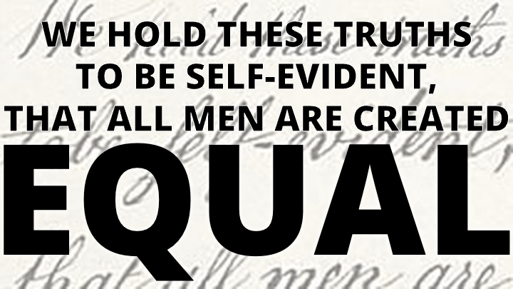
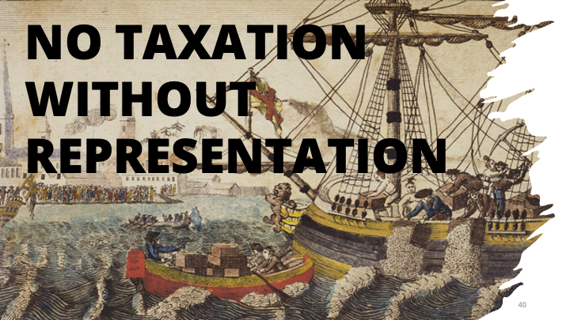
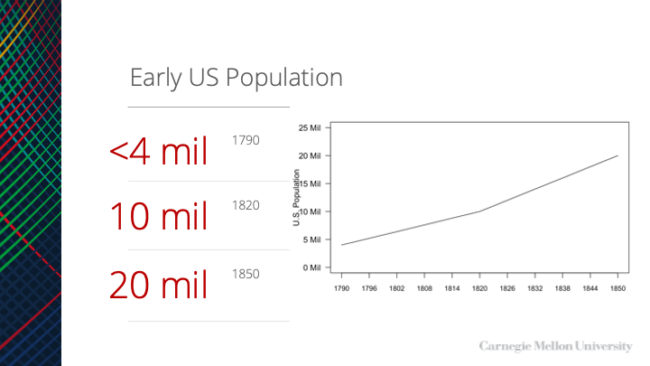

```{r setup, include=FALSE}
knitr::opts_chunk$set(echo = FALSE)
## rmarkdown::render('/Users/cervas/Library/CloudStorage/GoogleDrive-jcervas@uci.edu/My Drive/GitHub/teaching/classes/class-cmu-84-352/lecture-slides/the-right-to-vote-lecure-slides/The-Right-to-Vote-Part-I.Rmd', output_format = 'all')
```


## The Right to Vote

## What does the Constitution say?

- The original Constitution does not have much to say about the right to vote.

- Nowhere in the text does it explicitly say that citizens have the right to vote in elections.

- It merely states that anyone eligible to vote for the largest house of a state’s legislature is also eligible to vote for members of the House of Representatives from that state.

## What does the Constitution say?

- However, that is not to say the Constitution says nothing about elections.
  - Through the Elections Clause, it gives Congress and the federal government the power to determine the “Times, Places, and Manner” of congressional elections.
  - Congress has used this power throughout the nation’s history to, for example, establish a single national Election Day and mandate single-member congressional districts.
  - The Constitution also requires all states to have a representative form of government.

## Constitutional Amendments

- The **14th Amendment** extends citizenship to all natural born or naturalized Americans regardless of race and guaranteed that rights of citizenship, like voting, cannot be restricted by the states.

- The **15th Amendment** prohibits restricting the right to vote due to race.

- The **17th Amendment** requires states to elect senators by popular vote.

- The **19th Amendment** extends voting rights to all women.

- The **26th Amendment** extends the right to vote to everyone 18 years of age and older.

- Additionally, the **24th Amendment** explicitly bans poll taxes, which often prevented low-income citizens of all races from voting.

## Should we have this amendment?

> “Every citizen of the United States, who is of legal voting age, shall have the fundamental right to vote in any public election held in the jurisdiction in which the citizen resides.”

## Voting On the decline?

“_Americans no longer vote as much as they once did_”

- This is the first line from ”The Right to Vote”. But is it true? Let’s look at the data


## Voting Rates

- Even in the highest participation elections in the 21st century, more than 3 in 10 eligible voters sit it out.

- But why? And how do voters differ from non-voters?

## Trust in Government


https://www.pewresearch.org/politics/2022/06/06/public-trust-in-government-1958-2022/


## Of the people, By the people, For the people


## **BY** the people

- Explicit here is that the people choose their leaders

- When Lincoln spoke these words, many people were excluded from any right to vote.

- Why was this the case? Why were so many Americans, in different places and at different times, denied the right to vote?

## Universal Suffrage

```{r}
y <- seq(0.02,1,0.0235)
y <- y^2
years <- seq(1776, 2022, 6)
imaginary.data <- (y-min(y))/(max(y)-min(y))

plot(1, type = "n", xlab = "",
     ylab = "Suffrage (%)", xlim = c(1776, 2022), 
     ylim = c(0, 1), axes=F)
			axis(side=2, las=2, at=seq(0, 1, 0.25), labels=paste0(seq(0,100, 25), "%"))
			axis(side=1, las=2, at=seq(1776, 2022, 6), labels=seq(1776, 2022, 6), cex.axis=0.6)
			box(col="black")
			lines(years, imaginary.data)
```

- It is often popularly conceptualized that voting rights have steadily increased over time, so that we now have universal (or near) suffrage.

## Tocqueville's rule of social behavior

- “rule of social behavior”

- Tocqueville believed that once voting qualifications were lifted, it would lead to abolishing all qualifications.

## What do you imagine the trajectory of voting rights to be?

```{r}
years <- seq(1776, 2022, 6)
imaginary.data <- c(rep(0.25, 24), rep(0.5,8), rep(1,10))

plot(1, type = "n", xlab = "",
     ylab = "Suffrage (%)", xlim = c(1776, 2022), 
     ylim = c(0, 1), axes=F)
			axis(side=2, las=2, at=seq(0, 1, 0.25), labels=paste0(seq(0,100, 25), "%"))
			axis(side=1, las=2, at=seq(1776, 2022, 6), labels=seq(1776, 2022, 6), cex.axis=0.6)
			box(col="black")
```

## Exponential?

```{r}
y <- seq(0.02,1,0.0235)
y <- y^2
years <- seq(1776, 2022, 6)
imaginary.data <- (y-min(y))/(max(y)-min(y))

plot(1, type = "n", xlab = "",
     ylab = "Suffrage (%)", xlim = c(1776, 2022), 
     ylim = c(0, 1), axes=F)
			axis(side=2, las=2, at=seq(0, 1, 0.25), labels=paste0(seq(0,100, 25), "%"))
			axis(side=1, las=2, at=seq(1776, 2022, 6), labels=seq(1776, 2022, 6), cex.axis=0.6)
			box(col="black")
			lines(years, imaginary.data)
```

## Stepped and gradual?

```{r}
years <- seq(1776, 2022, 6)
imaginary.data <- c(rep(0.25, 24), rep(0.5,8), seq(0.5,1,0.055))

plot(1, type = "n", xlab = "",
     ylab = "Suffrage (%)", xlim = c(1776, 2022), 
     ylim = c(0, 1), axes=F)
			axis(side=2, las=2, at=seq(0, 1, 0.25), labels=paste0(seq(0,100, 25), "%"))
			axis(side=1, las=2, at=seq(1776, 2022, 6), labels=seq(1776, 2022, 6), cex.axis=0.6)
			box(col="black")
			lines(years, imaginary.data)
```

## Stepped and Steady?

```{r}
years <- seq(1776, 2022, 6)
imaginary.data <- c(rep(0.25, 24), rep(0.5,8), rep(1,10))

plot(1, type = "n", xlab = "",
     ylab = "Suffrage (%)", xlim = c(1776, 2022), 
     ylim = c(0, 1), axes=F)
			axis(side=2, las=2, at=seq(0, 1, 0.25), labels=paste0(seq(0,100, 25), "%"))
			axis(side=1, las=2, at=seq(1776, 2022, 6), labels=seq(1776, 2022, 6), cex.axis=0.6)
			box(col="black")
			lines(years, imaginary.data)
```

## Colonial “democracy”


## American colonies

- At its birth, the United States was not a_democratic_ nation—far from it
  - Democracy was a pejorative – “mob rule”, “government by the unfit”, “disorder”

- But, between the signing of the Declaration of Independence and the constitutional convention, states had started writing their own suffrage laws

- The consequences of these laws would have effects that last through even today

## Received Legacy


- Laws regarding voting were shaped by colonial precedents and particularly traditional English thought.
  - The prerequisite of both colonial and British suffrage regulations was the restriction of voting to **adult men who owned property**.

## Property and the vote

- In seven colonies, men had to own land of specified acreage or monetary value in order to participate in elections.

- Elsewhere, ownership of personal property or payment of taxes could substitute for real estate

## Property Requirements

- Both in England and in the colonies
  - men who possessed property (especially “real property,” i.e., land and buildings) had a unique “_stake in society_”
  - property owners alone possessed sufficient _independence_ to warrant their having a voice in governance

- The ballot was not to be entrusted to those who were economically dependent because they could too easily be controlled or manipulated by others

## Franklin on Voting Rights

> Today a man owns a jackass worth fifty dollars and he is entitled to vote; but before the next election the jackass dies. The man in the meantime has become more experienced, his knowledge of the principles of government, and his acquaintance with mankind, are more extensive, and he is therefore better qualified to make a proper selection of rulers—but the jackass is dead and the man cannot vote.

> Now gentlemen, pray inform me, in whom is the right of suffrage? In _the man_ or in _the jackass_? -Benjamin Franklin

## Residency Requirements

- Many colonies instituted residency requirements to exclude transients who presumably lacked the requisite stake in the colony’s affairs
  - some made citizenship, of England or the province, a prerequisite for voting
  - several colonies formally barred all servants from the polls, while others expressly excluded paupers _(dependents)_

## Women disenfranchisement

- Women too were prohibited from voting because they were thought to be dependent on adult men

- Their “_delicacy_” rendered them unfit for the worldly experiences necessary for engagement in politics

## Social membership limitations

- In the eighteenth century, Catholics were disfranchised in **five** states and Jews in **four** states

- Native Americans, free blacks, and non-naturalized aliens could vote in some places and not in others

- Women were barred expressly in several colonies, including Virginia, but statutes elsewhere made no reference to gender

## Qualifications by location

- Although differently configured, city and town suffrage qualifications were not uniformly stricter or more lenient than were the qualifications for voting in the countryside

- How do voters in cities differ from those in non-urban contexts in the 18th century?

## The Franchise

- The franchise was far more widespread in the colonies than it was in England
  - Unclear how many people could and did vote

- There certainly were communities, particularly newly settled communities where land was inexpensive, in which 70 or 80 percent of all white men were enfranchised

- As the revolution approached, the rate of property ownership was _falling_ , and the proportion of adult white males who were eligible to vote was probably less than **60 percent**

## American Revolution

- By challenging Britain’s right to rule the colonies, the American Revolution sparked a far-reaching public debate about the nature and sources of legitimate governmental authority

- The issue of suffrage was always near the center of that debate:
  - if the legitimacy of a government depended on the consent of the governed _(one of the key rhetorical claims of the revolution_ ), then limitations on suffrage were intrinsically problematic, since voting was the primary instrument through which a populace could express or withhold consent

## Self-Interest

- The planters, merchants, and prosperous farmers who wielded power and influence in late-eighteenth-century affairs had an unmistakable interest in keeping the franchise narrow:
  - a restricted suffrage would make it easier for them to retain their economic and social advantages.

- Conversely, tenant farmers, journeymen, and laborers _(not to mention African Americans and women)_ had something to gain from the diffusion of political rights

## Rights v. Privilege

- Throughout the ex-colonies, political leaders put forward several different arguments to justify the retention of restrictions, particularly property restrictions, on the franchise.

- Implicit in these arguments was the claim that voting was not a _right_ but a_privilege_, one that the state could legitimately grant or curtail in its own interest.

## Franchise and Suffrage

- In early English usage, the word _franchise_ referred to a privilege, immunity, or freedom that a state could grant, while the term _suffrage_ alluded to intercessory prayers.

- Even Pennsylvanian James Wilson, a signer of both the Declaration of Independence and the Constitution, and one of the more democratic of the founding fathers, described suffrage as a “darling privilege of free men” that could and should be “extended as far as considerations of safety and order will permit.”

## Earning the privilege

- Only men with property, preferably real property, were deemed to be sufficiently attached to the community and sufficiently affected by its laws to have earned the privilege of voting
  - The propertyless, if enfranchised, would constitute a menace to the maintenance of a well-ordered community

- The interests of the propertyless, like those of women and children, **could be represented effectively by wise, fair-minded, wealthy white men**. (Virtual Representation)
  - the poor, or the propertyless, should not vote because they would threaten the interests of property— **that is, they would have too much will of their own**

##



## Natural Right alternative

- Arrayed against these conservative views was a set of equally cogent, if somewhat experimental, arguments in favor of extending the franchise, particularly to men who did not own property

- The most broadly framed of these arguments was simple: voting was a "_natural right_" that the state **could not suspend** except in the most extreme circumstances.

## Natural Right to Vote

- The idea that voting was a natural right or even a right at all was rhetorically powerful:
  - it meshed well with the Lockean political theory _popular_ in eighteenth-century America, it had a clear _antimonarchical_ thrust, and it had the virtue of _simplicity_

## The Pandora’s box

- If voting was a natural right, then everyone should possess it

- Did this mean that not just every man (including poor men) should vote, but women as well?

  - What about African Americans—and recently arrived aliens?

  - Or children?

- If there was a “right” to suffrage, wast it not wrong or immoral to deprive any group or individual of that right?

- How could one justify denying anyone his or her natural —or socially acknowledged— rights?

##




## Avoiding Pandora’s Box

- Property qualifications ought to be replaced by taxpaying requirements, because all taxpayers (not just property owners) were contributing to the government and affected by its policies

- All those who paid taxes had the right to defend themselves against potentially unfair government policies.

- The logic of “_no taxation without representation_” had a domestic as well as anticolonial application

## Military Exception

The final cluster of arguments for expanding the franchise was rather different: extending the right to vote to everyone who was serving, or had served, in the army or the militia

## What about fighters?

> “_Every man in the country who manifests a disposition to venture his all for the defense of its liberty, should have a voice in its council_.” -- Philadelphia pamphleteer, probably Thomas Young

## Consent to be governed

- Arguments for and against a more democratic suffrage were voiced in newspapers, broadsides, provincial assemblies, town meetings, gatherings of militiamen, and constitutional conventions, as well as taverns, inns, city streets, and private homes

- The very act of declaring independence from Britain compelled the residents of each colony to form a new government, and the process of forming new governments inescapably brought the issue of suffrage to the fore

**For a government to be legitimate, who must consent to its design and structure?**

## 


## Small Electorate at founding

- Only a small fraction of the population cast ballots in the elections that elevated George Washington and John Adams to the office of the presidency

- Moreover, the constitution was signed by only 39 delegates, yet its impact continues to affect our lives

## Pennsylvania democracy

- The most influential and, perhaps, dramatic expansion of the franchise occurred in Pennsylvania during the first months of the revolution

- The militiamen succeeded in electing a constitutional convention dominated not by the traditional elites but by _artisans_, _lesser merchants_, and _farmers_.

- That convention, in the fall of 1776, produced the **most democratic constitution** in the thirteen original states:
  - it abolished property requirements and enfranchised all taxpaying adult males as well as the non-taxpaying sons of freeholders.
  - Since Pennsylvania had no poll tax—meaning a "head" tax or a tax on all household heads—this effectively enfranchised the great majority of adult males

## Vermont

- In only one state, Vermont, was a man’s ability to vote completely detached from his financial circumstances

- Vermont went a step further than PA, however, eliminating not only property requirements but taxpaying qualifications as well.

- Vermont was unique in not having a government when independence was declared
  - delegates to its constitutional convention were selected not by an existing state assembly but by popular elections held in the region’s townships.

- This democratically selected convention produced the first state constitution to **abolish slavery** and to institute anything **close to universal manhood suffrage**

## Wrap up on Colonial America

Suffrage in state constitutions

- Suffrage was defined as a constitutional issue:
  - all the early state constitutions (except that of Delaware) treated the right to vote as a matter of fundamental —and thus constitutional— law, rather than statute law.

- Implicit in this treatment was the notion that suffrage requirements ought to be durable and difficult to change; legislatures and governors alone were not entrusted with the power to tamper with the right to vote.

- **In theory at least, the franchise could be broadened or narrowed only through constitutional revision or amendment**

## Revolutionary Period

- The revolutionary period witnessed a broad range of reactions to economic restrictions on the franchise.

- Although often overshadowed by other issues _(such as taxation or the structure of future legislatures)_, the breadth of the franchise mattered greatly to citizens of the thirteen original ex-colonies and the new state of Vermont.

- In every state, there was pressure for suffrage reform, as well as conservative opposition to a less class-biased, more economically inclusive franchise.

- The outcomes of these conflicts followed _no_ clear regional pattern; they seem instead to have been shaped largely by the strength of local elites and by the political processes that unfolded in each state.

**The overall result was a mixed bag of substantial changes, cosmetic alterations, and preservation of the status quo**

## The New Nation

## The State and the Nation

- Under the _Articles of Confederation_, the states had retained complete control over the franchise

- But the _Constitution of the United States_ forged a link between state suffrage rules and the right to vote in national elections:
  - those who participated in elections for the “most numerous Branch of the state legislature” were automatically entitled to vote for members of the House of Representatives

- _These were the only national offices for which the Constitution demanded a popular electoral process of any kind_

- Constitutional Compromise: tie suffrage for the House of Representatives to state franchise requirements in elections to the lower house of each state legislature

## Constitutional Convention

- The records of the federal convention and state constitutional conventions suggest that most members of the new nation’s political leadership did not favor a more democratic franchise

- Madison’s views were more typical of the founding fathers than were those of Jefferson or Franklin

- The well-to-do Elbridge Gerry of Massachusetts (whose name would be immortalized in the word gerrymander), speaking at the end of the convention, described “_Democracy_” as “_the worst . . . of all political evils_.”

**This conservative consensus also was expressed in the Northwest Ordinance of 1787 _(**an act reaffirmed by the first Congress in 1789**)_, which instituted a freehold requirement in the territories northwest of the Ohio River**

- Freehold: permanent and absolute tenure of land or property with freedom to dispose of it at will

## Compromise

The decision made by the Constitutional Convention, however, stemmed at least as much from _practical politics_ as from _ideology_.

- The convention accepted the committee of detail’s formulation, with slight revisions, largely because of its desire to _avoid jeopardizing the ratification of the new constitution_.

- Any national suffrage requirement was likely to generate opposition in one state or another, and a narrow national suffrage, such as a freehold qualification, seemed _capable of derailing the Constitution altogether_.

**By making the franchise in national elections dependent on state suffrage laws, the authors of the Constitution compromised their substantive disagreements to solve a potentially explosive political problem**

## Federal lack of Voting Rights

**The Constitution adopted in 1787 left the federal government without any clear power or mechanism, other than through constitutional amendment, to institute a national conception of voting rights, to express a national vision of democracy**

- Although the Constitution was promulgated in the name of “_We, the people of the United States_”, the _individual states_ retained the power to define just who “_the people_” were

## The Presidency

Also problematic—in the long run—was the Constitution’s failure to guarantee to any Americans the right to vote for the highest office in the land, the presidency of the United States.

- Presidents were to be chosen through a complex mechanism that later came to be known as the “_Electoral College_.”

- “_Electors_” in each state were to meet and cast ballots for two persons, and those ballots were to be transmitted to Congress, where they would be opened and counted: the person receiving the largest number of votes would be elected president and the runner-up would become vice president.

## The Presidency

- But the Constitution left entirely to state legislatures the question of how the electors themselves would be chosen.

- Article 2, section 1 specified that “_each State shall appoint, in such Manner as the Legislature thereof may direct, a Number of Electors, equal to the whole Number of Senators and Representatives to which the State may be entitled in the Congress_.”

- The states were not required to hold popular elections to choose presidential electors, and state legislatures could, whenever they wished, change the “_manner_” of appointing electors.

- Not surprisingly, during the early years of the republic, some state legislatures chose presidential electors by themselves, leaving the people of their states no role whatsoever in determining who would wield the executive power of the new federal government.

## The American Revolution

- The American Revolution, produced modest, but only modest, gains, in the formal democratization of politics.

- By 1790, according to most estimates, roughly 60 to 70 percent of adult white men (and very few others) could vote.

**The notion that a legitimate government required the “consent” of the governed became a staple of political thought; and a new, contagious language of rights and equality was widely heard**

## Democracy Ascendant

## Early US Population




## State expansion of franchise

- Change created pressures for the states to significantly revise the blueprints for governance that they had drawn during the era of the revolution

- Between 1790 and the 1850s, every state (there were thirty-one by 1855) held at least one constitutional convention, and more than a few held several

**Disputes over political power, rights, and influence—including the breadth of the franchise and the apportionment of state legislative seats—were often what prompted states to call constitutional conventions in the first place**

- The torch had been passed to a new generation of political leaders equipped with different ideas who confronted significantly different conditions

## Expanding Rights

- Nearly everywhere, the laws governing the right to vote in the United States were greatly _elaborated_ and significantly transformed between 1790 and the 1850s

- At the nation’s founding, the concrete _procedures for voting varied_ widely from state to state and even from town to towns

- In some locales, particularly in the South, voting was still an oral and public act:
  - men assembled before election judges, waited for their names to be called, and then _announced_ which candidates they supported
  - in one variant of this process, common in Virginia, men inscribed their names in a poll book underneath the name of the candidate they preferred

## Expanding Rights

- Elsewhere, state constitutions or statutes required that voting be conducted by written ballot, to protect voters against intimidation

**By the mid-nineteenth century, nearly all states insisted that votes be cast through written ballots, placed in a box or handed to an official**

- As the number of offices to be filled through elections grew, _printed ballots gradually replaced handwritten ones_, and political parties themselves began to prepare printed ballots, both to assist and monitor their voters

## Administrative rules

- Other legal developments were essentially administrative, reflecting a need to translate broad precepts into detailed rules governing the conduct of elections

- Most states, for example, had to define what it meant to be a resident or inhabitant

- They had to decide how and when lists of eligible voters would be assembled, what documents had to be presented as proof of citizenship, and how challenges to a voter’s eligibility should be handled

**Similarly, race had to be given an operative definition. Just how white did you have to be in order to vote? One-half, three-quarters? An increasingly voluminous body of law offered answers to such questions**

## Changing Property Requirements

- The property qualifications for suffrage that had begun to erode during the revolution were gradually dismantled after 1790

- None of the new states admitted to the union after 1790 adopted mandatory property requirements in their original constitutions

- Granting exclusive political rights to landowners and others who possessed considerable property was inconsistent with the quasi-egalitarian rhetoric of the revolution and the early republic

- By the end of the 1850s, only two property requirements remained in force anywhere in the United States, one applying to foreign-born residents of Rhode Island and the other to African Americans in New York

## Rise of taxpayer requirements

- The demise of property requirements was not identical to the elimination of economic qualifications

- Several states already had taxpaying requirements in 1790
  - several others instituted such requirements when they abolished property qualifications, and several of the new western states, including Ohio and Louisiana, also insisted that voters be taxpayers

- Although taxpaying requirements were conceptually distinct from property qualifications _(paying a tax demonstrated one’s membership in a community)_, they nonetheless preserved the link between a person’s _financial status_ and his _voting rights_.

## Eroding Economic Barriers

- In 1808, Congress modified the property qualifications in the Northwest Ordinance; three years later it acted more decisively, enfranchising all_free white males_ who had paid taxes and resided in the territory

- Between 1830 and 1855, six states relinquished their insistence that voters pay taxes, leaving only six others with taxpaying clauses, several of which were quite minimal

- Taxpaying provisions also were opposed, by many Whigs as well as Democrats, because they were difficult to enforce and led to substantial fraud
  - **broadly stated tax requirements could prove difficult to translate into coherent, concrete policies**

- By 1855, thus, there were few formal or _explicit economic barriers_ to voting


## Convergence of state and local eligibility requirements

- Between 1790 and the 1850s, _state_ suffrage laws and _municipal_ suffrage laws became identical almost everywhere

- The idea that municipal charters were unalterable changed;

- State supremacy, or the idea that _municipalities legally ought to be regarded as administrative creatures of the state_, rather than as separate sovereignties of any type became the norm

- Although the idea persisted that municipalities had to perform special tasks that might warrant special suffrage requirements, there was a presumption, by the 1850s, that **state suffrage regulations would and did apply to all elections**

## Residency Requirements

- Almost everywhere states tinkered with their residency rules, which had become increasingly salient once property qualifications had been eliminated.

- In several states, including Delaware, Pennsylvania, South Carolina, Indiana, and Michigan, residency requirements were _shortened_, opening the polls to large numbers of migrants who previously had been barred

## Immigrant non-citizen voting

- Far more dramatic, and perhaps surprising, was the extension of the franchise to immigrants—although the history of noncitizen voting was anything but unidirectional

- At the end of the eighteenth century, _the line separating citizens from aliens was not clearly or consistently drawn, either in law or in practice_.

- The federal government, hoping to encourage settlement, expressly permitted aliens to vote in the Northwest Territories

## Constitutionality of alien suffrage

- Although the constitutionality of alien suffrage was heatedly debated in the mid-nineteenth century, state courts consistently upheld such provisions
  - opponents often claimed that states were usurping federal power by conferring the franchise on those who were not naturalized

## Citizenship and naturalization

- The federal government changed the procedures and qualifications for naturalization every few years, settling on a durable formula only in 1802, when Congress declared that any foreign-born white male who met a five-year residency requirement could become a citizen three years after formally announcing his intention to do so

- While revising their constitutions, New York, Massachusetts, Connecticut, Vermont, Maryland, and Virginia all replaced “_inhabitant_” with “_citizen_”

- Almost all the new states joining the union between 1800 and 1840 conferred the right to vote _exclusively_ on citizens

**By the Jacksonian era (1828), aliens were barred from the polls nearly everywhere**

## Party-competition

- The second-party system dynamics of partisan politics helped to increase the appetite for suffrage
  - **parties and factions vied to wear the increasingly popular mantle of democracy**
  - **Simultaneously, they accusing one another of circumventing the law for their own advantage**

- Campaigns to terminate taxpaying provisions were often launched by Democrats, but the Whigs usually jumped on the bandwagon quickly, both to shore up their democratic credentials

## Sources of Expansion of the franchise

## Broadening of the Suffrage

- The celebrated broadening of the suffrage during the first half of the 1800s was spawned by the convergence of several different factors, which varied by state
  - widespread and significant changes in the social structure and social composition of the nation’s population
  - the appearance or expansion of conditions under which the material interests of the enfranchised could be served by broadening the franchise
  - the formation of broadly based political parties that competed systematically for votes

## Changing social statuses

- All the states that had property requirements in 1790 witnessed an increase in the number and proportion of adult males who were unable to meet those requirements

- The urban population grew rapidly, swelling the ranks of those who owned no real property and sometimes no property at all.

**These changes in the social structure created significant and growing clusters of men who were full participants in economic and social life but who lacked political rights**

## How Change Happens

- The disfranchised were _unable_ to precipitate change by themselves

- When the voting rights were extended, it happened because men who were already enfranchised _actively supported_ the cause of suffrage expansion
  - **Why did voting members of the community sometimes elect to share their political power with others?**
    - they saw themselves as having a direct interest in enlarging the electorate

## War, what is it good for?

- In the wake of the Revolutionary War and again after the War of 1812, many middle-class citizens concluded that extending the franchise to the “lower orders” would:
  - enhance their own security
  - help to preserve their way of life, by assuring that such men would continue to serve in the army and the militias

- The nation’s experience during the War of 1812 underscored this concern:**the federal government had great difficulty recruiting and retaining soldiers and eventually had to call on militia forces to bolster the army**

- In the South, the issue had an added twist:**enfranchising all white Southerners was a means of making sure that poor whites would serve in militia patrols guarding against slave rebellions**

## New Territories

- As territories began to organize themselves into states, inhabitants of sparsely populated regions embraced white manhood suffrage, in part because they believed that a broad franchise would:
  - **encourage settlement and in so doing raise land values,**
  - **stimulate economic development,**
  - **generate tax revenues.**

## Political Competition

- Perhaps the most common way in which the fortunes of the already enfranchised were concretely linked to the cause of suffrage reform was through political parties and electoral competition
  - both _party loyalty_ and _party identification_ became prominent elements of public life

- Put simply, in a competitive electoral environment, parties were always alert to the potential advantage (or disadvantage) of enfranchising new voters and potential supporters
  - **The outcomes of electoral campaigns could easily depend on the size and shape of the electorate**
    - it was natural therefore for parties to try to broaden the franchise because they wanted to win elections, whatever their views about democratization

## Sources of Expansion of the franchise

- By the middle of the nineteenth century, the nation had taken significant steps in the direction of universal white male suffrage

- Reasons include:
  - the development of the economy
  - shifts in the social structure
  - the dynamics of party politics
  - the diffusion of democratic ideals
  - the experiences of war
  - the need to maintain militias

- The states, the federal government, and municipalities all had dismantled the most fundamental obstacles to the participation of men in elections

- The expansion of the suffrage played a key role in the upsurge of political participation in the 1830s and 1840s, when turnout in some locales reached 80 percent of all adult male citizens

## Backsliding and Sideslipping

## Trajectory

- The dominant thrust of legal change was toward_increasing_ the number of voters, laws also were passed that**tightened voting requirements**.

- Some of these were administrative in origin, giving specificity to vaguely worded constitutional mandates.

- Others were designed after the abolition of property and taxpaying requirements.

- Still, others were a response to the profound economic, social, and political changes transforming the nation:
  - as the U.S. began to wrestle with the impact of industrialism, sectional conflict, immigration, and westward expansion, the first clouds of an _anti-democratic reaction_ were forming on the horizon.

## Gender

- NJ’s state constitution of 1776 and an election law passed in 1790 granted the right to vote to all “_inhabitants_” who otherwise were qualified
  - this was interpreted locally to mean that property-owning women could vote

- The balance of political power had shifted, charges of voting fraud were rampant, and the Federalists, as well as two competing groups of Republicans, concluded that it was no longer to their advantage to have all “_inhabitants_”—including women, aliens, and African Americans—in the electorate.
  - **1807- Woman in New Jersey lost the right to vote**

## Gender

- Those who supported this retrenchment made little or no mention of women lacking the capacity to vote;

- Legislators were simply fighting corruption, correcting a “defect” in the constitution, and clearing up “doubts” about the composition of the electorate.

- Once that constitutional defect had been corrected, women everywhere in the nation were _barred_ from the polls

## African-Americans

- The number of states that formally excluded free African Americans was relatively_small_ at the nation’s founding

- It rose steadily from 1790 to 1850

- NJ, MD, and CT, which had permitted blacks to vote after independence, had banned it by 1820.

**Every state that entered the union after 1819 prohibited Blacks from voting**

## Pennsylvania

Had among the most liberal constitution during the revolutionary era, added the word “white” to its constitutional requirements in 1838.

This happened two years after its supreme court had ruled that blacks could not vote because they were not “freemen.”

## African-Americans

- The federal government prohibited Blacks from voting in the territories it controlled;
  - in 1857, the Supreme Court ruled that Blacks, free or slave, could not be citizens of the United States
- By 1855, only five states (Massachusetts, Vermont, New Hampshire, Maine, and Rhode Island) did _not_ discriminate against African Americans,
  - these states contained only 4 percent of the nation’s free black population

Pop quiz, what was the 1857 SCOTUS Case?

## Slaves

- Slaves were ineligible to vote everywhere

- Most free Blacks could not meet property and taxpaying requirements

- With each passing decade the free Black population grew, the abolition of property requirements made it possible for poor, uneducated Blacks to vote

- Inhabitants of northern states grew increasingly apprehensive about the prospect of attracting Black migrants from the South

## Growing Racism

- While abolitionist sentiment was growing, so too were sharply antagonistic, fearful, and hostile attitudes toward Blacks, especially in the North

- Republican factions were hostile to Black voting between 1810 and 1820, in part because they feared (correctly) that Blacks would constitute a Federalist voting bloc,
  - politically active Blacks throughout the North tended to support the Federalists because of their opposition to slavery

- In later decades, Democratic opposition to African-American suffrage was reinforced by the (equally correct) conviction that most Blacks would vote for Whigs.

## Slaves

- In the North in 1850, Blacks constituted more than 2 percent of the population in only one state, New Jersey

- Many areas that witnessed heated debates on the subject (e.g., Ohio and Indiana) had populations that were less than 1 percent black.

- The Black vote was decisive in a controversial county election in Pennsylvania in the 1830s, a fact that contributed to the adoption of a racial exclusion in the 1838 constitution.

- The fear of Black migration helped to fuel the demand for Black disfranchisement:
  - not only in Pennsylvania but in New York, Wisconsin, and elsewhere, convention delegates claimed that enfranchising blacks would only encourage freedmen and runaway slaves to flock to their states

## 19th Century minds

- Black suffrage was an emotionally charged issue that could not be reached through rational argument or fine distinctions

- Much of the populace believed that Blacks were inferior, and outside of the slave states, feared their presence.

- Permitting African Americans to vote seemed all too likely to open the doors to migration and “_amalgamation_ ,” and thus to diminish the significance of whiteness and citizenship

## Native Americans

- The citizenship status of Native Americans was ambiguous in early American law (the constitution specified that Indians “_not taxed_” were not to be counted in the census for the purposes of legislative apportionment)

- Many constitutional conventions held brief debates about whether Indians were or were not “_white_.”

- The prevailing view in much of the nation was that Native Americans, whether officially white or not, ought not be excluded from the franchise on racial grounds
  - if they were “civilized” and taxpaying, they should be entitled to vote

## Native Americans

- The ability of Native Americans to participate in politics was narrowed between 1790 and the 1850s

- Their legal status began to be clarified—_in a negative direction_.

- Indian tribes were “_domestic, dependent nations_ ,” according to Chief Justice Marshall, and thus individual Indians, living with their tribes, were aliens, even if born in the United States.

- Twenty years later, the Dred Scott decision affirmed this interpretation, while suggesting a path toward citizenship: Indians (unlike Blacks) could, if they left their tribes and settled among whites, “be entitled to all the rights and privileges which would belong to an immigrant from any other foreign people.”

## Native Americans

- Congress did attempt to naturalize some tribes, usually in return for a tribal agreement to accept a limited allotment of land

- Congressional actions affected only a small number of Native Americans.

- Several states formally moved to disfranchise all Indians, or Indians “not taxed,” or members of specific tribes, while others expressly limited suffrage to citizens or to “civilized” Indians who were “not a member of any tribe.”

- Native Americans were understood to be potential voters, but few in fact ever were able to vote during the antebellum era

## Other classes of people

- Despite the abolition of property requirements, most Americans did not believe that all adult white males were entitled to full membership in the political community

- Pauper exclusions were not antiquated carryovers of colonial precedents; they were generally _new_ constitutional provisions, often _adopted at the same conventions that abolished property or taxpaying requirements_

- The exclusion of paupers constituted a direct rejection of claims that suffrage was a right that ought to be universal among white males

- These exclusions made clear that individuals had to maintain a minimal level of _economic self-sufficiency_ in order to _possess political rights_
  - a man who accepted public support surrendered his independence and therefore lost the capacity to function as a citizen

## Felons

- The right to vote also was withheld from another group of men who violated prevailing social norms, those who had committed crimes, particularly felonies or so-called infamous crimes

- Disfranchisement for such crimes had a long history in English, European, and even Roman law, and it was hardly surprising that the principle of attaching civil disabilities to the commission of crimes appeared in American law as well

- Disfranchisement served as retribution for committing a crime and as a deterrent to future criminal behavior

## Felons

- Between 1776 and 1821, eleven state constitutions either expressly prohibited men with criminal convictions from voting or empowered their legislatures to enact laws disfranchising men based on criminal activity

- By the eve of the Civil War, more than two dozen states excluded those who had committed serious crimes, with many of the disfranchising provisions enacted in the wake of the abolition of property and tax-paying requirements

## Residency Requirements

- In several states, the franchise also was restricted by lengthening state or local residency requirements
  - in some states, the reverse was true

- In the absence of property or taxpaying qualifications, it seemed sensible to restrict the franchise to those who were familiar with local conditions and likely to have a stake in the outcome of elections.

- The average requirement tended to be one year in the state and three or six months in an individual township or county

## Residency Requirements

- There were strenuous advocates of both longer and shorter periods
  - In 1820, “hundreds of men . . . from New Hampshire” were reported to be flocking into Massachusetts each spring to vote in elections

- Federalists and then Whigs tended to favor longer periods of residence, because they were wary of the unsettled and the poor and suspected that most transients would vote for the Republicans or Democrats.

- The Democrats shared this analysis, advocating shorter residency requirements in the hope of enfranchising more of their own supporters

## Voter Registration

- Concern about transients and _--particularly foreign-born transients--_ sparked interest in the creation of formal systems of voter registration

- Most states did not keep official lists of voters or require voters to register in advance of elections

- Beginning in the 1830s, the idea of registration became more popular, particularly among Whigs, who believed that ineligible transients and foreigners were casting their votes for the Democratic Party

## Voter Registration

- _Capen v. Foster_ (1832), ruled that registry laws were not unconstitutional impositions of new voting qualifications but reasonable measures to regulate the conduct of elections.

- In 1836, Pennsylvania passed its first registration law, which required the assessors in Philadelphia _(and only Philadelphia)_ to prepare lists of qualified voters:**no person not on the list was permitted to vote**

- Although the proclaimed goal of the law was to reduce fraud, opponents insisted that its real intent was to _reduce the participation of the poor_ —who were frequently not home when assessors came by and who did not have “_big brass_” nameplates on their doors

## Literacy Tests

> “The least we can require is this very simple manifestation of intelligence.”

## Immigrants

- Apprehensions about immigrant voting in the 1840s considered proposals to institute literacy tests, or even English language literacy tests, for prospective voters

- Although the image of an educated electorate clearly had its attractions, these proposals were rapidly rebutted
  - there were many fine, upstanding citizens who happened to be illiterate or barely literate but were perfectly capable of responsibly exercising the franchise
  - It was claimed Andrew Jackson had difficulty spelling his own name

- Without universal education, a literacy requirement would be “a blow at the poor.”

**Literacy or “waiting period” restrictions were not imposed until the 1850s**

## Working Class and Socialism

- From the earliest periods, class played a relatively small role in American social and politics life.

- Enfranchisement of the American working class was uniquely early and quite uncontested

  - American workers gained universal suffrage _(or at least universal white male suffrage_ ) early in the process of industrialization and thus never were obliged to organize collectively to fight for the franchise.

  - Workers were able to address their grievances through the electoral process, they were not compelled to form labor parties, and they developed partisan attachments to previously established political organizations.

## Absence of class as a political wedge

- The subsequent evolution of American politics and American labor had a noticeable _absence of a strong socialist movement_

**To the extent that the working class was indeed enfranchised during the antebellum era**  _(and one should not ignore that women, free blacks, and recent immigrants constituted a large portion of the working class)_, **such enfranchisement was largely an unintended consequence of the changes in suffrage laws**

## Industrial Revolution and Suffrage

- The broadening of the franchise in antebellum America transpired before the industrial revolution had proceeded very far and before its social consequences were clearly or widely visible

- There were relatively few manufacturing workers in the northern states when property qualifications were abolished or new constitutions without property restrictions were adopted

- There was a dramatic shift in the ratios of farmers to workers
  - By 1850, persons who earned their living in agriculture were outnumbered in five states
  - **the relative importance of industry occurred twenty years or more after the suffrage laws had been changed**
  
- The American polity did not make a deliberate and conscious decision to enfranchise the working class that the industrial revolution was in the process of creating

## Class and Suffrage

- The early broadening of the franchise in the United States was not simply the consequence of a distinctive American commitment to democracy, of the insignificance of class, or of a belief in extending political rights to subaltern classes

- The early extension of voting rights occurred because the rights and power of the working class were not at issue when suffrage reforms were adopted.

- The American equivalent of the peasantry was not going to be enfranchised in any case _(because they were slaves)_, and the social landscape included few industrial workers

## Trends against suffrage

- Although the franchise overall had been broadened, new barriers were erected, targeting specific—and smaller—populations

- The concern about immigrant voters in the Northeast was mounting at precisely the same time that many Midwestern states were extending the franchise to non-declarant aliens.

- By the early 1850s, several groups or categories of men (and one group of women) had lost the political rights they possessed a half century earlier

**These barriers were expressions of the nation’s reluctance to embrace universal suffrage, of the limits to the democratic impulses that characterized the era**


