```{r setup, include=FALSE}
knitr::opts_chunk$set(echo = FALSE)
## rmarkdown::render('/Users/cervas/Library/CloudStorage/GoogleDrive-jcervas@uci.edu/My Drive/GitHub/teaching/classes/class-cmu-84-352/lecture-slides/the-right-to-vote-lecure-slides/The-Right-to-Vote.Rmd', output_format = 'all')
```

## The Right to Vote

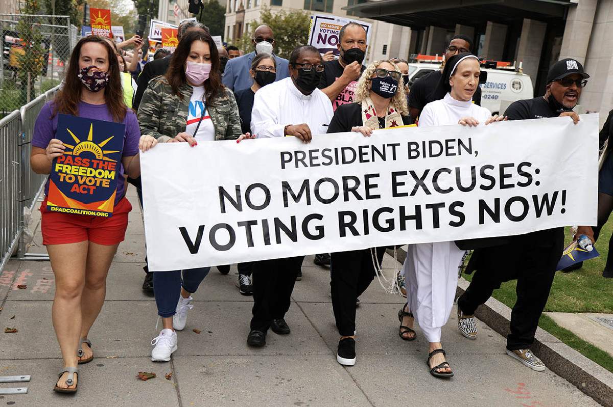

## What does the Constitution say?
>- The original Constitution does not have much to say about the right to vote.
>- Nowhere in the text does it explicitly say that citizens have the right to vote in elections.
>- It merely states that anyone eligible to vote for the largest house of a state’s legislature is also eligible to vote for members of the House of Representatives from that state.

## What does the Constitution say?

>- However, that is not to say the Constitution says nothing about elections.
>	+  Through the Elections Clause, it gives Congress and the federal government the power to determine the "Times, Places, and Manner" of congressional elections.
>	+  Congress has used this power throughout the nation’s history to, for example, establish a single national Election Day and mandate single-member congressional districts.
>	+  The Constitution also requires all states to have a representative form of government.

## Constitutional Amendments
>- The **14th Amendment** extends citizenship to all natural born or naturalized Americans regardless of race and guaranteed that rights of citizenship, like voting, cannot be restricted by the states.
>- The **15th Amendment** prohibits restricting the right to vote due to race.
>- The **17th Amendment** requires states to elect senators by popular vote.
>- The **19th Amendment** extends voting rights to all women.
>- The **26th Amendment** extends the right to vote to everyone 18 years of age and older.
>- Additionally, the **24th Amendment** explicitly bans poll taxes, which often prevented low-income citizens of all races from voting.

## Should we have this amendment?

> "Every citizen of the United States, who is of legal voting age, shall have the fundamental right to vote in any public election held in the jurisdiction in which the citizen resides."

## Voting On the decline?
"_Americans no longer vote as much as they once did_"
>- This is the first line from "The Right to Vote". But is it true? Let’s look at the data

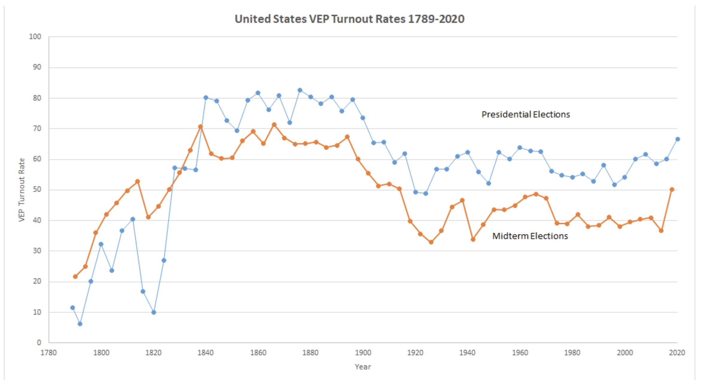

## Voting Rates
>- Even in the highest participation elections in the 21st century, more than 3 in 10 eligible voters sit it out.
>- But why? And how do voters differ from non-voters?

## Trust in Government

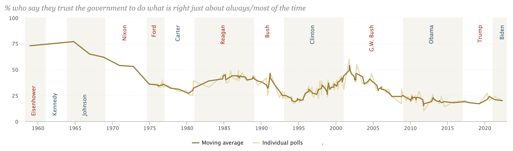

https://www.pewresearch.org/politics/2022/06/06/public-trust-in-government-1958-2022/


## Of the people, By the people, For the people
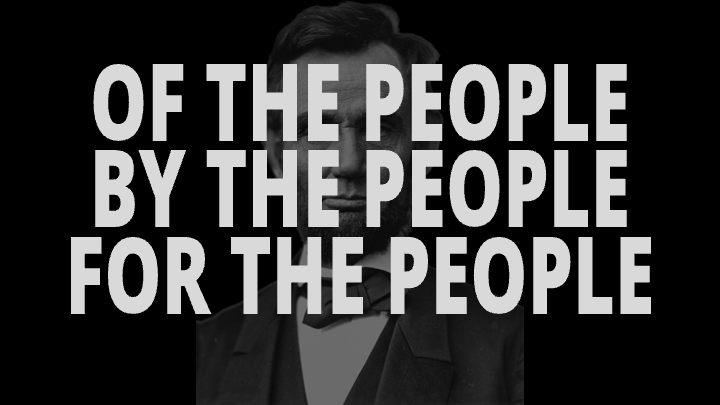

## **BY** the people
>- Explicit here is that the people choose their leaders
>- When Lincoln spoke these words, many people were excluded from any right to vote.
>- Why was this the case? Why were so many Americans, in different places and at different times, denied the right to vote?

## Universal Suffrage

```{r}
y <- seq(0.02,1,0.0235)
y <- y^2
years <- seq(1776, 2022, 6)
imaginary.data <- (y-min(y))/(max(y)-min(y))

plot(1, type = "n", xlab = "",
	ylab = "Suffrage (%)", xlim = c(1776, 2022), 
	ylim = c(0, 1), axes=F)
			axis(side=2, las=2, at=seq(0, 1, 0.25), labels=paste0(seq(0,100, 25), "%"))
			axis(side=1, las=2, at=seq(1776, 2022, 6), labels=seq(1776, 2022, 6), cex.axis=0.6)
			box(col="black")
			lines(years, imaginary.data)
```

>- It is often popularly conceptualized that voting rights have steadily increased over time, so that we now have universal (or near) suffrage.

## Tocqueville's rule of social behavior
>- "rule of social behavior"
>- Tocqueville believed that once voting qualifications were lifted, it would lead to abolishing all qualifications.

## What do you imagine the trajectory of voting rights to be?

```{r}
years <- seq(1776, 2022, 6)
imaginary.data <- c(rep(0.25, 24), rep(0.5,8), rep(1,10))

plot(1, type = "n", xlab = "",
	ylab = "Suffrage (%)", xlim = c(1776, 2022), 
	ylim = c(0, 1), axes=F)
			axis(side=2, las=2, at=seq(0, 1, 0.25), labels=paste0(seq(0,100, 25), "%"))
			axis(side=1, las=2, at=seq(1776, 2022, 6), labels=seq(1776, 2022, 6), cex.axis=0.6)
			box(col="black")
```

## Exponential?

```{r}
y <- seq(0.02,1,0.0235)
y <- y^2
years <- seq(1776, 2022, 6)
imaginary.data <- (y-min(y))/(max(y)-min(y))

plot(1, type = "n", xlab = "",
	ylab = "Suffrage (%)", xlim = c(1776, 2022), 
	ylim = c(0, 1), axes=F)
			axis(side=2, las=2, at=seq(0, 1, 0.25), labels=paste0(seq(0,100, 25), "%"))
			axis(side=1, las=2, at=seq(1776, 2022, 6), labels=seq(1776, 2022, 6), cex.axis=0.6)
			box(col="black")
			lines(years, imaginary.data)
```

## Stepped and gradual?

```{r}
years <- seq(1776, 2022, 6)
imaginary.data <- c(rep(0.25, 24), rep(0.5,8), seq(0.5,1,0.055))

plot(1, type = "n", xlab = "",
	ylab = "Suffrage (%)", xlim = c(1776, 2022), 
	ylim = c(0, 1), axes=F)
			axis(side=2, las=2, at=seq(0, 1, 0.25), labels=paste0(seq(0,100, 25), "%"))
			axis(side=1, las=2, at=seq(1776, 2022, 6), labels=seq(1776, 2022, 6), cex.axis=0.6)
			box(col="black")
			lines(years, imaginary.data)
```

## Stepped and Steady?

```{r}
years <- seq(1776, 2022, 6)
imaginary.data <- c(rep(0.25, 24), rep(0.5,8), rep(1,10))

plot(1, type = "n", xlab = "",
	ylab = "Suffrage (%)", xlim = c(1776, 2022), 
	ylim = c(0, 1), axes=F)
			axis(side=2, las=2, at=seq(0, 1, 0.25), labels=paste0(seq(0,100, 25), "%"))
			axis(side=1, las=2, at=seq(1776, 2022, 6), labels=seq(1776, 2022, 6), cex.axis=0.6)
			box(col="black")
			lines(years, imaginary.data)
```

## Colonial "democracy"

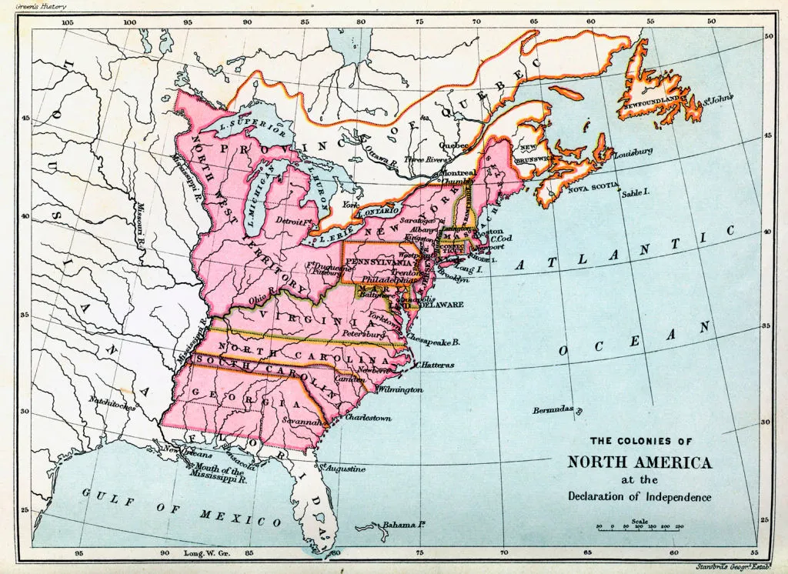

## American colonies
>- At its birth, the United States was not a_democratic_ nation—far from it
>	+  Democracy was a pejorative – "mob rule", "government by the unfit", "disorder"
>- But, between the signing of the Declaration of Independence and the constitutional convention, states had started writing their own suffrage laws
>- The consequences of these laws would have effects that last through even today

## Received Legacy

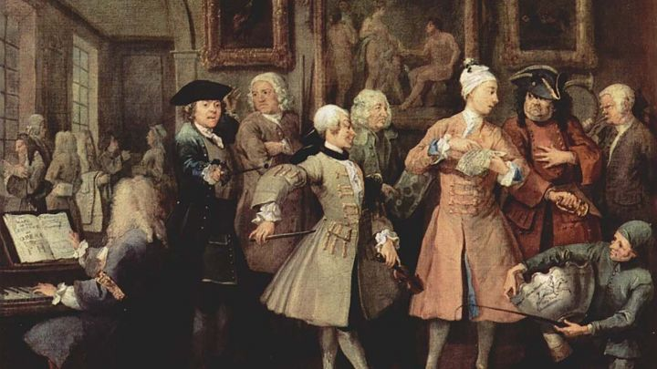

>- Laws regarding voting were shaped by colonial precedents and particularly traditional English thought.
>	+  The prerequisite of both colonial and British suffrage regulations was the restriction of voting to **adult men who owned property**.

## Property and the vote
>- In seven colonies, men had to own land of specified acreage or monetary value in order to participate in elections.
>- Elsewhere, ownership of personal property or payment of taxes could substitute for real estate

## Property Requirements
>- Both in England and in the colonies
>	+  men who possessed property (especially "real property," i.e., land and buildings) had a unique "_stake in society_"
>	+  property owners alone possessed sufficient _independence_ to warrant their having a voice in governance
>- The ballot was not to be entrusted to those who were economically dependent because they could too easily be controlled or manipulated by others

## Franklin on Voting Rights
> Today a man owns a jackass worth fifty dollars and he is entitled to vote; but before the next election the jackass dies. The man in the meantime has become more experienced, his knowledge of the principles of government, and his acquaintance with mankind, are more extensive, and he is therefore better qualified to make a proper selection of rulers—but the jackass is dead and the man cannot vote.
> Now gentlemen, pray inform me, in whom is the right of suffrage? In _the man_ or in _the jackass_? -Benjamin Franklin

## Residency Requirements
>- Many colonies instituted residency requirements to exclude transients who presumably lacked the requisite stake in the colony’s affairs
>	+  some made citizenship, of England or the province, a prerequisite for voting
>	+  several colonies formally barred all servants from the polls, while others expressly excluded paupers _(dependents)_

## Women disenfranchisement
>- Women too were prohibited from voting because they were thought to be dependent on adult men
>- Their "_delicacy_" rendered them unfit for the worldly experiences necessary for engagement in politics

## Social membership limitations
>- In the eighteenth century, Catholics were disfranchised in **five** states and Jews in **four** states
>- Native Americans, free blacks, and non-naturalized aliens could vote in some places and not in others
>- Women were barred expressly in several colonies, including Virginia, but statutes elsewhere made no reference to gender

## Qualifications by location
>- Although differently configured, city and town suffrage qualifications were not uniformly stricter or more lenient than were the qualifications for voting in the countryside
>- How do voters in cities differ from those in non-urban contexts in the 18th century?

## The Franchise
>- The franchise was far more widespread in the colonies than it was in England
>	+  Unclear how many people could and did vote

>- There certainly were communities, particularly newly settled communities where land was inexpensive, in which 70 or 80 percent of all white men were enfranchised

>- As the revolution approached, the rate of property ownership was _falling_ , and the proportion of adult white males who were eligible to vote was probably less than **60 percent**

## American Revolution
>- By challenging Britain’s right to rule the colonies, the American Revolution sparked a far-reaching public debate about the nature and sources of legitimate governmental authority
>- The issue of suffrage was always near the center of that debate:
>	+  if the legitimacy of a government depended on the consent of the governed _(one of the key rhetorical claims of the revolution_ ), then limitations on suffrage were intrinsically problematic, since voting was the primary instrument through which a populace could express or withhold consent

## Self-Interest
>- The planters, merchants, and prosperous farmers who wielded power and influence in late-eighteenth-century affairs had an unmistakable interest in keeping the franchise narrow:
>	+  a restricted suffrage would make it easier for them to retain their economic and social advantages.
>- Conversely, tenant farmers, journeymen, and laborers _(not to mention African Americans and women)_ had something to gain from the diffusion of political rights

## Rights v. Privilege
>- Throughout the ex-colonies, political leaders put forward several different arguments to justify the retention of restrictions, particularly property restrictions, on the franchise.
>- Implicit in these arguments was the claim that voting was not a _right_ but a_privilege_, one that the state could legitimately grant or curtail in its own interest.

## Franchise and Suffrage
>- In early English usage, the word _franchise_ referred to a privilege, immunity, or freedom that a state could grant, while the term _suffrage_ alluded to intercessory prayers.
>- Even Pennsylvanian James Wilson, a signer of both the Declaration of Independence and the Constitution, and one of the more democratic of the founding fathers, described suffrage as a "darling privilege of free men" that could and should be "extended as far as considerations of safety and order will permit."

## Earning the privilege
>- Only men with property, preferably real property, were deemed to be sufficiently attached to the community and sufficiently affected by its laws to have earned the privilege of voting
>	+  The propertyless, if enfranchised, would constitute a menace to the maintenance of a well-ordered community
>- The interests of the propertyless, like those of women and children, **could be represented effectively by wise, fair-minded, wealthy white men**. (Virtual Representation)
>	+  the poor, or the propertyless, should not vote because they would threaten the interests of property— **that is, they would have too much will of their own**

##

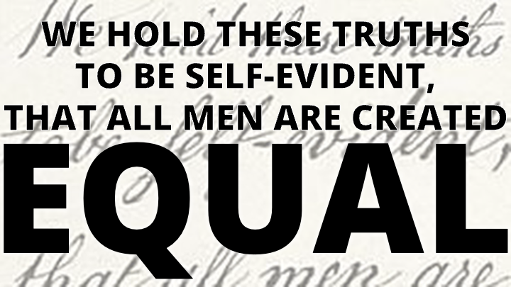

## Natural Right alternative
>- Arrayed against these conservative views was a set of equally cogent, if somewhat experimental, arguments in favor of extending the franchise, particularly to men who did not own property
>- The most broadly framed of these arguments was simple: voting was a "_natural right_" that the state **could not suspend** except in the most extreme circumstances.

## Natural Right to Vote
>- The idea that voting was a natural right or even a right at all was rhetorically powerful:
>	+  it meshed well with the Lockean political theory _popular_ in eighteenth-century America, it had a clear _antimonarchical_ thrust, and it had the virtue of _simplicity_

## The Pandora’s box
>- If voting was a natural right, then everyone should possess it
>- Did this mean that not just every man (including poor men) should vote, but women as well?
>	+  What about African Americans—and recently arrived aliens?
>	+  Or children?
>- If there was a "right" to suffrage, wast it not wrong or immoral to deprive any group or individual of that right?
>- How could one justify denying anyone his or her natural —or socially acknowledged— rights?

##

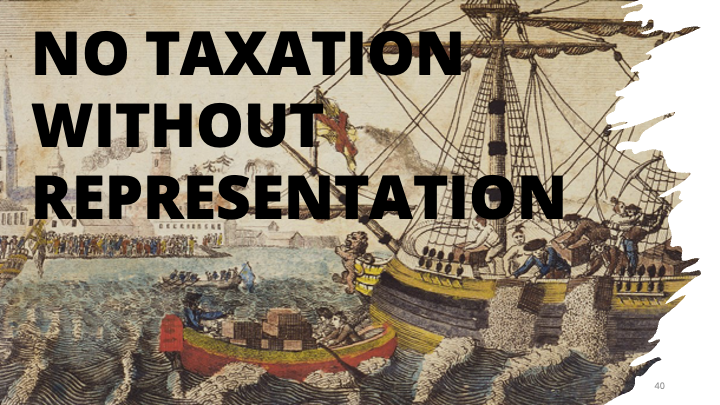

## Avoiding Pandora’s Box
>- Property qualifications ought to be replaced by taxpaying requirements, because all taxpayers (not just property owners) were contributing to the government and affected by its policies
>- All those who paid taxes had the right to defend themselves against potentially unfair government policies.
>- The logic of "_no taxation without representation_" had a domestic as well as anticolonial application

## Military Exception
The final cluster of arguments for expanding the franchise was rather different: extending the right to vote to everyone who was serving, or had served, in the army or the militia

## What about fighters?
> "_Every man in the country who manifests a disposition to venture his all for the defense of its liberty, should have a voice in its council_." ->- Philadelphia pamphleteer, probably Thomas Young

## Consent to be governed
>- Arguments for and against a more democratic suffrage were voiced in newspapers, broadsides, provincial assemblies, town meetings, gatherings of militiamen, and constitutional conventions, as well as taverns, inns, city streets, and private homes
>- The very act of declaring independence from Britain compelled the residents of each colony to form a new government, and the process of forming new governments inescapably brought the issue of suffrage to the fore
**For a government to be legitimate, who must consent to its design and structure?**

## 


## Small Electorate at founding
>- Only a small fraction of the population cast ballots in the elections that elevated George Washington and John Adams to the office of the presidency
>- Moreover, the constitution was signed by only 39 delegates, yet its impact continues to affect our lives

## Pennsylvania democracy
>- The most influential and, perhaps, dramatic expansion of the franchise occurred in Pennsylvania during the first months of the revolution
>- The militiamen succeeded in electing a constitutional convention dominated not by the traditional elites but by _artisans_, _lesser merchants_, and _farmers_.
>- That convention, in the fall of 1776, produced the **most democratic constitution** in the thirteen original states:
>	+  it abolished property requirements and enfranchised all taxpaying adult males as well as the non-taxpaying sons of freeholders.
>	+  Since Pennsylvania had no poll tax—meaning a "head" tax or a tax on all household heads—this effectively enfranchised the great majority of adult males

## Vermont
>- In only one state, Vermont, was a man’s ability to vote completely detached from his financial circumstances
>- Vermont went a step further than PA, however, eliminating not only property requirements but taxpaying qualifications as well.
>- Vermont was unique in not having a government when independence was declared
>	+  delegates to its constitutional convention were selected not by an existing state assembly but by popular elections held in the region’s townships.
>- This democratically selected convention produced the first state constitution to **abolish slavery** and to institute anything **close to universal manhood suffrage**

## Wrap up on Colonial America

## Suffrage in state constitutions
>- Suffrage was defined as a constitutional issue:
>	+  all the early state constitutions (except that of Delaware) treated the right to vote as a matter of fundamental —and thus constitutional— law, rather than statute law.
>- Implicit in this treatment was the notion that suffrage requirements ought to be durable and difficult to change; legislatures and governors alone were not entrusted with the power to tamper with the right to vote.
>- **In theory at least, the franchise could be broadened or narrowed only through constitutional revision or amendment**

## Revolutionary Period
>- The revolutionary period witnessed a broad range of reactions to economic restrictions on the franchise.
>- Although often overshadowed by other issues _(such as taxation or the structure of future legislatures)_, the breadth of the franchise mattered greatly to citizens of the thirteen original ex-colonies and the new state of Vermont.
>- In every state, there was pressure for suffrage reform, as well as conservative opposition to a less class-biased, more economically inclusive franchise.
>- The outcomes of these conflicts followed _no_ clear regional pattern; they seem instead to have been shaped largely by the strength of local elites and by the political processes that unfolded in each state.
**The overall result was a mixed bag of substantial changes, cosmetic alterations, and preservation of the status quo**

## The New Nation

## The State and the Nation
>- Under the _Articles of Confederation_, the states had retained complete control over the franchise
>- But the _Constitution of the United States_ forged a link between state suffrage rules and the right to vote in national elections:
>	+  those who participated in elections for the "most numerous Branch of the state legislature" were automatically entitled to vote for members of the House of Representatives
>- _These were the only national offices for which the Constitution demanded a popular electoral process of any kind_
>- Constitutional Compromise: tie suffrage for the House of Representatives to state franchise requirements in elections to the lower house of each state legislature

## Constitutional Convention
>- The records of the federal convention and state constitutional conventions suggest that most members of the new nation’s political leadership did not favor a more democratic franchise
>- Madison’s views were more typical of the founding fathers than were those of Jefferson or Franklin
>- The well-to-do Elbridge Gerry of Massachusetts (whose name would be immortalized in the word gerrymander), speaking at the end of the convention, described "_Democracy_" as "_the worst...of all political evils_"
**This conservative consensus also was expressed in the Northwest Ordinance of 1787 _(**an act reaffirmed by the first Congress in 1789**)_, which instituted a freehold requirement in the territories northwest of the Ohio River**
>- Freehold: permanent and absolute tenure of land or property with freedom to dispose of it at will

## Compromise
>- The decision made by the Constitutional Convention, however, stemmed at least as much from _practical politics_ as from _ideology_.
>- The convention accepted the committee of detail’s formulation, with slight revisions, largely because of its desire to _avoid jeopardizing the ratification of the new constitution_.
>- Any national suffrage requirement was likely to generate opposition in one state or another, and a narrow national suffrage, such as a freehold qualification, seemed _capable of derailing the Constitution altogether_
**By making the franchise in national elections dependent on state suffrage laws, the authors of the Constitution compromised their substantive disagreements to solve a potentially explosive political problem**

## Federal lack of Voting Rights
**The Constitution adopted in 1787 left the federal government without any clear power or mechanism, other than through constitutional amendment, to institute a national conception of voting rights, to express a national vision of democracy**
>- Although the Constitution was promulgated in the name of "_We, the people of the United States_", the _individual states_ retained the power to define just who "_the people_" were

## The Presidency
Also problematic—in the long run—was the Constitution’s failure to guarantee to any Americans the right to vote for the highest office in the land, the presidency of the United States.
>- Presidents were to be chosen through a complex mechanism that later came to be known as the "_Electoral College_"
>- "_Electors_" in each state were to meet and cast ballots for two persons, and those ballots were to be transmitted to Congress, where they would be opened and counted: the person receiving the largest number of votes would be elected president and the runner-up would become vice president

## The Presidency
>- But the Constitution left entirely to state legislatures the question of how the electors themselves would be chosen
>- Article 2, section 1 specified that "_each State shall appoint, in such Manner as the Legislature thereof may direct, a Number of Electors, equal to the whole Number of Senators and Representatives to which the State may be entitled in the Congress_"
>- The states were not required to hold popular elections to choose presidential electors, and state legislatures could, whenever they wished, change the "_manner_" of appointing electors.
>- Not surprisingly, during the early years of the republic, some state legislatures chose presidential electors by themselves, leaving the people of their states no role whatsoever in determining who would wield the executive power of the new federal government

## The American Revolution
>- The American Revolution, produced modest, but only modest, gains, in the formal democratization of politics.
>- By 1790, according to most estimates, roughly 60 to 70 percent of adult white men (and very few others) could vote.
**The notion that a legitimate government required the "consent" of the governed became a staple of political thought; and a new, contagious language of rights and equality was widely heard**

## Democracy Ascendant

## Early US Population

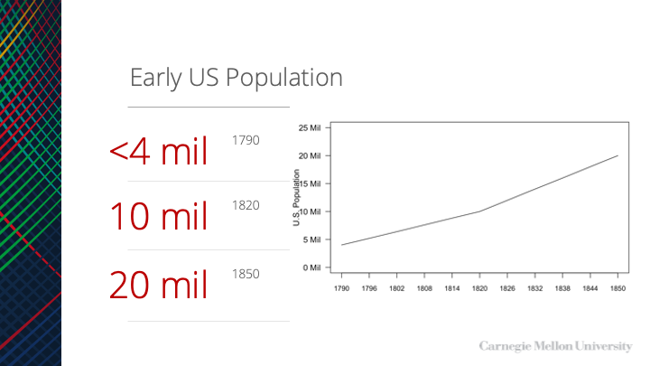

## State expansion of franchise
>- Change created pressures for the states to significantly revise the blueprints for governance that they had drawn during the era of the revolution
>- Between 1790 and the 1850s, every state (there were thirty-one by 1855) held at least one constitutional convention, and more than a few held several
**Disputes over political power, rights, and influence—including the breadth of the franchise and the apportionment of state legislative seats—were often what prompted states to call constitutional conventions in the first place**
>- The torch had been passed to a new generation of political leaders equipped with different ideas who confronted significantly different conditions

## Expanding Rights
>- Nearly everywhere, the laws governing the right to vote in the United States were greatly _elaborated_ and significantly transformed between 1790 and the 1850s
>- At the nation’s founding, the concrete _procedures for voting varied_ widely from state to state and even from town to towns
>- In some locales, particularly in the South, voting was still an oral and public act:
>	+  men assembled before election judges, waited for their names to be called, and then _announced_ which candidates they supported
>	+  in one variant of this process, common in Virginia, men inscribed their names in a poll book underneath the name of the candidate they preferred

## Expanding Rights
>- Elsewhere, state constitutions or statutes required that voting be conducted by written ballot, to protect voters against intimidation
**By the mid-nineteenth century, nearly all states insisted that votes be cast through written ballots, placed in a box or handed to an official**
>- As the number of offices to be filled through elections grew, _printed ballots gradually replaced handwritten ones_, and political parties themselves began to prepare printed ballots, both to assist and monitor their voters

## Administrative rules
>- Other legal developments were essentially administrative, reflecting a need to translate broad precepts into detailed rules governing the conduct of elections
>- Most states, for example, had to define what it meant to be a resident or inhabitant
>- They had to decide how and when lists of eligible voters would be assembled, what documents had to be presented as proof of citizenship, and how challenges to a voter’s eligibility should be handled
**Similarly, race had to be given an operative definition. Just how white did you have to be in order to vote? One-half, three-quarters? An increasingly voluminous body of law offered answers to such questions**

## Changing Property Requirements
>- The property qualifications for suffrage that had begun to erode during the revolution were gradually dismantled after 1790
>- None of the new states admitted to the union after 1790 adopted mandatory property requirements in their original constitutions
>- Granting exclusive political rights to landowners and others who possessed considerable property was inconsistent with the quasi-egalitarian rhetoric of the revolution and the early republic
>- By the end of the 1850s, only two property requirements remained in force anywhere in the United States, one applying to foreign-born residents of Rhode Island and the other to African Americans in New York

## Rise of taxpayer requirements
>- The demise of property requirements was not identical to the elimination of economic qualifications
>- Several states already had taxpaying requirements in 1790
>	+  several others instituted such requirements when they abolished property qualifications, and several of the new western states, including Ohio and Louisiana, also insisted that voters be taxpayers
>- Although taxpaying requirements were conceptually distinct from property qualifications _(paying a tax demonstrated one’s membership in a community)_, they nonetheless preserved the link between a person’s _financial status_ and his _voting rights_.

## Eroding Economic Barriers
>- In 1808, Congress modified the property qualifications in the Northwest Ordinance
>	+ three years later it acted more decisively, enfranchising all _free white males_ who had paid taxes and resided in the territory
>- Between 1830 and 1855, six states relinquished their insistence that voters pay taxes, leaving only six others with taxpaying clauses, several of which were quite minimal
>- Taxpaying provisions also were opposed, by many Whigs as well as Democrats, because they were difficult to enforce and led to substantial fraud
>	+  **broadly stated tax requirements could prove difficult to translate into coherent, concrete policies**
>- By 1855, thus, there were few formal or _explicit economic barriers_ to voting

## Convergence of state and local eligibility requirements
>- Between 1790 and the 1850s, _state_ suffrage laws and _municipal_ suffrage laws became identical almost everywhere
>- The idea that municipal charters were unalterable changed;
>- State supremacy, or the idea that _municipalities legally ought to be regarded as administrative creatures of the state_, rather than as separate sovereignties of any type became the norm
>- Although the idea persisted that municipalities had to perform special tasks that might warrant special suffrage requirements, there was a presumption, by the 1850s, that **state suffrage regulations would and did apply to all elections**

## Residency Requirements
>- Almost everywhere states tinkered with their residency rules, which had become increasingly salient once property qualifications had been eliminated.
>- In several states, including Delaware, Pennsylvania, South Carolina, Indiana, and Michigan, residency requirements were _shortened_, opening the polls to large numbers of migrants who previously had been barred

## Immigrant non-citizen voting
>- Far more dramatic, and perhaps surprising, was the extension of the franchise to immigrants—although the history of noncitizen voting was anything but unidirectional
>- At the end of the eighteenth century, _the line separating citizens from aliens was not clearly or consistently drawn, either in law or in practice_.
>- The federal government, hoping to encourage settlement, expressly permitted aliens to vote in the Northwest Territories

## Constitutionality of alien suffrage
>- Although the constitutionality of alien suffrage was heatedly debated in the mid-nineteenth century, state courts consistently upheld such provisions
>	+  opponents often claimed that states were usurping federal power by conferring the franchise on those who were not naturalized

## Citizenship and naturalization
>- The federal government changed the procedures and qualifications for naturalization every few years, settling on a durable formula only in 1802, when Congress declared that any foreign-born white male who met a five-year residency requirement could become a citizen three years after formally announcing his intention to do so
>- While revising their constitutions, New York, Massachusetts, Connecticut, Vermont, Maryland, and Virginia all replaced "_inhabitant_" with "_citizen_"
>- Almost all the new states joining the union between 1800 and 1840 conferred the right to vote _exclusively_ on citizens
**By the Jacksonian era (1828), aliens were barred from the polls nearly everywhere**

## Party-competition
>- The second-party system dynamics of partisan politics helped to increase the appetite for suffrage
>	+  **parties and factions vied to wear the increasingly popular mantle of democracy**
>	+  **Simultaneously, they accusing one another of circumventing the law for their own advantage**
>- Campaigns to terminate taxpaying provisions were often launched by Democrats, but the Whigs usually jumped on the bandwagon quickly, both to shore up their democratic credentials

## Sources of Expansion of the franchise

## Broadening of the Suffrage

>- The celebrated broadening of the suffrage during the first half of the 1800s was spawned by the convergence of several different factors, which varied by state
>	+  widespread and significant changes in the social structure and social composition of the nation’s population
>	+  the appearance or expansion of conditions under which the material interests of the enfranchised could be served by broadening the franchise
>	+  the formation of broadly based political parties that competed systematically for votes

## Changing social statuses
>- All the states that had property requirements in 1790 witnessed an increase in the number and proportion of adult males who were unable to meet those requirements
>- The urban population grew rapidly, swelling the ranks of those who owned no real property and sometimes no property at all.
**These changes in the social structure created significant and growing clusters of men who were full participants in economic and social life but who lacked political rights**

## How Change Happens
>- The disfranchised were _unable_ to precipitate change by themselves
>- When the voting rights were extended, it happened because men who were already enfranchised _actively supported_ the cause of suffrage expansion
>	+  **Why did voting members of the community sometimes elect to share their political power with others?**
>	+  they saw themselves as having a direct interest in enlarging the electorate

## War, what is it good for?
>- In the wake of the Revolutionary War and again after the War of 1812, many middle-class citizens concluded that extending the franchise to the "lower orders" would:
>	+  enhance their own security
>	+  help to preserve their way of life, by assuring that such men would continue to serve in the army and the militias
>- The nation’s experience during the War of 1812 underscored this concern:**the federal government had great difficulty recruiting and retaining soldiers and eventually had to call on militia forces to bolster the army**
>- In the South, the issue had an added twist:**enfranchising all white Southerners was a means of making sure that poor whites would serve in militia patrols guarding against slave rebellions**

## New Territories
>- As territories began to organize themselves into states, inhabitants of sparsely populated regions embraced white manhood suffrage, in part because they believed that a broad franchise would:
>	+  **encourage settlement and in so doing raise land values,**
>	+  **stimulate economic development,**
>	+  **generate tax revenues.**

## Political Competition
>- Perhaps the most common way in which the fortunes of the already enfranchised were concretely linked to the cause of suffrage reform was through political parties and electoral competition
>	+  both _party loyalty_ and _party identification_ became prominent elements of public life
>- Put simply, in a competitive electoral environment, parties were always alert to the potential advantage (or disadvantage) of enfranchising new voters and potential supporters
>	+  **The outcomes of electoral campaigns could easily depend on the size and shape of the electorate**
>	+  it was natural therefore for parties to try to broaden the franchise because they wanted to win elections, whatever their views about democratization

## Sources of Expansion of the franchise
>- By the middle of the nineteenth century, the nation had taken significant steps in the direction of universal white male suffrage
>- Reasons include:
>	+  the development of the economy
>	+  shifts in the social structure
>	+  the dynamics of party politics
>	+  the diffusion of democratic ideals
>	+  the experiences of war
>	+  the need to maintain militias
>- The states, the federal government, and municipalities all had dismantled the most fundamental obstacles to the participation of men in elections
>- The expansion of the suffrage played a key role in the upsurge of political participation in the 1830s and 1840s, when turnout in some locales reached 80 percent of all adult male citizens

## Backsliding and Sideslipping

## Trajectory
>- The dominant thrust of legal change was toward_increasing_ the number of voters, laws also were passed that**tightened voting requirements**.
>- Some of these were administrative in origin, giving specificity to vaguely worded constitutional mandates.
>- Others were designed after the abolition of property and taxpaying requirements.
>- Still, others were a response to the profound economic, social, and political changes transforming the nation:
>	+  as the U.S. began to wrestle with the impact of industrialism, sectional conflict, immigration, and westward expansion, the first clouds of an _anti-democratic reaction_ were forming on the horizon.

## Gender
>- NJ’s state constitution of 1776 and an election law passed in 1790 granted the right to vote to all "_inhabitants_" who otherwise were qualified
>	+  this was interpreted locally to mean that property-owning women could vote

>- The balance of political power had shifted, charges of voting fraud were rampant, and the Federalists, as well as two competing groups of Republicans, concluded that it was no longer to their advantage to have all "_inhabitants_"—including women, aliens, and African Americans—in the electorate.
>	+  **1807, Woman in New Jersey lost the right to vote**

## Gender
>- Those who supported this retrenchment made little or no mention of women lacking the capacity to vote;
>- Legislators were simply fighting corruption, correcting a "defect" in the constitution, and clearing up "doubts" about the composition of the electorate.
>- Once that constitutional defect had been corrected, women everywhere in the nation were _barred_ from the polls

## African-Americans
>- The number of states that formally excluded free African Americans was relatively_small_ at the nation’s founding
>- It rose steadily from 1790 to 1850
>- NJ, MD, and CT, which had permitted blacks to vote after independence, had banned it by 1820.
**Every state that entered the union after 1819 prohibited Blacks from voting**

## Pennsylvania
> Pennsylvania Had among the most liberal constitution during the revolutionary era, added the word "white" to its constitutional requirements in 1838.
> This happened two years after its supreme court had ruled that blacks could not vote because they were not "freemen."

## African-Americans
>- The federal government prohibited Blacks from voting in the territories it controlled;
>	+  in 1857, the Supreme Court ruled that Blacks, free or slave, could not be citizens of the United States
>- By 1855, only five states (Massachusetts, Vermont, New Hampshire, Maine, and Rhode Island) did _not_ discriminate against African Americans,
>	+  these states contained only 4 percent of the nation’s free black population

Pop quiz, what was the 1857 SCOTUS Case?

## Slaves
>- Slaves were ineligible to vote everywhere
>- Most free Blacks could not meet property and taxpaying requirements
>- With each passing decade the free Black population grew, the abolition of property requirements made it possible for poor, uneducated Blacks to vote
>- Inhabitants of northern states grew increasingly apprehensive about the prospect of attracting Black migrants from the South

## Growing Racism
>- While abolitionist sentiment was growing, so too were sharply antagonistic, fearful, and hostile attitudes toward Blacks, especially in the North
>- Republican factions were hostile to Black voting between 1810 and 1820, in part because they feared (correctly) that Blacks would constitute a Federalist voting bloc,
>	+  politically active Blacks throughout the North tended to support the Federalists because of their opposition to slavery
>- In later decades, Democratic opposition to African-American suffrage was reinforced by the (equally correct) conviction that most Blacks would vote for Whigs.

## Slaves
>- In the North in 1850, Blacks constituted more than 2 percent of the population in only one state, New Jersey
>- Many areas that witnessed heated debates on the subject (e.g., Ohio and Indiana) had populations that were less than 1 percent black.
>- The Black vote was decisive in a controversial county election in Pennsylvania in the 1830s, a fact that contributed to the adoption of a racial exclusion in the 1838 constitution.
>- The fear of Black migration helped to fuel the demand for Black disfranchisement:
>	+  not only in Pennsylvania but in New York, Wisconsin, and elsewhere, convention delegates claimed that enfranchising blacks would only encourage freedmen and runaway slaves to flock to their states

## 19th Century minds
>- Black suffrage was an emotionally charged issue that could not be reached through rational argument or fine distinctions
>- Much of the populace believed that Blacks were inferior, and outside of the slave states, feared their presence.
>- Permitting African Americans to vote seemed all too likely to open the doors to migration and "_amalgamation_ ," and thus to diminish the significance of whiteness and citizenship

## Native Americans
>- The citizenship status of Native Americans was ambiguous in early American law (the constitution specified that Indians "_not taxed_" were not to be counted in the census for the purposes of legislative apportionment)
>- Many constitutional conventions held brief debates about whether Indians were or were not "_white_."
>- The prevailing view in much of the nation was that Native Americans, whether officially white or not, ought not be excluded from the franchise on racial grounds
>	+  if they were "civilized" and taxpaying, they should be entitled to vote

## Native Americans
>- The ability of Native Americans to participate in politics was narrowed between 1790 and the 1850s
>- Their legal status began to be clarified—_in a negative direction_.
>- Indian tribes were "_domestic, dependent nations_ ," according to Chief Justice Marshall, and thus individual Indians, living with their tribes, were aliens, even if born in the United States.
>- Twenty years later, the Dred Scott decision affirmed this interpretation, while suggesting a path toward citizenship: Indians (unlike Blacks) could, if they left their tribes and settled among whites, "be entitled to all the rights and privileges which would belong to an immigrant from any other foreign people."

## Native Americans
>- Congress did attempt to naturalize some tribes, usually in return for a tribal agreement to accept a limited allotment of land
>- Congressional actions affected only a small number of Native Americans.
>- Several states formally moved to disfranchise all Indians, or Indians "not taxed," or members of specific tribes, while others expressly limited suffrage to citizens or to "civilized" Indians who were "not a member of any tribe."
>- Native Americans were understood to be potential voters, but few in fact ever were able to vote during the antebellum era

## Other classes of people
>- Despite the abolition of property requirements, most Americans did not believe that all adult white males were entitled to full membership in the political community
>- Pauper exclusions were not antiquated carryovers of colonial precedents; they were generally _new_ constitutional provisions, often _adopted at the same conventions that abolished property or taxpaying requirements_
>- The exclusion of paupers constituted a direct rejection of claims that suffrage was a right that ought to be universal among white males
>- These exclusions made clear that individuals had to maintain a minimal level of _economic self-sufficiency_ in order to _possess political rights_
>	+  a man who accepted public support surrendered his independence and therefore lost the capacity to function as a citizen

## Felons
>- The right to vote also was withheld from another group of men who violated prevailing social norms, those who had committed crimes, particularly felonies or so-called infamous crimes
>- Disfranchisement for such crimes had a long history in English, European, and even Roman law, and it was hardly surprising that the principle of attaching civil disabilities to the commission of crimes appeared in American law as well
>- Disfranchisement served as retribution for committing a crime and as a deterrent to future criminal behavior

## Felons
>- Between 1776 and 1821, eleven state constitutions either expressly prohibited men with criminal convictions from voting or empowered their legislatures to enact laws disfranchising men based on criminal activity
>- By the eve of the Civil War, more than two dozen states excluded those who had committed serious crimes, with many of the disfranchising provisions enacted in the wake of the abolition of property and tax-paying requirements

## Residency Requirements
>- In several states, the franchise also was restricted by lengthening state or local residency requirements
>	+  in some states, the reverse was true
>- In the absence of property or taxpaying qualifications, it seemed sensible to restrict the franchise to those who were familiar with local conditions and likely to have a stake in the outcome of elections.
>- The average requirement tended to be one year in the state and three or six months in an individual township or county

## Residency Requirements

>- There were strenuous advocates of both longer and shorter periods
>	+  In 1820, "hundreds of men...from New Hampshire" were reported to be flocking into Massachusetts each spring to vote in elections
>- Federalists and then Whigs tended to favor longer periods of residence, because they were wary of the unsettled and the poor and suspected that most transients would vote for the Republicans or Democrats.
>- The Democrats shared this analysis, advocating shorter residency requirements in the hope of enfranchising more of their own supporters

## Voter Registration
>- Concern about transients and _--particularly foreign-born transients--_ sparked interest in the creation of formal systems of voter registration
>- Most states did not keep official lists of voters or require voters to register in advance of elections
>- Beginning in the 1830s, the idea of registration became more popular, particularly among Whigs, who believed that ineligible transients and foreigners were casting their votes for the Democratic Party

## Voter Registration
>- _Capen v. Foster_ (1832), ruled that registry laws were not unconstitutional impositions of new voting qualifications but reasonable measures to regulate the conduct of elections.
>- In 1836, Pennsylvania passed its first registration law, which required the assessors in Philadelphia _(and only Philadelphia)_ to prepare lists of qualified voters:**no person not on the list was permitted to vote**
>- Although the proclaimed goal of the law was to reduce fraud, opponents insisted that its real intent was to _reduce the participation of the poor_ —who were frequently not home when assessors came by and who did not have "_big brass_" nameplates on their doors

## Literacy Tests

> "The least we can require is this very simple manifestation of intelligence."

## Immigrants

>- Apprehensions about immigrant voting in the 1840s considered proposals to institute literacy tests, or even English language literacy tests, for prospective voters
>- Although the image of an educated electorate clearly had its attractions, these proposals were rapidly rebutted
>	+  there were many fine, upstanding citizens who happened to be illiterate or barely literate but were perfectly capable of responsibly exercising the franchise
>	+  It was claimed Andrew Jackson had difficulty spelling his own name
>- Without universal education, a literacy requirement would be "a blow at the poor."
**Literacy or "waiting period" restrictions were not imposed until the 1850s**

## Working Class and Socialism
>- From the earliest periods, class played a relatively small role in American social and politics life.
>- Enfranchisement of the American working class was uniquely early and quite uncontested
>	+  American workers gained universal suffrage _(or at least universal white male suffrage_ ) early in the process of industrialization and thus never were obliged to organize collectively to fight for the franchise.
>	+  Workers were able to address their grievances through the electoral process, they were not compelled to form labor parties, and they developed partisan attachments to previously established political organizations.

## Absence of class as a political wedge
>- The subsequent evolution of American politics and American labor had a noticeable _absence of a strong socialist movement_
**To the extent that the working class was indeed enfranchised during the antebellum era**	_(and one should not ignore that women, free blacks, and recent immigrants constituted a large portion of the working class)_, **such enfranchisement was largely an unintended consequence of the changes in suffrage laws**

## Industrial Revolution and Suffrage

>- The broadening of the franchise in antebellum America transpired before the industrial revolution had proceeded very far and before its social consequences were clearly or widely visible
>- There were relatively few manufacturing workers in the northern states when property qualifications were abolished or new constitutions without property restrictions were adopted
>- There was a dramatic shift in the ratios of farmers to workers
>	+  By 1850, persons who earned their living in agriculture were outnumbered in five states
>	+  **the relative importance of industry occurred twenty years or more after the suffrage laws had been changed**	
>- The American polity did not make a deliberate and conscious decision to enfranchise the working class that the industrial revolution was in the process of creating

## Class and Suffrage

>- The early broadening of the franchise in the United States was not simply the consequence of a distinctive American commitment to democracy, of the insignificance of class, or of a belief in extending political rights to subaltern classes
>- The early extension of voting rights occurred because the rights and power of the working class were not at issue when suffrage reforms were adopted.
>- The American equivalent of the peasantry was not going to be enfranchised in any case _(because they were slaves)_, and the social landscape included few industrial workers

## Trends against suffrage
>- Although the franchise overall had been broadened, new barriers were erected, targeting specific—and smaller—populations
>- The concern about immigrant voters in the Northeast was mounting at precisely the same time that many Midwestern states were extending the franchise to non-declarant aliens.
>- By the early 1850s, several groups or categories of men (and one group of women) had lost the political rights they possessed a half century earlier
**These barriers were expressions of the nation’s reluctance to embrace universal suffrage, of the limits to the democratic impulses that characterized the era**

## Part II

## Mid-Nineteenth Century to the Twentieth Century

## Changing Country

>- After 1850, conflict over the right to vote heightened dramatically
>	+ There was a shift in temper after mid-century, marked by a heightened resolve on
the part of those seeking to contract the right to vote or limit its further expansion
>	+ Freedmen were enfranchised during Reconstruction because Republicans in Congress came to believe that freedom would be illusory without political rights

>- The potential electorate in 1880 or 1900 looked very different than it had in 1840
>	+  The optimism about popular participation, so visible in the 1830s and 1840s, gave way to apprehension and fear by the late 1870s and 1880s
>	+  Country increasingly consisted of men and women who were racially, ethnically, and culturally unlike old-stock white Americans


## High Point of Democracy

> "the democratic principle... reached its culmination about 1850." >
_Atlantic Monthly_
>- The high tide of faith in democracy in the United States was reached at mid-century in the 1800s; thereafter it ebbed

## Immigrants
>- The first targets of the nation’s shifting political mood in the 1850s were working-class immigrants, especially those from Ireland
>- Although foreshadowed by the public debates of the 1840s, a full-blown _nativist_ movement surfaced only during the following decade, precipitated by an extraordinary surge in immigration after 1845
>	+  Between 1845 and 1854, nearly three million foreigners arrived, equal to roughly 15 percent of the population in 1845; in 1854 alone, the flow reached a record high of 427,833, a figure that would not be surpassed until the 1870s
**By the mid-1850s, more than one-fifth of all residents of Boston and New York were Irish-born**

## Immigrants, settlers
>- In the 1850s, foreign-born settlers were not only welcomed to the United States but often _encouraged_ to participate in politic
>- Laws permitting declarant non-citizens to vote after a limited residence period were passed in Wisconsin, Minnesota, Michigan, Indiana, Oregon, Kansas, and Washington territory between 1848 and 1859.
>	+  All of these states were predominantly _agricultural_, thinly _populated_ , and hoping to encourage _settlement_
>	+  their immigrant populations, actual and prospective, consisted primarily of farmers

## Immigrants, workers
>- Workers, however, were a different story
>- They were generally poor
>	+  they crowded into densely populated, urban neighborhoods
>	+  they were commonly depicted as rowdy rather than "upright, honorable, and industrious"
>	+  most were Irish Catholic. 
>- Although their labor was welcome and there was substantial sympathy for the desperate poverty that had impelled them to emigrate, their _religion_ , _ethnicity_ , and _class_ converged to cast doubt on their _desirability_ as members of the polity

## Nativism

>- Some natives regarded recently arrived immigrants, _even citizens_, as insufficiently tutored in American values and the workings of American democracy
>- Others feared that Catholics were controlled by the Pope and would seek to undermine Protestant society.
>- Charges that immigrants corrupted elections by voting illegally and selling their votes were commonplace, as were stories of politically motivated mass naturalizations in the days before elections

## Trump equivlent (there's always one it seems)


## Objections

>- Whig and then Republican objections were strengthened by the tendency of many immigrants to drink alcohol and vote Democratic
>- Abolitionists came to regard immigrants as a pro-slavery voting bloc that would help to keep the planter aristocracy in power in the South
**Political nativism moved to the foreground of the political stage, however, when the Know-Nothings burst onto the scene in 1853–1854**

## Know-Nothings

>- The Know-Nothings dominated political life in the Northeast, parts of the Midwest, and even southern states with sizable immigrant populations, such as Louisiana and Maryland

>- By 1854, the Know-Nothings had a million members, as well as chapters in all northern states

>- The Know-Nothings expressed disdain for the existing party system, opposed the extension of slavery, and endorsed a host of genuinely progressive reforms:
>	+ strengthened lien laws for mechanics
>	+ property rights for married women
>	+ expansion of public schools

## Religious Bigotry

>- But, they gave voice to unvarnished ethnic and religious bigotry, denouncing and caricaturing immigrants in general, and Catholics in particular

>- To join the "Order of the Star Spangled Banner" (original name for their a secret organization), one had to be:
>	+  native-born 
>	+  white male adult
>	+  no personal or familial connection to Catholicism

_Order of the Star Spangled Banner became known as "know-nothings" because they would deny knowing anything about the order_

**They feared that immigrants, especially Catholics, wielded too much electoral power and would use it to subvert American values and institutions**

## Proposed Changes to Law

>- They proposed that federal laws be changed to require a twenty-one-year (rather than five-year) waiting period prior to naturalization ->- or even permanent denial of citizenship to the foreign-born.

>- The Know-Nothings also advocated significant changes in state voting laws, including _registration systems_, _literacy tests_, and in the absence of a change in naturalization laws, a twenty-one-or fourteen-year post-naturalization _residence period_ before a foreign-born male could vote

## Know-Nothing Political Success

>- The Know-Nothings stunned the nation’s political elite by scoring huge electoral successes between 1854 and 1856.
>	+  They won gubernatorial elections in nine states and controlled legislative branches in at least a half dozen
>	+  Their vote was particularly strong in states and cities with sizable immigrant populations, including Massachusetts, Maine, Connecticut, New Jersey, New York, Michigan, and parts of Ohio, as well as cities such as Baltimore, New Orleans, and Pittsburgh

**The Know-Nothings were victorious enough to kill off the faltering Whig party and briefly emerge as the primary alternative to the immigrant-friendly Democrats**

## Massachusetts Know-Nothings

>- Their success was most pronounced in Massachusetts, where the Know-Nothings elected a governor and won control of the legislature in 1854, retaining considerable power throughout the decade.

>- Most Know-Nothing support came from the eastern half of the state, which had rapidly industrialized and become home to hundreds of thousands of Irish immigrants.

>- In 1857, Massachusetts passed a law requiring prospective voters to demonstrate their ability to read the Constitution and to write their own names

>- Such laws, according to the Know-Nothings, would keep the "ignorant, imbruted Irish" from the polls

## End of the Know-Nothings

>- After the mid-1850s, the Know-Nothings quickly disappeared from view, as nativism was eclipsed by sectional politics and the Republican Party gained the support of many former Know-Nothing backers

>- Although the Republicans succeeded in part by embracing some of the nativist agenda, they quickly turned their attention to other issues and were increasingly sensitive to the political risks they ran, particularly in the Midwest, by associating themselves too closely with anti-immigrant politics

## Black Voting Rights

>- Four years of armed conflict, as well as _the challenge of reconstructing the nation_ after the war, brought the question of **Black voting rights** to the foreground of national politics

>- The issue of Black enfranchisement raised critical questions, largely ignored since the writing of the Constitution, about the _role of the federal government_ in determining the breadth of the franchise

## War and veteran rights

>- At the outset of the Civil War, only five states, all in New England, permitted Blacks to vote on the same basis as whites

>- A sixth, New York, enfranchised African Americans who met a property requirement

>- The abolition of slavery turned four million men and women into free citizens who had a new claim on political rights
>	+  African Americans were loyal supporters of the Union cause and the Republican Party

**By 1865, the traditional argument that men who bore arms ought to wield the ballot was applicable to more than 180,000 Blacks**

## Becoming American

>- To African Americans, enfranchisement not only constituted a means of self-protection but was a critical symbol and expression of their standing in American society

>- Between 1864 and 1868, the more militant and egalitarian Radical wing of the Republican Party included an increasing number of men who embraced "_impartial_ " or "_universal_ " suffrage

## Beecher's Sentiments 

> "The broad and radical democratic doctrine of the natural rights of men shall be applied to all men, without regard to race, or color, or condition. [Suffrage] is not a privilege or a prerogative, but a _right_ . Every man has a right to have a voice in the laws, the magistracies, and the policies that take care of him. That is an inherent _right_ ; it is not a _privilege_ conferred.""

>- Henry Ward Beecher, _New York’s influential Protestant minister_

## Black Franchise

>- Most white Americans, however, did not share such views
>	+  In the South, the prospect of Black enfranchisement not only violated two centuries of structured and deeply rooted racism but also threatened the postwar white goal of regaining political, social, and economic control over the Black population

>- There was ongoing hostility in the North as well
>	+  fear of Black migration to the North was intensified by emancipation

>- Between 1863 and 1870, proposals to enfranchise Blacks were defeated in more than fifteen northern states and territories

## Defeat of universal manhood suffrage

>- Prior to the passage of the _Fifteenth Amendment_, only Iowa and Minnesota, in 1868, adopted impartial suffrage, and the Minnesota vote was facilitated by wording that masked the subject of the referendum.

>- Although most northern Republicans supported Black suffrage, Democrats adamantly were opposed, and they generally were _joined by enough Republicans_ to guarantee popular or legislative defeat of any reforms

## Reconstruction

>- The political dynamics of _Reconstruction_ led to a path-breaking series of steps by the federal government to override state control of the franchise and grant political rights to Black men

>- Pres. Johnson offered lenient terms to the southern states so that they could be restored quickly to the Union

>- Johnson’s program demanded few reforms and virtually guaranteed that political and economic power in the South would remain in the hands of whites, including those who had supported the rebellion

>- Alarmed at this prospect and at the resistance of many southern leaders to policies emanating from Washington, the Republican-controlled Congress began to formulate its own program in 1866

>- They did seek to guarantee the civil rights of Blacks and promote greater racial equality in southern society – but _not yet_ **Black enfranchisement**

## _Fourteenth_ Amendment

>- The moderate majority of Republicans in Congress negotiated the passage of the _Fourteenth_ Amendment in June 1866.

>- A compromise measure, the amendment was designed to 
>	+  punish Confederate political leaders (by preventing them from holding office) 
>	+  to affirm the South’s responsibility for a share of the national debt, 
>	+  to protect southern Blacks without arousing the racial fears of northern whites

## XIV Amendment

## XIV Amendment

_Fourteenth_ Amendment:

* Section 1
 * **All persons born or naturalized in the United States and subject to the jurisdiction thereof, are citizens of the United States and of the State wherein they reside. No State shall make or enforce any law which shall abridge the privileges or immunities of citizens of the United States; nor shall any State deprive any person of life, liberty, or property, without due process of law; nor deny to any person within its jurisdiction the equal protection of the laws.**

## XIV Amendment

_Fourteenth_ Amendment:

* Section 2
 * **Representatives shall be apportioned among the several States according to their respective numbers, counting the whole number of persons in each State, excluding Indians not taxed. But when the right to vote at any election for the choice of electors for President and Vice President of the United States, Representatives in Congress, the Executive and Judicial officers of a State, or the members of the Legislature thereof, is denied to any of the male inhabitants of such State, being twenty-one years of age, and citizens of the United States, or in any way abridged, except for participation in rebellion, or other crime, the basis of representation therein shall be reduced in the proportion which the number of such male citizens shall bear to the whole number of male citizens twenty-one years of age in such State.**

## XIV Amendment

_Fourteenth_ Amendment:

* Section 3
 * **No person shall be a Senator or Representative in Congress, or elector of President and Vice President, or hold any office, civil or military, under the United States, or under any State, who, having previously taken an oath, as a member of Congress, or as an officer of the United States, or as a member of any State legislature, or as an executive or judicial officer of any State, to support the Constitution of the United States, shall have engaged in insurrection or rebellion against the same, or given aid or comfort to the enemies thereof. But Congress may by a vote of two-thirds of each House, remove such disability.**

## XIV Amendment

_Fourteenth_ Amendment:

* Section 4
 * **The validity of the public debt of the United States, authorized by law, including debts incurred for payment of pensions and bounties for services in suppressing insurrection or rebellion, shall not be questioned. But neither the United States nor any State shall assume or pay any debt or obligation incurred in aid of insurrection or rebellion against the United States, or any claim for the loss or emancipation of any slave; but all such debts, obligations and claims shall be held illegal and void.**

## XIV Amendment

_Fourteenth_ Amendment:

* Section 5
 * **The Congress shall have power to enforce, by appropriate legislation, the provisions of this article.**

## Effect of XIV

>- By declaring that "all persons born or naturalized in the United States" were "citizens of the United States and of the State wherein they reside," the amendment at long last offered a national definition of citizenship and confirmed that Blacks were indeed citizens.

>- Since most congressional Republicans ->- whatever their personal beliefs ->- were convinced that northern whites would not support the outright enfranchisement of Blacks, the amendment took an oblique approach
>	+  any state that denied the right to vote to a portion of its male citizens would have its representation in Congress (and thus the Electoral College) reduced in proportion to the percentage of citizens excluded

## What was left out of the 14th

>- The amendment tacitly recognized the _right of individual states_ to **create racial barriers**

>- The use of the word male constituted a de facto recognition of the legitimacy of excluding women from electoral politics

>- The _Fourteenth_ Amendment was fiercely opposed by President Johnson, white Southerners, and northern Democrats

## New appetite for Black enfranchisement

>- To more and more Republicans, many of whom were changing their views in the cauldron of circumstance, Black enfranchisement appeared:
>	+  essential to protect the freedmen
>	+  provide the Republican Party with an electoral base in the South
>	+  make it possible for loyal governments to be elected in the once-rebellious states

## Federal Intervention

>- Congress first signaled its shift in perspective by passing a law ending racial qualifications for voting in the District of Columbia

>- President Johnson vetoed the legislation, maintaining that it was wrong to enfranchise "a new class, wholly unprepared" for democracy "by previous habits and opportunities."

>- Congress overrode the veto and weeks later passed a bill prohibiting racial bars in any existing or future federal territories.

>- Congress then proceeded to insist that Nebraska and Colorado adopt impartial suffrage as a prerequisite for admission to statehood

## Reconstruction

>- This surge of activity, fed by continued southern intransigence, culminated in the passage of the Reconstruction Act of March 1867.

The act was the legal centerpiece of Radical Reconstruction
>	+  it _denied recognition to the existing state governments of the South _ and authorized _continued military rule_ of the region under the control of Congress.
>	+  In order to terminate such rule and be fully readmitted to the Union, each southern state was required to ratify the _Fourteenth_ Amendment and to approve, by manhood suffrage, a state constitution that permitted Blacks to vote on the same terms as whites.

>- President Johnson vetoed the bill, but his veto was quickly overridden. 

**To rejoin the political nation, the states of the Confederacy were now compelled to permit Blacks to vote**

## Black Voting

>- In 1867 and 1868, African Americans, working with white Unionists and Republicans, in the South, elected new state governments, wrote progressive constitutions that included manhood suffrage provisions, and ratified the _Fourteenth_ Amendment

>- Black enthusiasm for political participation was so great that freedmen often put down their tools and ceased working when elections or conventions were being held

>- By June 1868, seven states, with manhood suffrage, had been readmitted to the Union, and the process was well under way elsewhere.

>- All this was achieved despite fierce opposition from upper-class whites, who feared that a biracial alliance of Blacks and non-elite whites would bring about a new and inhospitable economic and political order

## Backlash

>- Anti-Black and anti-Republican violence flared up throughout the region, often spearheaded by the rapidly growing Ku Klux Klan

>- Republican achievements in the South were accompanied by a succession of electoral defeats in the North
>	+  The Democrats gained ground from the Atlantic to the Pacific.

>- Interpreted by both parties as the consequence of Republican support for Black suffrage, this electoral swing led the Republicans to seek more moderate ground
 — in part out of fear that they could lose the 1868 presidential election and thereby bring a premature end to Reconstruction.

>- The party nominated the uncontroversial General Ulysses Grant for the presidency and adopted a platform that supported Black suffrage for the South while advocating state control of electoral rules in the North.

## 1868 Election

>- The Republicans did not fare well in the 1868 elections: 
>	+  Grant was victorious, but the winning margin was surprisingly slim 
>	+  The Democrats continued to gain ground in Republican strongholds

>- Within days of the 1868 election, the Republicans shifted course, as Radicals, in and out of Congress, announced that they would press forward with a constitutional amendment to enfranchise African Americans

## Fading Support

>- The decline in support for the Republican Party, as well as the referenda outcomes in 1867 and 1868, underscored the strength and breadth of opposition to Black enfranchisement.

>- Republicans sensed that control of the national government might be slipping from their grasp
>	+  White Southerners were intensifying their opposition to Black equality
>	+  Something had to be done soon to guarantee Black political rights, particularly in the event that the Democrats returned to power in the South or nationally.
>	+  Election results also indicated that Black voters might be important to the fortunes of the Republican Party in northern as well as southern states

## Amendment XV Debate

>- Debate on the _Fifteenth Amendment_ was the first time since the constitutional convention in Philadelphia that the national government of the United States had grappled directly and extensively with the issue of voting rights

>- The debate began with a strategic focus on the rights of African Americans, particularly in the South, but it soon broadened into a far-reaching consideration of the **meaning of democracy and the power of the national government**

## 15th Proposals

>- Several proposals for the 15th amendment were put forward.

>- Samuel Shellabarger’s amendment prohibited the states from denying or abridging the voting rights of any adult male of "sound mind," except those who had engaged in rebellion against the United States or committed other "infamous" crimes. 
	— it implicitly would have ended not only racial discrimination but also property, tax, nativity, and literacy requirements

>- George Boutwell's proposal guaranteed "the right of any citizen of the United States to vote shall not be denied or abridged by the United States or any State by reason of race, color, or previous condition of slavery of any citizens or class of citizens of the United States."

>- Massachusetts Senator Henry Wilson a shoemaker by trade, a long>- time foe of slavery, and later vice president of the United States:
>	+  prohibited discrimination "among the citizens of the United States in the exercise of the elective franchise or in the right to hold office in any State on account of race, color, nativity, property, education or creed."
>	+  tacitly permitted suffrage qualifications based on age and residence

## Wilson

>- Wilson and his allies, many from the Midwest, mounted a powerful array of arguments in favor of a broadly phrased amendment. 
 >- They voiced a prescient fear (as had Shellabarger) that a watered down amendment such as Boutwell’s would end up being circumvented by southern states that could disfranchise Blacks through literacy, tax, or property requirements. 
 >- Wilson maintained shrewdly that his proposal might have the best chance of being ratified by the states because it effectively would enfranchise everyone (including many immigrant supporters of the Democrats) and not appear to be granting special privileges to African Americans

## "Rights" argument

>- The "rights" arguments in behalf of any particular suffrage extension opened up a Pandora’s box, because the same arguments could justify anyone’s enfranchisement.

>- Enfranchising Blacks on the grounds that voting was a right or natural right carried the implication that all adult male citizens should be enfranchised
 >- Some argued to be consistent and to set the matter to rest, once and for all, the franchise indeed should be further extended rather than limited

>- Most Republicans remained reluctant to let women out of the Pandora’s box, but these advocates of a broad constitutional amendment nonetheless were staking out new ground in public debate for the cause of universal suffrage

## Pushback

>- That the Wilson amendment sanctioned Black office-holding, as well as suffrage, only intensified the opposition

>- Senators from the West were apprehensive that it would enfranchise the Chinese

>- Several northeastern Republicans wanted states to retain the power to circumscribe the voting rights of immigrants

>- Others argued that municipalities and states ought to be able to impose property requirements in elections dealing with taxes and financial matters

## "republican guarantee"

>- The most frequently voiced reason for opposing universal manhood suffrage was not that it would empower an " _inferior_ " people but rather that it would produce a " _radical and revolutionary_ " **transformation of the relationship between the federal government and the states**

>- The Wilson amendment would vest that power in the federal government and in so doing alter the Constitution while undermining the autonomy and authority of the states

>- Radicals replied that the "republican guarantee" clause of article 4 already gave the federal government the power to regulate the franchise

## Federalism

>- Democrats, of course, were broadly committed to preserving the power of the states, but even moderate Republicans, in the Senate and the House, worried that the Wilson amendment would upset the balance of state and federal authority enshrined in the Constitution

>- Such arguments offered critics of the amendment a convenient, apparently principled means of opposing franchise extension without sounding undemocratic or racist

>- They also reflected a desire to shore up federalism in an era when the exigencies of war and the economic program of the Republican Party were shifting power toward Washington

>- Faced with a choice between a narrowly phrased amendment and the possibility of no amendment at all, advocates of broad-gauged democratization surrendered

## Opposition on other grounds to the 15th

>- Opposition to the amendment was widespread and intense
>	+  it was passed easily only in New England, where Blacks already voted, and in the South, where the federal government had already intervened to compel Black enfranchisement
>	+  Elsewhere, battles over ratification were closely fought and heavily partisan

>- On the West Coast, especially in California, opposition to the _Fifteenth Amendment_ was fueled by the anti-Chinese furor that would sour the region’s politics for decades: 
>	+  whites, including many working-class whites, feared that the amendment would 
>	+  enfranchise the Chinese
>	+  encourage further Chinese immigration 
>	+  lower the wages and living standards of white workers
>	+  State legislatures in the western states (excepting Nevada) refused to ratify the amendment, despite the tiny African-American presence in the region
	
## (Un)remarkable

>- What opponents of a broad amendment rejected in the end was the abolition of discrimination based on nativity, religion, property, and education
>	+  They wanted to retain the power to limit the political participation of the Irish and Chinese, Native Americans, and the increasingly visible clusters of illiterate and semi-literate workers massing in the nation’s cities

>- As Henry Adams astutely observed, the _Fifteenth Amendment_ was "more remarkable for what it does not than for what it does contain."

**The _Fifteenth Amendment_ was certainly a landmark in the history of the right to vote. The federal government enfranchised more than a million men who only a decade earlier had been slave**

## Amendment XV

## Amendment XV

Section 1

**The right of citizens of the United States to vote shall not be denied or abridged by the United States or by any State on account of race, color, or previous condition of servitude.**

Section 2

**The Congress shall have power to enforce this article by appropriate legislation.**

## So close…

>- It is a remarkable fact that the Wilson amendment (or some variant thereof) came so close to passage
>	+  The Civil War and Reconstruction invigorated and extended (in some quarters, at least) the democratic convictions that had flourished at mid-century

>- The extraordinary circumstances surrounding the war propelled many Americans to support Black suffrage, and as happened repeatedly in American history, contending with the issue of race provoked new thinking about democratic rights in general

**By the late 1860s, large segments of the nation’s citizenry and political leadership were prepared to embrace universal male suffrage, and some men were even ready to endorse women’s suffrage**

## The Right to Vote in the Constitution
>- Congress and state legislatures had created laws that would have been unthinkable in 1860 or even 1865. 
>- The words _right to vote_ were penned into the nation’s Constitution for the first time, announcing a new, active role for the federal government in defining democracy
>- **The celebrations of the Black community would soon prove to be premature, and the unresolved tension between federal and state authorities would vibrate for another century**

## Voting Rights under attack
>- Even before Reconstruction came to a quasi-formal end in 1877, Black voting rights were under attack
>- Elections were hotly contested, and white Southerners, seeking to " _redeem_ " the region from Republican rule, engaged in both legal and extralegal efforts to limit the political influence of freedmen
>- In the early 1870s, both in the South and in the border states, districts were gerrymandered, precincts reorganized, and polling places closed to hinder Black political participation
>- Organizations such as the Ku Klux Klan mounted violent campaigns against Blacks who sought to vote or hold office, as well as their white Republican allies

## Enforcement & KKK Acts
>- In May 1870, stretching the limits of its constitutional powers, Congress passed an Enforcement Act that made **interference with voting a federal offense, punishable in federal courts** 
>	+ federal courts were presumed to be more reliable than state courts
>- It also passed the Ku Klux Klan Act, which, among its provisions, authorized the president to **deploy the army to protect the electoral process**

## Losing enthusiasm
>- By the mid-1870s, many northern Republicans, including President Grant, had lost their enthusiasm for policing the South
>- Preoccupied with an economic depression and labor conflict in the North, they wearily drifted toward a "_let alone policy_"
>- In September 1875, one Republican newspaper referred to the _Fourteenth_ and _Fifteenth Amendments_ as "dead letters"

## Southern Redeemers
>- The Redeemers who were gaining power throughout the South in the 1870s had goals that were at once _political_, _social_, and _economic_
>- Most immediately they sought to drive the Republicans from power and elect Democrats, an objective hard to attain in a fully enfranchised South.
>	+ Limiting Black voting therefore was a means to a end.
>- Keeping freedmen from the polls was also a means of rebuffing broader claims to equality, a way of returning Blacks to "_their place_", and **making clear that whatever the _Fourteenth_ Amendment said, _Blacks did not enjoy full citizenship_**

## Rising Redeemers
>- The pace of Redemption was quickened by the presidential election of 1876 and the subsequent removal of the last federal troops from the South.
>- In 1878, Democrats won control of both houses of Congress for the first time in twenty years
>- The Redeemers, who controlled most state legislatures, continued to try to shrink the Black (and opposition white) electorate through gerrymandering, registration systems, complicated ballot configurations, and the secret ballot (which served as a _de facto_ literacy test)

## Shifting partisan winds
>- National elections were extremely close and fiercely contested in the late 1870s and 1880s
>	+ congressional majorities were unstable
>	+ in 1884 Grover Cleveland became the first Democratic president since before the Civil War
>- In the eyes of many Republicans, the Democrats’ success, their ability to wield national power, was illegitimate, dependent on wholesale violations of the _Fifteenth Amendment_ in the South

## Illegitimate power
>- In its 1888 platform, the Republicans charged "_that the present Administration and the Democratic majority owe their existence to the suppression of the ballot by a criminal nullification of the Constitution and laws of the United States_"
>- After they were victorious in that year’s elections, the Republicans had a chance to do something about it: they had won the presidency and control of both houses of Congress
>	+ They proposed the _Federal Elections Bill_
>	+ a small number of petitions to federal circuit courts could lead to the appointment of federal supervisors were entrusted with:
>		+ attending elections, inspecting registration lists, verifying information given by doubtful voters, administering oaths to challenged voters, preventing illegal immigrants from voting, and certifying the count
>	+ the bill gave federal officials and courts the power to overturn election results that had been declared and certified by state officials

## Federal Elections Bill
>- The Republicans certainly stood to gain from fair elections in the South and from less corrupt elections in some Democratically run northern cities
>- Those who voted for the enforcement acts of the 1870s (which were scaled back by the Courts), were enraged that the hard-won victories of war and Reconstruction were being undermined by fraud and violence.
>- The Democrats, of course, fiercely opposed the bill, denouncing it as "a scheme to rob the people of the States of the dearest right of American citizenship."
>- Losing 35 to 24 with 19 abstentions, the federal government backed away from a significant expansion of its role in shaping electoral law and guaranteeing democratic rights
>	+ this occurred not only because the nation and the Congress were divided, but also because of back-door political dealing and accidents of timing

## Federal Involvement
>- This signaled to the South that the federal government was not prepared to act energetically to guarantee the voting rights of Blacks
>- **Whatever the _Fourteenth_ and _Fifteenth Amendments_ said on paper, the right to vote was back in the hands of the states**
>- Not until the 1960s, when the Lodge Force Bill was reincarnated as Lyndon Johnson’s _Voting Rights Act_, did Congress again seriously consider federal intervention in southern politics

## Rollback
>- The year 1890 also marked the beginning of systematic efforts by southern states to disfranchise Black voters legally
>- Democrats chose to solidify their hold on the South by modifying the voting laws in ways that would exclude African Americans without overtly violating the _Fifteenth Amendment_.
>- Experiments with these legal strategies had occurred in the 1870s and 1880s, but it was between 1890 and 1905 that they became the primary weapon in enforcing and institutionalizing Redeemer rule
>- White Democrats turned back the clock on the broadly progressive franchise provisions that had been etched into most Reconstruction-era state constitutions

## Mississippi
>- Passed provisions that would remove Blacks from Mississippi political life while technically adhering to the _Fifteenth Amendment_
>- These provisions included a sharp increase in the _residency_ requirement ("the negro is...a nomadic tribe," opined the state’s attorney general), the institution of a two-dollar _poll tax_, and the imposition of a _literacy test_ that required potential voters to demonstrate that they could understand and interpret the Constitution
>- **Other states quickly followed suit**

## Suppression
>- The overarching aim of such restrictions, usually undisguised, was to keep poor and illiterate Blacks–and in Texas, Mexican Americans–from the polls.
>- Literacy tests served that goal well, since 50 percent of all Black men (as well as 15 percent of all whites) were illiterate, and even small tax requirements were a deterrent to the poor
>- It was during this period that the meaning of poll tax shifted: where it once had referred to a head tax that every man had to pay and that sometimes could be used to satisfy a taxpaying requirement for voting, it came to be understood as a _tax that one had to pay in order to vote_

## Uneven enforcement
>- Small errors in registration procedures or marking ballots might or might not be ignored _at the whim_ of election officials; taxes might be paid easily or only with difficulty
>- Discrimination also was built into literacy tests, with their "_understanding_" clauses: officials administering the test could, and did, judge whether a prospective voter’s "_understanding_" was adequate
_That, exactly, is what this Convention was elected for–to discriminate to the very extremity of permissible action under the limitations of the Federal Constitution, with a view to the elimination of every negro voter who can be gotten rid of, legally, without materially impairing the numerical strength of the white electorate._ >- future Senator Carter Glass

## Grandfather Clause
>- Discrimination, as well as circumvention of the _Fifteenth Amendment_, was also the aim of the well-known grandfather clauses
 >- exempted men from literacy, tax, residency, or property requirements if they had performed military service or if their ancestors had voted in the 1860s.
 >- The first southern grandfather clause was adopted in South Carolina in 1890; with exquisite regional irony, it was modeled on the anti-immigrant Massachusetts law of 1857

## Anti-white-opposition
>- Contrary to twentieth-century images of a monolithic solid South, there was substantial white opposition to new restrictions on the franchise
 >- many upcountry whites, small farmers, Populists, and Republicans viewed such laws as a means of suppressing dissent, a self-interested and partisan grab for power by dominant, elite, often Black-belt Democrats
 >- This resulted in prolonged and bitter debates about the dangers of "_reform_ "

## Effect of new suppression laws
>- The laws, of course, worked.
>- In Mississippi after 1890, less than 9,000 out of 147,000 voting-age Blacks were registered to vote
>- In Louisiana, where more than 130,000 Blacks had been registered to vote in 1896, the figure dropped to an astonishing 1,342 by 1904

## Voting Rates
>- Just how many persons were barred from the polls is impossible to determine, but what is known is that both registration and turnout (calculated as the percentage of votes cast divided by the number of men of voting age) dropped precipitously after the electoral laws were reconfigured
>- By 1910, in Georgia, only 4 percent of all Black males were registered to vote.
>- In Mississippi, electoral turnout had exceeded 70 percent in the 1870s and approached 50 percent in the decade after the Redeemers came to power: by the early twentieth century, it had plummeted to 15 percent and remained at that level for decades.
>- In the South as a whole, post-Reconstruction turnout levels of 60 to 85 per-cent fell to 50 percent for whites and single digits for Blacks
>- **The achievements of Reconstruction had been reversed, and the rollback had restored the southern electorate to _at best_ pre–Civil War proportions**

## What this all meant
>- The African-American population remained largely disfranchised until the 1960s, electoral participation remained low, and one-party rule by conservative Democrats became the norm
>- The nineteenth-century trend toward democratization had been not only checked, but reversed
>- The increasingly egalitarian institutions and convictions forged before the Civil War were undermined, while class barriers to electoral participation were strengthened or resurrected

## The North stood by
>- All of which took place _without_ great protest from the North
>	+ Although Republican politicians and newspapers routinely criticized the disfranchising laws, scattered efforts to enforce the __Fourteenth_ Amendment_ by reducing the congressional representation of southern states generated little support
>- The Supreme Court upheld the legality of all of the major techniques of disfranchisement.
>- In 1898 it ruled that Mississippi’s literacy test did not violate the _Fifteenth Amendment_ because the law creating the test was not, _on its face_, designed to discriminate against Blacks
>- **The North tolerated disfranchisement in the South ->- in part from weariness, in part due to the partisan interests of the Democratic Party, and in part because Northerners too had been losing faith in democracy**

## The Redemption of the North

## Elections in the 1870s-80s
>- National elections were closely contested
>- Control of Congress changed hands frequently
>- Presidents were elected by razor-thin margins 
>	+ sometimes with less than a majority of the popular vote

## Third Parties
>- Party identifications were strong, but third parties frequently cropped up 
>- Often gained substantial influence in state and local governments

## Issues
>- The issues animating political life were high stakes
>	+ The rapid spread of industrialization and class and interest-group conflict
>	+ The tariff and the money supply (which affected prices and the availability of credit) were issues in every national election
>- Railroad rates and regulation often dominated state political contests
>- City dwellers fought over the development and financing of increasingly necessary water, sewer, and transport systems

## Corporate interests v. workers and farmers
>- Continued uncertainty about the proper role of the state 
>- Corporations became more powerful in light of industrialization
>	+ Workers sought legislation to shorten the hours of labor
>	+ Small businesses cried out against monopolies
>- Railroads controlled access to markets
>	+ Farmers and shippers pressed the states and DC to protect them against the predatory railroads


## Economic and Cultural issues
>- Urban consumers demanded regulation of utility companies
>- The sale of liquor was a life-and-death issue in many elections
>- **Politics revolved around the myriad consequences of the increasingly evident triumph of industrial capitalism**

## Fate of the South
>- Critical election of 1896, which yielded a new and long-lasting partisan alignment
>	+ The tone of political life shifted, although the dominant issues remained the same
>- The fate of the South was settled (removing one key contentious issue from the political arena), the Republican Party securely dominated much of the North-east and Midwest
>	+ third-party rebellions became infrequent
>	+ Electoral turnout fell, North and South
>	+ Political parties experienced a decline in enthusiasm and loyalty

## Changing country
>- Between 1865 and 1900, the United States became the leading manufacturing nation in the world 
>	+ its industrial output eclipsed that of agriculture
>	+ the population more than doubled from 35 million to 75 million
>- Non-farm employment tripled
>	+ More than 10,000,000 people worked in manufacturing, mining, construction, and transportation

## Older Americans
>- To older Americans, what America looked like post-Civil War was disturbing
 >- new industries
 >- large and impersonal workplaces
 >- private corporations wielding enormous economic and political power
 >- economic panics that created new problems such as mass unemployment
 >- They saw abandoned farms, railroads crisscrossing vast stretches of country, and–distressingly–cities of unprecedented size and complexity.

## Growing American Cities
>- In 1870, only New York and Philadelphia had populations greater than 500,000;
>- By 1910, there were eight, three of which contained more than a million people
>	+ these cities increasingly were governed by political organizations (political machines)
>	+ the traditional elites could not control or even understand

## Immigrants and labor
>- What these Americans most feared was the extremely rapid growth of an immigrant working class.
>- The flow of immigrants that had begun in the 1840s resumed quickly after the Civil War
>	+ the nation’s expanding industries needed labor
>	+ Most came from Europe and to a far lesser extent Asia and Mexico.

## Immigrants
>- Between 1865 and World War I, nearly twenty-five million immigrants journeyed to the United States
>	+ 25% of the 1917 (WWI)population was immigrant 
>- The vast majority of these immigrants were propertyless workers rather than settlers.
>- The Irish and Germans continued to arrive
>- A growing numbers of southern and eastern Europeans came. They:
>	+ did not speak English
>	+ cultures were alien
>	+ most were Catholic or Jewish
>- **By 1910, most urban residents were immigrants or the children of immigrants, and the nation’s huge working class was predominantly foreign-born, native-born of foreign parents, or Black**

## Immigrant electoral behavior
>- To many old-stock Americans, the mass of immigrant workers was an unwelcome addition to the electorate
>	+ immigrants were seen as being:
>		+ poor
>		+ uneducated
>		+ ignorant of (American) traditions
>		+ lacked judgment, knowledge, and commitment to American values
>- They were also radicals (socialist in later decades) who:
>	+ struck or rioted against the railroads and corporations
>- They also supported political machines
>	+ ethnic loyalty in exchange for favors for votes

## More objections to immigrant voting
>- They purportedly were prone to voting illegally, irresponsibly, and against the interests of their betters
>- Charges of corruption and naturalization fraud were repeated endlessly
>	+ electoral outcomes were twisted by "naturalization mills" that, with the aid of "professional perjurers and political manipulators," transformed thousands of immigrants into citizens in the weeks before elections
>	+ even if their votes were legal, they were inappropriately cast, bartered for jobs or favors from a boss

## Decline of democracy
>- Within a few years of passage of the _Fifteenth Amendment_, a significant segment of the intellectual community was announcing its distrust of democracy and rejecting the claim that suffrage was a right
>- The breadth of the franchise – particularly extension of the franchise to the poor, uneducated, and foreign-born – was once again a live issue
>- The terms of public discussion were being set by men who believed that _universal suffrage_ had failed, and that it was neither viable nor desirable in the socially heterogeneous, industrial world of the late nineteenth century

## Reforms against suffrage
>- Proposals for reducing the electorate began to find their way onto the public agenda in the 1870s and remained there for decades
>- Proposals included:
>	+ less frequent elections
>	+ at-large rather than district voting
>	+ increased public accountability for office holders
>	+ state control over key arenas of municipal administration
>	+ remove public offices from the electoral sphere and make them appointive
>		+ It was "absurd" to involve the electorate in "the selection of judges and sheriffs, and district attorneys, of state treasurers and attorney-generals, of school commissioners and civil engineers."
>		+ **In other words, democracy could be salvaged by circumscribing its domain**

## Reforms to strength democracy
>- Other critics were more optimistic about the possibilities of changing the size and shape of the electorate
>- Some advocated reinstituting property and tax qualifications or imposing literacy tests on prospective voters
>- More subtle approaches also were proposed, including 
>	+ longer residence periods
>	+ stricter naturalization laws
>	+ waiting periods before new citizens could vote
>	+ complex ballot laws
>	+ elaborate systems of voter registration

## Revising the rules
>- The laws governing elections in most states were revised often between the Civil War and World War I
>- States held constitutional conventions that defined or redefined the shape of the electorate and outlined of the electoral process
>- State legislatures drew up increasingly detailed statutes that spelled out electoral procedures of all types
>	+ timing of elections
>	+ location of polling places
>	+ hours that polls would be open
>	+ configuration of ballots
>	+ counting of votes
>- Many of these laws were straightforwardly administrative, while other laws were more controversial, inspired by partisan interests, enacted to influence the outcome of elections

## Institutional reforms
>- The apportionment of state legislative as well as congressional seats was a key issue, generating recurrent conflicts, particularly between urban and rural areas
>- Linked to apportionment was the location of district boundaries in states and within cities
>	+ gerrymandering was a routine form of political combat
>	+ it was practiced by both major parties against one another and against any upstart political organizations
>- Technical rules governing the presence of parties and candidates on the ballot also were subjects of contention
>	+ they could encourage, or discourage, third parties and fusion slates

## The electorate
>- The most critical laws remained those that determined the size and contours of the electorate
>- These were of two types.
>	+ First and most important were those that set out the fundamental qualifications that a man (or woman) had to meet in order to become an eligible voter
>	+ The second, of increasing significance, established the procedures that a potential voter had to follow in order to participate in elections
>- **The Constitution and federal courts had little to say about suffrage (outside of race), and therefore the rules remained under _state control_**

## Economic qualifications
>- Contrary to received wisdom, economic requirements for voting were not a dead issue after 1850
>- Economic qualifications continued to offer opponents of universal suffrage a direct and potentially efficient means of winnowing out undesirable voters
>- The tax requirement had served as an obstacle to poor people’s voting and as a drain on the treasuries of both political parties
>- By the late 1880s, the Massachusetts Democratic Party–with more working-class supporters and thus greater financial exposure–reportedly was spending $50,000 at each election to pay the poll taxes of its supporters

## Court on economic constraints
>- The U.S. Supreme Court made clear that it too did not see anything unconstitutional about taxpaying or property requirements in _Myers v. Anderson_ in 1915
>- The Court thus found the law to be racially discriminatory in violation of the _Fifteenth Amendment_; at the same time, however, it noted that economic discrimination in the form of a property requirement was presumed to be "free from constitutional objection."

## The Right to Vote in the Constitution
>- Congress and state legislatures had created laws that would have been unthinkable in 1860 or even 1865. 
>- The words _right to vote_ were penned into the nation’s Constitution for the first time, announcing a new, active role for the federal government in defining democracy
>- **The celebrations of the Black community would soon prove to be premature, and the unresolved tension between federal and state authorities would vibrate for another century**

## Voting Rights under attack
>- Even before Reconstruction came to a quasi-formal end in 1877, Black voting rights were under attack
>- Elections were hotly contested, and white Southerners, seeking to "_redeem_" the region from Republican rule, engaged in both legal and extralegal efforts to limit the political influence of freedmen
>- In the early 1870s, both in the South and in the border states, districts were gerrymandered, precincts reorganized, and polling places closed to hinder Black political participation
>- Organizations such as the Ku Klux Klan mounted violent campaigns against Blacks who sought to vote or hold office, as well as their white Republican allies

## Enforcement & KKK Acts
>- In May 1870, stretching the limits of its constitutional powers, Congress passed an Enforcement Act that made **interference with voting a federal offense, punishable in federal courts** 
>	+ federal courts were presumed to be more reliable than state courts
>- It also passed the _Ku Klux Klan Act_, which, among its provisions, authorized the president to **deploy the army to protect the electoral process**

## Losing enthusiasm
>- By the mid-1870s, many northern Republicans, including President Grant, had lost their enthusiasm for policing the South
>- Preoccupied with an economic depression and labor conflict in the North, they wearily drifted toward a "_let alone policy_"
>- In September 1875, one Republican newspaper referred to the _Fourteenth_ and _Fifteenth Amendments_ as "dead letters"

## Southern Redeemers
>- The Redeemers who were gaining power throughout the South in the 1870s had goals that were at once _political_, _social_, and _economic_
>- Most immediately they sought to drive the Republicans from power and elect Democrats, an objective hard to attain in a fully enfranchised South
>	+ Limiting Black voting therefore was a means to a end.
>- Keeping freedmen from the polls was also a means of rebuffing broader claims to equality, a way of returning Blacks to "_their place_," of making clear that, whatever the _Fourteenth Amendment_ said, **Blacks did not enjoy full citizenship**

## Rising Redeemers
>- The pace of Redemption was quickened by the presidential election of 1876 and the subsequent removal of the last federal troops from the South.
>- In 1878, Democrats won control of both houses of Congress for the first time in twenty years
>- The Redeemers, who controlled most state legislatures, continued to try to shrink the Black (and opposition white) electorate through:
>	+ gerrymandering
>	+ registration systems
>	+ complicated ballot configurations
>	+ the secret ballot (which served as a _de facto_ literacy test)

## Shifting partisan winds
>- National elections were extremely close and fiercely contested in the late 1870s and 1880s
>	+ congressional majorities were unstable
>	+ Grover Cleveland (in 1884) became the first Democratic president since before the Civil War
>- In the eyes of many Republicans, the Democrats’ success, their ability to wield national power, was illegitimate, dependent on wholesale violations of the __Fifteenth Amendment__ in the South

## Illegitimate power
>- In its 1888 platform, the Republicans charged "_that the present Administration and the Democratic majority owe their existence to the suppression of the ballot by a criminal nullification of the Constitution and laws of the United States._"
>- After they were victorious in that year’s elections, the Republicans had a chance to do something about it: they had won the presidency and control of both houses of Congress
>	+ They proposed the _Federal Elections Bill_
>	+ a small number of petitions to federal circuit courts could lead to the appointment of federal supervisors were entrusted with:
>		+ attending elections, inspecting registration lists, verifying information given by doubtful voters, administering oaths to challenged voters, preventing illegal immigrants from voting, and certifying the count
>	+ the bill gave federal officials and courts the power to overturn election results that had been declared and certified by state officials

## Federal Elections Bill
>- The Republicans certainly stood to gain from fair elections in the South and from less corrupt elections in some Democratically run northern cities
>- Those who voted for the enforcement acts of the 1870s (which were scaled back by the Courts), were enraged that the hard-won victories of war and Reconstruction were being undermined by fraud and violence.
>- The Democrats, of course, fiercely opposed the bill, denouncing it as "a scheme to rob the people of the States of the dearest right of American citizenship."
>- Losing 35 to 24 with 19 abstentions, the federal government backed away from a significant expansion of its role in shaping electoral law and guaranteeing democratic rights
>	+ this occurred not only because the nation and the Congress were divided, but also because of back-door political dealing and accidents of timing

## Federal Involvement
>- This signaled to the South that the federal government was not prepared to act energetically to guarantee the voting rights of Blacks
>- Whatever the _Fourteenth_ and _Fifteenth Amendments_ said on paper, the right to vote was back in the hands of the states
>- Not until the 1960s, when the Lodge Force Bill was reincarnated as Lyndon Johnson’s _Voting Rights Act_, did Congress again seriously consider federal intervention in southern politics

## Black members of Congress
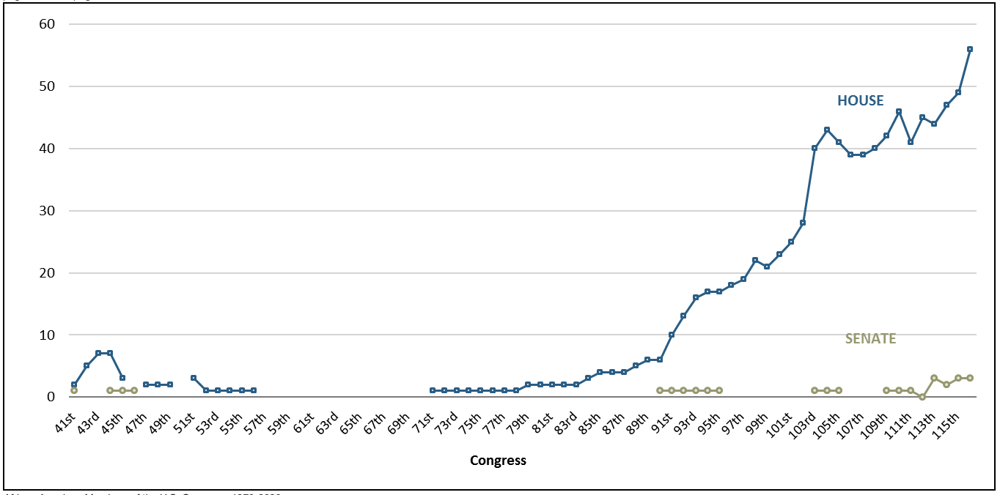

## Black members of Congress
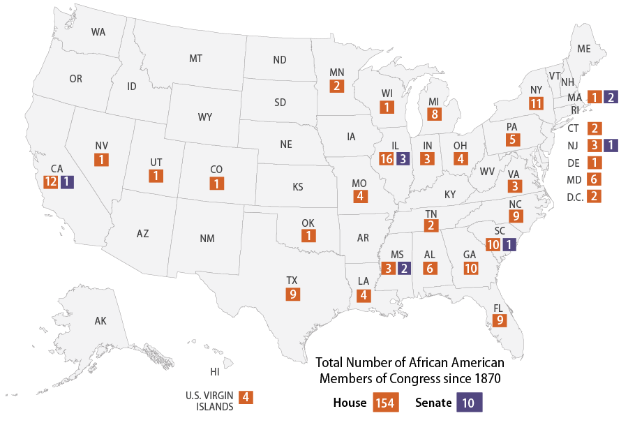

## Rollback
>- The year 1890 also marked the beginning of systematic efforts by southern states to disfranchise Black voters legally
>- Democrats chose to solidify their hold on the South by modifying the voting laws in ways that would exclude African Americans without overtly violating the __Fifteenth Amendment__.
>- Experiments with these legal strategies had occurred in the 1870s and 1880s, but it was between 1890 and 1905 that they became the primary weapon in enforcing and institutionalizing Redeemer rule
>- White Democrats turned back the clock on the broadly progressive franchise provisions that had been etched into most Reconstruction-era state constitutions

## Mississippi
>- Mississippi passed provisions that would remove Blacks from political life while technically adhering to the __Fifteenth Amendment__
>- These provisions included: 
>	+ a sharp increase in the _residency_ requirement ("the negro is...a nomadic tribe," opined the state’s attorney general)
>	+ the institution of a two-dollar _poll tax_ 
>	+ the imposition of a _literacy test_ that required potential voters to demonstrate that they could understand and interpret the Constitution
>- **Other states quickly followed suit**

## Suppression
>- The overarching aim of such restrictions, usually undisguised, was to keep poor and illiterate Blacks –and in Texas, Mexican Americans– from the polls.
>	+ Literacy tests served that goal well, since 50 percent of all Black men (as well as 15 percent of all whites) were illiterate
>	+ Even small tax requirements were a deterrent to the poor
>- It was during this period that the meaning of poll tax shifted: where it once had referred to a head tax that every man had to pay and that sometimes could be used to satisfy a taxpaying requirement for voting, it came to be understood as a _tax that one had to pay in order to vote_

## Uneven enforcement
>- Small errors in registration procedures or marking ballots might or might not be ignored _at the whim_ of election officials; taxes might be paid easily or only with difficulty
>- Discrimination also was built into literacy tests, with their "_understanding_" clauses: officials administering the test could, and did, judge whether a prospective voter’s "_understanding_" was adequate
>- _That, exactly, is what this Convention was elected for –to discriminate to the very extremity of permissible action under the limitations of the Federal Constitution, with a view to the elimination of every negro voter who can be gotten rid of, legally, without materially impairing the numerical strength of the white electorate._
>	+ future Senator Carter Glass

## Grandfather Clause
>- Circumvention of the __Fifteenth Amendment__, as well as discriination, was the aim of grandfather clauses
>	+ Grandfather clauses exempted men from literacy, tax, residency, or property requirements if they had performed military service or if their ancestors had voted in the 1860s.
>	+ The first southern grandfather clause was adopted in South Carolina in 1890; with exquisite regional irony, it was modeled on the anti-immigrant Massachusetts law of 1857

## Anti-white-opposition
>- Contrary to twentieth-century images of a monolithic solid South, there was substantial white opposition to new restrictions on the franchise
>	+ many small farmers, Populists, and Republicans viewed such laws as a means of suppressing dissent, a self-interested and partisan grab for power by dominant, elite, often Black-belt Democrats
>	+ This resulted in prolonged and bitter debates about the dangers of "_reform_"

## Effect of new suppression laws
>- The laws, of course, worked.
>- In Mississippi after 1890, less than 9,000 out of 147,000 voting-age Blacks were registered to vote
>- In Louisiana, where more than 130,000 Blacks had been registered to vote in 1896, the figure dropped to an astonishing 1,342 by 1904

## Voting Rates
>- Just how many persons were barred from the polls is impossible to determine, but what is known is that both registration and turnout (calculated as the percentage of votes cast divided by the number of men of voting age) dropped precipitously after the electoral laws were reconfigured
>	+ By 1910, in Georgia, only 4 percent of all Black males were registered to vote.
>	+ In Mississippi, electoral turnout had exceeded 70 percent in the 1870s and approached 50 percent in the decade after the Redeemers came to power: by the early twentieth century, it had plummeted to 15 percent and remained at that level for decades.
>- In the South as a whole, post-Reconstruction turnout levels of 60 to 85 percent fell to 50 percent for whites and single digits for Blacks
>- **The achievements of Reconstruction had been reversed, and the rollback had restored the southern electorate to–at best–pre–Civil War proportions**

## What this all meant
>- The African-American population remained largely disfranchised until the 1960s, electoral participation remained low, and one-party rule by conservative Democrats became the norm
>- The nineteenth-century trend toward democratization had been not only checked, but reversed
>- The increasingly egalitarian institutions and convictions forged before the Civil War were undermined, while class barriers to electoral participation were strengthened or resurrected

## The North stood by
>- All of which took place _without_ great protest from the North
>	+ Although Republican politicians and newspapers routinely criticized the disfranchising laws, scattered efforts to enforce the __Fourteenth_ Amendment_ by reducing the congressional representation of southern states garnered little support
>- The Supreme Court upheld the legality of all of the major techniques of disfranchisement
>	+ In 1898 it ruled that Mississippi’s literacy test did not violate the __Fifteenth Amendment__ because the law creating the test was not, _on its face_, designed to discriminate against Blacks
>- **The North tolerated disfranchisement in the South ->- in part from weariness, in part due to the partisan interests of the Democratic Party, and in part because Northerners too had been losing faith in democracy**

## The Redemption of the North

## Elections in the 1870s-80s
>- National elections were closely contested
>- Control of Congress changed hands frequently
>- Presidents were elected by razor-thin margins 
>	+ sometimes with less than a majority of the popular vote

## Third Parties
>- Party identifications were strong, but third parties frequently cropped up 
>- They often gained substantial influence in state and local governments
>- They did not last long as their issues were absorbed by the major parties

## Issues that were important
>- The issues animating political life were high stakes
>	+ The rapid spread of industrialization and class and interest-group conflict
>	+ The tariff and the money supply (which affected prices and the availability of credit) were issues in every national election
>- Railroad rates and regulation often dominated state political contests
>- City dwellers fought over the development and financing of increasingly necessary water, sewer, and transport systems

## Corporate interests v. workers and farmers
>- There remained uncertainty about the proper role of the state 
>- Corporations became more powerful in light of industrialization
>	+ Workers sought legislation to shorten the hours of labor
>	+ Small businesses cried out against monopolies
>- Railroads controlled access to markets
>	+ Farmers and shippers pressed the states and DC to protect them against the predatory railroads

## Economic and Cultural issues
>- Urban consumers demanded regulation of utility companies
>- The sale of liquor was a life-and-death issue in many elections
>- **Politics revolved around the myriad consequences of the increasingly evident triumph of industrial capitalism**

## Fate of the South
>- Critical election of 1896 yielded a new and long-lasting partisan alignment
>	+ The tone of political life shifted, although the dominant issues (industrialization) remained the same
>- The fate of the South was settled (removing one key contentious issue from the political arena), the Republican Party securely dominated much of the North-east and Midwest
>	+ third-party rebellions became infrequent
>	+ Electoral turnout fell, North and South
>	+ Political parties experienced a decline in enthusiasm and loyalty

## Changing country
>- Between 1865 and 1900, the United States became the leading manufacturing nation in the world 
>	+ its industrial output eclipsed that of agriculture
>	+ the population more than doubled from 35 million to 75 million
>- Non-farm employment tripled
>	+ More than 10,000,000 people worked in manufacturing, mining, construction, and transportation

## Older Americans
>- For older Americans, what America looked like post-Civil War was disturbing
>	+ new industries
>	+ large and impersonal workplaces
>	+ private corporations wielding enormous economic and political power
>	+ economic panics that created new problems such as mass unemployment
>	+ They saw abandoned farms, railroads crisscrossing vast stretches of country, and–distressingly–cities of unprecedented size and complexity.

## Growing American Cities
>- In 1870, only New York and Philadelphia had populations greater than 500,000;
>- By 1910, there were eight, three of which contained more than a million people
>	+ these cities increasingly were governed by political organizations (political machines)
>	+ the traditional elites could not control or even understand

## Immigrants and labor
>- What these Americans most feared was the extremely rapid growth of an immigrant working class
>- The flow of immigrants that had begun in the 1840s resumed quickly after the Civil War
>	+ the nation’s expanding industries needed labor
>	+ most came from Europe and to a far lesser extent Asia and Mexico

## Immigrants
>- Between 1865 and World War I, nearly twenty-five million immigrants journeyed to the United States
>	+ 25% of the 1917 (WWI)population was immigrant 
>- The vast majority of these immigrants were propertyless workers rather than settlers
>- The Irish and Germans continued to arrive
>- A growing numbers of southern and eastern Europeans came. They:
>	+ did not speak English
>	+ cultures were alien
>	+ most were Catholic or Jewish

>- **By 1910, most urban residents were immigrants or the children of immigrants, and the nation’s huge working class was predominantly foreign-born, native-born of foreign parents, or Black**

## Immigrant electoral behavior
>- To many old-stock Americans, the mass of immigrant workers was an unwelcome addition to the electorate
>	+ immigrants were seen as being:
>		+ poor
>		+ uneducated
>		+ ignorant of (American) traditions
>		+ lacked judgment, knowledge, and commitment to American values
>- They were also radicals (socialist in later decades) who:
>	+ struck or rioted against the railroads and corporations
>- They also supported political machines
>	+ ethnic loyalty in exchange for favors for votes

## More objections to immigrant voting
>- They purportedly were prone to voting illegally, irresponsibly, and against the interests of their betters
>- Charges of corruption and naturalization fraud were repeated endlessly
>	+ electoral outcomes were twisted by "naturalization mills" that, with the aid of "professional perjurers and political manipulators," transformed thousands of immigrants into citizens in the weeks before elections
>	+ even if their votes were legal, they were inappropriately cast, bartered for jobs or favors from a boss

## Decline of democracy
>- Within a few years of passage of the __Fifteenth Amendment__, a significant segment of the intellectual community was announcing its distrust of democracy and rejecting the claim that suffrage was a right
>- The breadth of the franchise –particularly extension of the franchise to the poor, uneducated, and foreign-born– was once again a live issue
>- The terms of public discussion were being set by men who believed that _universal suffrage_ had failed, and that it was neither viable nor desirable in the socially heterogeneous, industrial world of the late nineteenth century

## Reforms against suffrage
>- Proposals for reducing the electorate found their way onto the public agenda in the 1870s and remained there for decades
>- Proposals included:
>	+ less frequent elections
>	+ at-large rather than district voting
>	+ increased public accountability for office holders
>	+ state control over key arenas of municipal administration
>	+ remove public offices from the electoral sphere and make them appointive
>	    + It was "absurd" to involve the electorate in "the selection of judges and sheriffs, and district attorneys, of state treasurers and attorney-generals, of school commissioners and civil engineers."
>	    + **In other words, democracy could be salvaged by circumscribing its domain**

## Reforms to strength democracy
>- Other critics were more optimistic about the possibilities of changing the size and shape of the electorate
>- Some advocated reinstituting property and tax qualifications or imposing literacy tests on prospective voters
>- More subtle approaches also were proposed, including 
>	+ longer residence periods
>	+ stricter naturalization laws
>	+ waiting periods before new citizens could vote
>	+ complex ballot laws
>	+ elaborate systems of voter registration

## Purifying the Electorate

## Revising the rules
>- The laws governing elections in most states were revised often between the Civil War and World War I
>- States held constitutional conventions that defined or redefined the shape of the electorate and outlined of the electoral process
>- State legislatures drew up increasingly detailed statutes that spelled out electoral procedures of all types
>	+ timing of elections
>	+ location of polling places
>	+ hours that polls would be open
>	+ configuration of ballots
>	+ counting of votes
>- Many of these laws were straightforwardly administrative, while other laws were more controversial, inspired by partisan interests, enacted to influence the outcome of elections

## Institutional reforms
>- The apportionment of state legislative as well as congressional seats was a key issue
>    + generated recurrent conflicts, particularly between urban and rural areas
>- Linked to apportionment was the location of district boundaries in states and within cities
>	+ gerrymandering was a routine form of political combat
>	+ it was practiced by both major parties against one another and against any upstart political organizations
>- Technical rules governing the presence of parties and candidates on the ballot also were subjects of contention
>	+ they could encourage, or discourage, third parties and fusion slates

## The electorate
>- The most critical laws remained those that determined the size and contours of the electorate
>- These were of two types.
>	+ First and most important were those that set out the fundamental qualifications that a man (or woman) had to meet in order to become an eligible voter
>	+ The second, of increasing significance, established the procedures that a potential voter had to follow in order to participate in elections
>- **The Constitution and federal courts had little to say about suffrage (outside of race), and therefore the rules remained under _state control_**

## Money and the Vote

## Economic qualifications
>- Economic requirements for voting were not a dead issue after 1850
>- Economic qualifications continued to offer opponents of universal suffrage a direct and potentially efficient means of winnowing out undesirable voters
>- The tax requirement had served two purposes:
>	+ as an obstacle to poor people’s voting 
>	+ as a drain on the treasuries of both political parties
>		+ for example, by the late 1880s, the Massachusetts Democratic Party –with more working-class supporters and thus greater financial exposure– reportedly was spending $50,000 in each election to pay the poll taxes of its supporters
>- In the North, a poll tax was used by the Republicans to disenfranchise the poor, often immigrants, who more often than not supported Democrats
>	+ combined with apportionment schemes and bans on foreign-born voting, Republican elites in the countryside kept power from those in cities

## Court on economic constraints
>- The U.S. Supreme Court made clear that it too did not see anything unconstitutional about taxpaying or property requirements  (_Myers v. Anderson_, 1915)
>	+ The Court found the law to be racially discriminatory in violation of the _Fifteenth Amendment_ 
>	+ however, it noted that economic discrimination in the form of a property requirement was presumed to be "free from constitutional objection"
>		+ the _Twenty-fourth Amendment_, ratified in 1964, abolishes any poll tax

## Class motivation
>- Overtly class-based economic restrictions were accompanied by legal changes expressly designed to reduce the number of "undesirable" immigrants who could vote
>- Beginning in the 1890s, the nation witnessed the growth of a significant movement to **restrict immigration altogether**
>	+ widespread middle-class anxiety about the impact of the foreign-born on politics, particularly urban politics
>- The effort to keep immigrants from the polls was distinct from the movement for outright restriction
>	+ it bore fruit long before Congress passed the pathbreaking restriction and quota acts of 1921 and 1924
>- As the ratio of immigrant workers to settlers soared and the need to encourage settlement diminished, granting the franchise to non-citizens seemed increasingly undesirable and risky.

## Alien suffrage
>- Most states rejected alien suffrage proposals in the late nineteenth century
>	+ beginning with Idaho territory in 1874, states that had permitted non-citizens to vote began to repeal their declarant alien provisions
>	+ picked up steam in the wake of the depression of the 1890s and the assassination of President McKinley by an immigrant in 1901
>	+ it accelerated again during and after World War I, when concerns about the loyalty of the foreign–born contributed to a rare instance of wartime contraction of the franchise.
>	+ The last state to permit non-citizens to vote was Arkansas, which abolished the practice in 1926

## Immigrant Voters

## New Obstacles for Immigrant Voters
>- Numerous states placed new obstacles in the path of immigrant voters
>	+ Most were supported by some Republicans, opposed by Democrats, and justified on the grounds that they would reduce fraud
>	+ Required naturalized citizens to present their naturalization papers to election officials before registering or voting
>	+ Although not unreasonable on its face, this requirement, as lawmakers knew, was a significant procedural hurdle for many immigrants, who might easily have lost their papers or been unaware of the requirement
>	+ when coupled with provisions that permitted anyone present at the polls to challenge the credentials of immigrant voters, these laws placed substantial discretionary power in the hands of local officials

## Reducing immigrant voting
>- The concerns that prompted such efforts to keep immigrants from the polls also contributed to the tightening of federal immigration and naturalization laws between 1880 and the 1920s
>- Beginning in 1882, Congress began to narrow the channels through which the flow of European immigrants passed
>- Between 1906 and 1910, Congress codified the naturalization laws
>	+ prohibited many "undesirable" foreign-born residents from becoming citizens
>	+ set a time limit on the validity of declarations of intent
>	+ required candidates for naturalization to write their own names and present ample proof (including witnesses) of their eligibility and continuous residence in the United States for five years

## Purpose of the laws
>- These laws were unabashedly aimed at making it more difficult for men and women to become citizens, and by all accounts they succeeded, reducing the proportion of immigrants who could vote
>- The most controversial reform of the immigration laws was the imposition of a literacy or education test for admission to the United States
>	+ support of a unique coalition of northern professionals, many Republicans, southern Democrats, anti-Catholics, anti-Semites, and the American Federation of Labor
>		+ the bill’s target was the “new” immigrant population, eastern and southern Europeans who had high rates of illiteracy (more than 20 percent in 1914) and who generally were regarded as less desirable than their English, German, Scandinavian, and even Irish predecessors

## Asian immigrants
>- Intense as apprehensions about poor European immigrants may have been, they paled in comparison to American attitudes toward the Chinese and other east Asians
>- By the final quarter of the nineteenth century, most Americans (and especially those on the West Coast) wanted not only to keep the Chinese from voting but to halt Chinese immigration and even deport those who were already here
>    + feared because of their willingness to work for low wages 
>    + despised for racial and cultural reasons
>- The Chinese had never been a significant political presence because they had almost always been treated as nonwhite and therefore ineligible for citizenship
>- California Constitutional Convention of 1878–1879: "no native of China" (the wording was aimed at circumventing the _Fifteenth Amendment_’s ban on racial barriers) "shall ever exercise the privileges of an elector in this State"
>	+ The suffrage provision of the 1879 constitution remained in force until 1926

## Educated Voters

_A knowledge of the language of our laws and the faculty of informing oneself without aid of their provisions, would in itself constitute a test, if rigorously enforced, incompatible with the existence of a proletariat._

-- Charles Francis Adams, Jr. "Protection of the Ballot" (1869)

## Literacy tests
>- Perhaps the most popular method of constricting the electorate was the literacy or education test
>	+ Massachusetts and Connecticut adopted tests in the 1850s
>- Requiring voters to be literate, particularly in English, had a number of apparent virtues
>	+ it would reduce the "ignorance" of the electorate and weed out sizable numbers of poor immigrant voters (outside of the South, the native-born population was almost entirely literate)
>	+ it was more palatable than taxpaying restrictions or waiting periods for the foreign-born
>	+ literacy tests did not overtly discriminate against particular classes or ethnic groups, and illiteracy itself was a remediable shortcoming

## Justifications for literacy tests
>1. illiterate men lacked the intelligence or knowledge necessary to be wise or even adequate voters
>2. English-language literacy was essential for the foreign-born to become properly acquainted with American values and institutions (aimed at new immigrants)
>3. tying voting to literacy would encourage assimilation and education, which would benefit American society as well as immigrants themselves

## Australian ballot
>- The adoption of the secret or Australian ballot was an indirect and limited means of promoting a literate electorate
>- Australian Ballot first appeared in Australia in 1856 and then was implemented in England in 1872
>- For much of the nineteenth century, voters had obtained their ballots from political parties
>	+ since the ballots generally contained only the names of an individual party’s candidates, literacy was not required
>	+ all that a man had to do was drop a ballot in a box
>	+ since ballots tended to be of different sizes, shapes, and colors, a man’s vote was hardly a secret
>		+ to election officials, party bosses, employers, or anyone else watching the polls

## Australian ballot
>- The Australian ballot was an effort to allow people to freely support whoever they wanted and from corruption and intimidation
>	+ It was a standard ballot, usually printed by the city or state, containing the names of all candidates for office
>- The voter (often in private) placed a mark by the names of the candidates or parties for whom he wished to vote
>	+ The democratic virtues of secret voting were widely apparent
>- The Australian ballot was an obstacle to participation by many illiterate foreign-born voters in the North, as well as uneducated Black voters in the South
>	+ In some states, this problem was remedied by expressly permitting illiterate voters to be assisted or by attaching party emblems to the names of candidates

## Increasing literacy tests in the North
>- Opposition to literacy test was strong (outside of the South)
>	+ Northern Democrats, who counted the urban poor among their constituents, generally voted against education requirements
>	+ So too did politically organized ethnic groups, regardless of their party affiliation, which helps to explain why no English-language literacy tests were imposed in the Midwest
>		+ the German and Scandinavian communities of the Midwest, though often allied with the Republicans, vehemently opposed education requirements
>- Even so, by the mid-1920s, thirteen states in the North and West were disfranchising illiterate citizens who met all other eligibility requirements
>- In all of these states, the Republican Party was strong
>	+ several had large immigrant populations that played important roles in party competition
>	+ a handful of others were predominantly rural states with small but visible clusters of poor foreign-born voters
>	+ several had significant Native-American populations

## Literacy test effects
>- The potential impact of these literacy laws–all of which were sanctioned by the courts–was enormous.
>- According to the census (which relied on self-reporting), there were nearly five million illiterate men and women in the nation in 1920
>	+ this was roughly 8 percent of the voting-age population
>- Other sources suggest that in fact the figure was much higher
>	+ Twenty-five percent of men who took an army literacy test during World War I were judged to be illiterate and another 5 percent semiliterate
>- **A reasonable estimate is that a minimum of several hundred thousand voters –and likely more than a million– were barred by literacy tests outside of the South**

## Residency


## Migrants and Residents
>- The difficulty of defining or establishing residence was becoming more complex
>	+ in Boston, only 64% of residents who lived there in 1880 still lived there in 1890
>- There was an increasingly accepted legal notion that sheer physical presence in a community for a specified length of time was not sufficient for a person to be considered a resident
>	+ Physical presence thus had to be accompanied by the intention of remaining in a community for what the courts came to describe as "an indefinite period"
>	+ Although the concept was reasonable, intention could be difficult to ascertain or prove
>- Courts found themselves evolving criteria to gauge the intentions of both individuals and groups (such as ministers and railway workers, who were often on the move) as they tried to apply broadly stated laws to extremely varied situations.
>- The insistence on intention tended to make legal residence harder to establish, especially for men whose occupations demanded mobility

## Residency
>- No jurisdiction questioned the legitimacy of statutes or constitutional amendments establishing residence qualifications (even lengthy residence qualifications) for voting
>- The U.S. Supreme Court in _Pope v. Williams_ (1904) affirmed the constitutionality of residency qualifications and state efforts to enforce them
>- While the courts debated the _definition_ of residence, constitutional conventions, and sometimes legislatures, determined the appropriate length of residency requirements
>- In much of the nation, there was a broad consensus that a year’s residence in the state was necessary and sufficient for a man to responsibly exercise the franchise
>	+ in many midwestern states the consensus period was six months

## Education and residency
>- The most difficult case proved to be students at colleges, seminaries, and other institutions of higher learning
>- In many states, there was substantial sentiment in favor of prohibiting students from gaining residence in the communities where they attended college: 
>	+ claiming that students were not truly members of the community, political leaders cited anecdotes of:
>		+ students being paraded to the polls to vote en masse
>		+ of unscrupulous politicians enlisting students to cast their ballots
>		+ of students (who did not pay taxes) voting to impose tax increases on permanent residents
>- There was a notable degree of resistance to such laws grounded in a reluctance to keep respectable, middle-class, native-born men from voting

## Physical presence
>- The notion that legal residence was tied as much to intention as physical presence inexorably led states to consider mechanisms for absentee voting
>	+ for men and women who were temporarily away from home but intended to return
>- The Civil War and the desire to permit soldiers to vote during the war severed the link between voting and physical presence in a community
>- World War I added a new urgency to the issue, since nearly three million men were inducted into the army
>- By 1918, nearly all states had made provisions for men serving in the military to cast their ballots, at least in time of war

## Absentee voting (i.e., mail-in ballots)

## Absentee voting (i.e., mail-in ballots)
>- By the end of World War I, more than twenty states had provided for absentee voting on the part of anyone who could demonstrate a work-related reason (and in a few cases, any reason) for being absent on election day.
>- Concerns about fraud generally were alleviated by tight procedural rules and requirements that absentee ballots be identical to conventional ones
>- A conservative estimate would be that 5–10 percent of the nation’s adult population failed to meet the residency requirements at each election which was high enough to have potentially changed the outcomes of innumerable elections

## voter Registration

## Keeping Track of Voters
>- Before the 1870s in most states, there were no official preprepared lists of eligible voters
>- Men who sought to vote were not obliged to take any steps to establish their eligibility prior to election day
>- Between the 1870s and World War I the majority of states adopted formal registration procedures, particularly for their larger cities
>- The rationale for requiring voters to register and have their eligibility certified in advance of elections was straightforward:
>	+ it would help to eliminate fraud and also bring an end to disruptive election-day conflicts at the polls

## Rules for eligibility
>- The devil is in the details:
>	+ How far in advance of elections did a man or woman have to register?
>	+ When would registration offices be open?
>	+ Did one register in the county, the district, the precinct?
>	+ What documents had to be presented and issued?
>	+ How often did one have to register?
>- **All such questions had to be decided, and since the answers inescapably had implications for the composition of the electorate, they were a frequent source of contention**

## Political fights over the rules
>- The two parties also feuded over the hours that the polls would be open
>	+ when the Republicans were able to, they passed laws closing the polls at sunset on the grounds that illegal voting was most likely to occur after dark
>	+ the Democrats protested that "sunset laws" kept workers from voting, and when in power, they extended the hours into the evening
>- Things that were subject to dispute, change, and partisan jockeying:
>	+ the length of the registration period
>	+ its proximity to the date of an election
>	+ the size of registration districts
>	+ the frequency of reregistration
>	+ the necessity of documentary evidence of eligibility
>	+ the location of the burden of proof

## Early Nineteenth Century Democracy
>- By WWI, large slices of the middle and upper classes, as well as portions of the working class, had ceased to believe in universal suffrage—and had acted on their beliefs
>- In the South, blacks and many poor whites had been evicted wholesale from electoral politics

## 
>- In the North and West, exclusions were on a smaller scale, but still numerous: 
>	+ depending on the state or city in which he lived, a man could be kept from the polls because:
>		+ he was an alien
>		+ a pauper
>		+ a lumberman
>		+ an anarchist
>		+ did not pay taxes or own property
>		+ could not read or write
>		+ had moved from one state to another in the past year
>		+ had recently moved from one neighborhood to another
>		+ did not possess his naturalization papers
>		+ was unable to register on the third or fourth Tuesday before an election
>		+ could not prove that he had canceled a prior registration
>		+ been convicted of a felony, or been born in China or on an Indian reservation
>- It can be no surprise, in light of this legal history, that turnout at elections dropped during the latter half of this period
>- **Voting was not for everyone**

## Root Causes of regression
>- Those who wielded economic and social power in the rapidly changing late nineteenth century found it difficult to control the state (which they increasingly needed) under conditions of full democratization
>- In the South, the abolition of slavery, coupled with the beginnings of industrialization and the com-pelling need for a docile, agricultural labor force, created pressures that overwhelmed fledgling democratic institutions
>- In the North and West, the explosive growth of manufacturing and of labor-intensive extractive industries generated class conflict on a scale that the nation had never known
>- As Max Weber noted long ago, it is during periods of rapid economic and technological change that class becomes most salient and class issues most prominent
>- **The United States was not the only country whose political institutions were profoundly shaken by the stresses of industrialism**

## Racial Hostility
>- Equally critical was the fact that the threatening lower orders consisted largely of men who were racially different or came from different ethnic, cultural, and religious back- grounds
>- What transpired in the South seems unimaginable in the absence of racial hostility and prejudice
>- The changes in voting laws in the North and the West were made possible, and shaped, by the presence of millions of immigrants and their children, indeed by the very foreignness of Jews and Chinese, of the Irish and Italian Catholics, of Indians and Mexicans
>- **It was the convergence of racial and ethnic diversity with class tension that fueled the movement to “reform” suffrage**
>- Note: The wartime conditions that commonly spawned pressures for franchise expansion simply were not present

## North and South Differences
>- The parallels between North and South, of course, ought not be overdrawn
>	+ What transpired in the southern states was far more draconian, sweeping, and violent
>	+ The disfranchisement was massive rather than segmented, the laws were enforced brutally, and they were always administered with overtly discriminatory intent
>		+ In New York and Massachusetts, an illiterate immigrant could gain the franchise by learning to read; for a black man in Alabama, education was beside the point, whatever the law said
>- The transgressions of the North was far milder than the parallel movement in the South 
>	+ testimony not only to the significance of race but also to differences in the regions’ social structures and political organizations
>		+ Northern society was too fluid, heterogeneous, and urban to permit the successful imposition of a project as sweeping as the Mississippi plan
>		+ The existence a competitive party system, with elite and middle-class elements supporting each party, meant that efforts at wholesale disfranchisement were certain to encounter fierce resistance and likely to meet defeat
>		+ Dominant parties integrated and incorporated many working-class and immigrant voters making disfranchisement less necessary: the Democratic Party in the North (unlike the heavily Black Republican Party in the South) did not threaten the established order

## Legal Restrictions had an effect
>- Both North and South, however, the legal contraction of the franchise made a difference
>- Millions of people (most of them working class and poor) were deprived of the right to vote in municipal, state, and national elections
>	+ Their exclusion from the electorate meant that the outcomes of innumerable political contests were altered
>	+ different policies were put into place
>	+ different judges appointed
>	+ different taxes imposed
>- **Many of the core institutions of the modern American state—institutions built and solidified between Reconstruction and World War I were shaped and accepted by a polity that was far from democratic**

## Skipped pages 127-136