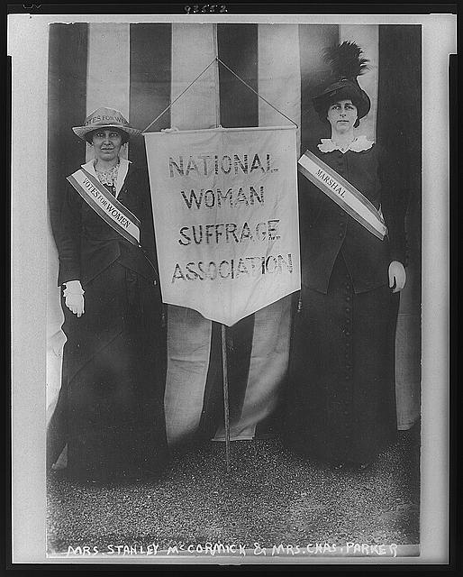

```{r setup, include=FALSE}
knitr::opts_chunk$set(echo = FALSE)

## rmarkdown::render('/Users/cervas/Library/CloudStorage/GoogleDrive-jcervas@uci.edu/My Drive/GitHub/teaching/classes/2023 - Spring/class-cmu-84-352/lecture-slides/the-right-to-vote-lecure-slides/right-to-vote-draft.rmd', output_format = 'all')
```

## Women’s Suffrage
>- As half the population, women constituted the largest group of adults excluded from the franchise at the nation’s birth and throughout the nineteenth century
  >- efforts to gain the right to vote persisted for more than seventy years
  >- eventually gave rise to the nation’s largest mass movement for suffrage, as well as a singular countermovement of citizens opposed to their own enfranchisement
>- Women possessed a different, more intimate relationships with the men who could enfranchise them than did other excluded groups, such as African Americans, aliens, or the  or the propertyless

##
>- The broad antebellum impulse toward democratization helped to fuel the movement for women’s rights
>- decades later, the reaction against universal suffrage retarded its progress
>- Black suffrage and women’s suffrage were closely linked issues everywhere in the 1860s and in the South well into the twentieth century
>- the voting rights of immigrants and the poor pressed repeatedly against the claims of women in the North and West
>- Women were not a socially segregated group:
>     + they were black and white
>     + rich and poor
>     + foreign-born
>     + native

## From Seneca Falls to the Fifteenth Amendment
>- The movement to enfranchise women in the United States had its legendary beginnings at a convention held in July 1848, in the small town of Seneca Falls, New York
>- The convention was held in a local church
>	+ attracted nearly three hundred people, including many men
>	+ After two days of discussion, one hundred of the participants approved and signed a set of resolutions calling for equal rights for women, including "_their sacred right to the elective franchise_"
>- Declaration of Sentiments
>	+ declared "that all men _and women_ are created equal"
>	+ "this first right of a citizen, the elective franchise, thereby leaving her without representation in the halls of legislation" and "oppressed on all sides"
>- Laws made only by men, the declaration detailed, relegated women to an inferior place in the social, civil, and economic order

## Why no female franchise?
>- Although women were regarded as intelligent adults, they were viewed as having capacities different from those of men
>	+ capacities appropriate to private life and the domestic sphere rather than the public world of politics
>- Women were treated in law as members of families rather than as autonomous individuals
>	+ were excluded for the same reason that the poor and propertyless were disfranchised in the late 1900s: they "lacked the independence" necessary for participation in electoral politics
>- Women did not seem (to men) to be endangered by their inability to vote
>	+ women were not believed to need the franchise because their interests were defended by the men in their families, presumably husbands and fathers ("_virtual representation_")
>- Nowhere did the enfranchisement of women seem likely to vest Republicans or Democrats with any discernible partisan advantage

## The timing of Seneca Falls and the Rise of Suffrage
>- Women remained outside the polity throughout the first half of the nineteenth century, and efforts to promote their inclusion were rare
>- The decades preceding Seneca Falls had witnessed:
>	+ the expansion of an urban and quasi-urban middle class in much of the North who valued and embraced an expansion of civil, economic, and political rights
>	+ the number of women in the paid labor force increased sharply
>	+ the antislavery movement that proved to be a breeding ground for advocates of women’s rights
>	+ spillover effects of the era’s broader democratizing current
>- **The termination of property and taxpaying restrictions on voting and debates about the enfranchisement of aliens and African Americans, threw open the logical and rhetorical doors to the further expansion of suffrage.**

## After the Civil War
>- As the war ended and Reconstruction began, leaders of the suffrage movement were optimistic
>- The public embrace of democracy was as broad as it ever had been
>	+ the war and the plight of former slaves had energized the language of universal rights
>	+ the Republican Party, home of the staunchest advocates of civil and political rights, was firmly in power
>	+ also felt that their claim to the franchise had been strengthened by the energetic support women had lent to the war effort
>		+ such activities presumably had neutralized the oft-repeated argument that women should not vote because they did not bear arms

## Pushback happens immediately
>- Within months of the war’s end, Republican leaders and male abolitionists began to signal their lack of enthusiasm for coupling women’s rights to black rights
>- "One question at a time. This hour belongs to the negro." - Wendell Phillips
>- The Fourteenth Amendment disheartened suffragists and made clear that the Republican Party could not be counted on to promote suffrage for women
>	+ the amendment undercut the claims of women by adding the word _male_ to its pathbreaking guarantee of political rights
>- the number of Republicans committed to enfranchising the former slaves was growing rapidly, but many of these men, whatever their personal convictions, feared that this goal would be jeopardized by simultaneously pursuing the controversial cause of women’s suffrage
>	+ some abolitionists and African Americans actively opposed the drive for woman suffrage, while many feminists denigrated the abilities and qualifications of African Americans

## The Fifteenth Amendment's Crushing Blow
- With the passage and ratification of the Fifteenth Amendment in 1869 and 1870, the causes of black (male) and women’s suffrage were decisively severed
- the national drive for suffrage expansion, beginning with Seneca Falls, came to a close
	+ the status of women at best unchanged; 
	+ arguably, women were worse off, because the Fifteenth Amendment appeared to implicitly condone political discrimination based on sex

## Legal structure
>- Some suffragists turned briefly to a legal strategy for gaining the right to vote
>- The _Fourteenth Amendment_, which declared that "all persons" born or naturalized in the United States were citizens of the nation and the state in which they resided
>	+ Women, as "persons," were unquestionably citizens
>	+ the franchise was an intrinsic feature of citizenship: the Constitution, therefore, already guaranteed women the right to vote in federal elections
>- Various dictionaries, including Webster’s, actually defined an American citizen as someone entitled to vote and hold office
>
>## Minor v. Happersett (1875)
>- In 1872, Virginia Minor sued a St. Louis registrar who prevented her from registering to vote. She Claimed:
>      + they infringed on Virginia Minor’s right of free speech, which was protected by the First Amendment
>      + they violated the _Fourteenth Amendment_’s command that states not abridge the "privileges or immunities" of citizens of the United States.
>- Voting, the Minors claimed, was one of those privileges
>- Although the argument was a coherent one, the justices of the Supreme Court unanimously disagreed
>- **Upholding a lower court decision, they ruled in 1875 that suffrage was not coextensive with citizenship and thus that states possessed the authority to decide which citizens could and could not vote**

## Another Legal Challenge
>- Suffragists took another legal tack as well: they promoted tax rebellions among female property owners in the late 1860s and early 1870s
>- women refused to pay their taxes as long as they were prevented from voting, insisting that it was unconstitutional to impose the obligations of citizenship on them while they were deprived of political rights
>- "No taxation without representation" remained a resonant slogan
>	+ activists showed research demonstrating that women in fact paid a sizable portion of the taxes in many municipalities

## Suffrage Convictions
>- Supporters of women’s suffrage sincerely and deeply believed not only in the rightness of their cause but in the power of their simple egalitarian arguments: women were capable adult citizens and as such ought to be able to choose the lawmakers and laws that governed them
>- Suffragists lived in an era when a righteous cause –the abolition of slavery– that had triumphed over ferocious, entrenched opposition
>- They had witnessed not only the end of slavery but also an extraordinary transformation of popular views and laws regarding Black suffrage
>	+ within a decade, an idea supported only by those on the fringes of politics had acquired the backing of the Republican Party and then been embedded in the Constitution
>- **If one accepted the premise that voting was a right, natural or otherwise, it was not a long leap from black to women’s suffrage**
>- Black suffrage triumphed (albeit temporarily) not because the polity had become convinced of the virtues of equal rights or universal suffrage but due to the unique political exigencies of Reconstruction and the political goals of the Republican Party

## NWSA


"It was we, the people; not we, the white male citizens; nor yet we, the male citizens; but we, the whole people, who formed the Union."

_Susan B. Anthony_

## Regrouping
>- National Woman Suffrage Association (NWSA)
>	+ Founded by Susan B. Anthony and Elizabeth Stanton
>- NWSA’s strategy was to pressure the federal government to offer women the same constitutional protections given to freedmen in the Fifteenth Amendment
>- Proposed Amendment: "the right of suffrage in the United States shall be based on citizenship" and that "all citizens...shall enjoy this right equally without any distinction or discrimination whatever founded on sex"
>	+ made little headway due to its similarities to the Wilson amendment
>- "the right of citizens of the United States to vote shall not be denied or abridged by the United States or by any state on account of sex"
>	+  the amendment was finally brought to a vote on the Senate floor where it was decisively defeated in January 1887 by a margin of thirty-four to sixteen (with twenty-six abstentions)
>		+ a far cry from the two-thirds positive vote required for passage
>		+ no southern senator voted in favor of the amendment, while twenty-two voted against it
>- **After 1893, no congressional committee reported it favorably until late in the Progressive era**

## State action
>- Although the issue was debated in numerous constitutional conventions, and referendum were held in eleven states (eight of them west of the Mississippi) between 1870 and 1910, concrete gains were few
>- The territory of Wyoming enfranchised women in 1869, a policy affirmed at statehood in 1889
>- Utah did the same in 1870 and 1896 (interrupted by a brief period when the federal government stripped Utah’s women of the suffrage as a curious step in its effort to rid the territory of polygamy)
>- Idaho and Colorado granted suffrage to women in the mid-1890s
>- **Everywhere else referendum failed and the writers of new constitutions chose not to present the proposition to voters for ratification**

## Partial enfranchisement
>- A significant number of locales (states, counties, and municipalities) where partial suffrage was adopted
>	+ permitted women to vote in 
>		+ municipal elections
>		+ on liquor licensing matters
>		+ for local school boards and on issues affecting education
>- The most common form of partial enfranchisement involved schools
>	+ recognizing women’s responsibility for childrearing, as well as their education experience, legislatures responded to pressure from the suffrage movement by permitting women to vote on matters affecting schooling
>	+ Nearly all state legislatures considered adopting laws of this type, and by 1890, more than twenty states had done 
>- In the 1880s and 1890s, women in a few states were granted the right to vote in municipal elections, or if they were taxpayers, to vote on tax and bond issues
>	+ there was a conservative twist to this expansion of the franchise, since it appealed to those who believed that voting should be restricted to property owners and taxpayers

## Essentialist argument
>- A more essentialist strand of argument: that women possessed particular qualities or virtues that would improve the character of politics and governance
>	+ were embraced by many male politicians who seemed more comfortable stressing women’s unique virtues rather than their similarity to men
>	+ women would elevate the tone of politics
>	+ would be less corruptible and more likely to promote policies favoring social justice, peace, and sobriety
>- This argument became preeminent by the end of the 1870s
>	+ women ought to be enfranchised not because they were identical to men but precisely because they were different
>	+ the qualities that made them different would be a boon to American political life
>- Has a conservative thrust as well: the virtues of women could be counted on to preserve the traditional social order, to protect property, order, and stability, particularly against the vices of the urban working class

## Less nobel reasons for suffrage
>- At times in the 1870s and 1880s, this rationale went a giant step beyond fairness and acquired a more overtly politicized, racist edge
>	+ female suffrage would benefit society because white native-born women outnumbered—and would outvote—blacks, the Chinese, aliens, or transients
>	+ the political dominance of "Americans," therefore, would be insured by the enfranchisement of women
>- Proponents of expansion rarely argued that women lacked the intelligence to participate in politics or that their enfranchisement would damage the political order
>	+ they insisted that women themselves would be degraded by participating in politics
>	+ some maintained that the prospect of being dragged down "into the very filth and mire of degradation and human infamy" would mean that only the "worst" women actually would vote
>	+ others (including anti-suffrage women) claimed that most women in fact did not want to be enfranchised
>- Also invoked repeatedly the notion that voting ought to be linked to military service

## Other reasons not to francise females
>- Opponents further insisted that voting was not a natural right and that women did not need to vote because their civil rights already were amply protected
>- There was anxiety that enfranchising women would deform natural gender roles and destroy family life
>	+ admitting women into the public arena would encourage promiscuity, undermine the purity of women, and expose them to the irresistible predations of men
>	+ the sexual charms and seductiveness of women would distort the ways in which men voted
>	+ would create dissension within families, that inescapably there would be arguments between husband and wife that would fracture the family

## Suffragists rebuking critics
>- Many women themselves were either opposed indifferent to their own enfranchisement
>- The demand for suffrage was most resonant among middle-class women, women from families engaged in the professions, trade or commerce, and educated women who lived in cities and developing towns
>- These were the women whose experiences and desires clashed most directly with traditional norms and who were most likely to seek the independence, autonomy, and equality that enfranchisement represented
>- Though there numbers were growing, they were far from a majority in 1880

## Upper-class anti-suffragists
>- Farm women, living in greater isolation and in more traditional social structures, were less responsive to calls for suffrage as well as more difficult to mobilize into collective action
>- Upper-class women often became the leaders of formally organized anti-suffrage campaigns
>	+ already had access to power and could wield influence through their wealth
>- The political pressure that suffragists could exert thus was limited by their numbers
>	+ too limited to overcome the entrenched ideological and psychological resistance of many male voters and politicians
>	+ the campaigns for suffrage generated organized opposition from some interest groups (identification of suffrage with temperance and prohibition)
>		+ antisuffrage reaction among brewers and liquor retailers
>		+ some immigrants who felt culturally assaulted by the attack on alcohol

## Additional challenges
>- Machine politicians also were dubious about women’s suffrage
>	+ in part for cultural reasons and in part because they always sought to keep the electorate as manageable as possible
>- Equally skeptical were conservative members of the economic elite who took seriously the proposition that women would promote egalitarian social reforms
>- Reinforcing these diverse sources of antagonism was the generally declining faith in democracy

## The South
>- The South was particularly resistant to enfranchising women
>- The movement was slow to gather steam in the South
>	+ suffrage organizations were far smaller and less visible than in the North
>- The lag had two critical sources:
>	1. South’s predominantly rural, agricultural social structure
>		+ The social strata most receptive to woman suffrage (urban, professional, educated, middle-class) emerged belatedly and slowly in the South
>	2. Race
>		+ white male Southerners believed that women’s suffrage meant opening the door to a large new constituency of black voters
>- The movement for a national suffrage amendment was repellent to southern Democrats, who perceived such an amendment as yet another federal threat to **states’ rights**

## The West
>- The West was unusually receptive
>	+ All of the states that fully enfranchised women in the 1800s were west of the Mississippi, as were most states that held suffrage referendum
>- What seems to have tipped the balance in a handful of western states was a combination of several additional ingredients:
>	+ the egalitarian influences of frontier life and western Populism
>	+ the desire to encourage settlement
>	+ opportunities presented by the convening of constitutional conventions at statehood
>	+ a more fluid pattern of party competition
>	+ a highly visible number of working-class transients who labored in mining, railroading, and agriculture
>		+ overwhelmingly of single males; female enfranchisement offered political benefits to the settler population
>- Most western states between 1850 and the 1890s did not experience the massive growth of an industrial working class that triggered such an antidemocratic reaction in the East and Midwest
>	+ The region’s swing against democracy was more mild and emotionally focused on the largely male Chinese population

## _Doldrums and Democracy_
>- In October 1893, the _New York Times_ declared in an editorial that "the cause of woman suffrage does not seem to have made the least progress in this part of the country in the last quarter of a century, if indeed it has not lost ground"
>	+ _Note_: The NYTs would editorialize against women’s suffrage well into the twentieth century
>	+ only a tiny portion of the nation’s women was fully enfranchised
>	+ interest was flagging in many states
>	+ most of the women who were entitled to vote in school board elections did _not_ show up at the polls

## Organization
>- National American Woman Suffrage Association (NAWSA) – combination of two organizations in 1890
>	+ By the end of the 1890s, NAWSA had created branches in every state, founded hundreds of local clubs, generated large quantities of literature, and was pressuring politicians everywhere
>- NAWSA also began to target and raise funds from wealthy, upper-class women, some of whom for the first time were lending their support to the movement

## Shifts in ideology
>- If not shifts in ideology, at least by shifts in the emphases placed on various arguments
>	+ Mirroring the broader middle-and upper-class disenchantment with democracy, suffragists placed less weight on equal rights arguments, which implied that everyone, male and female, should possess the right to vote
>	+ They stressed instead the more palatable essentialist theme that feminine qualities would be a welcome addition to the polity
>- Essentialist emphasis was reinforced by the increasingly common claim that women had distinct economic and social interests that could only be protected by possession of the right to vote
>- White middle-class suffragists placed new weight on the argument that the enfranchisement of women would compensate for, and counterbalance, the votes of the ignorant and undesirable
>	+ this conservative notion, with its unmistakable class and racial edge, had been voiced since the late 1860s, but only in the late 1880s and 1890s did it become commonplace

## Changing strategies
>- In the South the American Republic was thought to be threatened not by immigrants but by Blacks
>- "A Solution to the Southern Question" (1890 publication)
>	+ it was argued that "the medium through which to retain the supremacy of the white race over the African" (Belle Kearney)
>- The relationship between women’s suffrage and black enfranchisement in the South was complicated
>	+ Many white suffragists declined to play the race card, and even some who did were motivated less by a commitment to white supremacy than by the search for a potent line of attack
>	+ One of the principal arguments against female enfranchisement from 1890 to 1920 was that it would open an additional door to black voting and possibly to federal intervention in election laws
>- The NAWSA executive board formally affirmed its recognition of "states’ rights" effectively permitting southern chapters to bar blacks from membership
>- In both the North and South, the notion that women were the antidote to undesirable voters led many suffragists, including Stanton, to join the conservative chorus calling for literacy tests as a means of shaping the electorate
>- **Suffragists effectively abandoned the principle of universal suffrage in favor of increasingly popular class-based limitations on electoral participation**
PAGE 162
## "the doldrums"
The period from 1896 to 1910 came to be known among suffragists as "the doldrums"
Although the issue was raised repeatedly in state legislatures and constitutional conventions, there were no new additions to the suffrage column.
In the South, the statistical argument was simply no match for the frenzied political circus that was disfranchising Blacks and poor whites in one state after another
In the North, the parallel push for suffrage for educated women collided head-on with the powerful middle-and upper-class desire to shrink the electorate

## Internal contradictions
Whatever its statistical validity, the anti-Black, anti-immigrant, and anti–working class argument in favor of women’s suffrage was inescapably weakened by its own _internal contradictions _
An **antidemocratic** argument in favor of enlarging the franchise could neither overwhelm nor outflank the simpler, more consistent conservative view that the polity should be as _narrowly circumscribed_ as possible

## Coalition building
The first decade of the twentieth century proved to be less a period of failure than of fruitful stock-taking and coalition building
The movement became socially and ideologically more diverse, attracting both elite and working-class supporters to complement its middle-class base
Female workers
By 1900, roughly one fifth of the labor force was female, and many of these women held poorly paid, semiskilled jobs; in 1905, there were 50,000 women in New York’s garment industry alone
New emphasis on working women had both ideological and pragmatic attractions for suffragists.
Female workers were described as "exemplars of independent womanhood"
They were also vulnerable and exploited victims of industrial capitalism whose plight readily tapped the broad impulses of Progressive-era social reform

## Class and gender
That suffrage would never be achieved until it had gained the electoral support of working-class men–which meant emphasizing class as well as gender issues
Working women themselves, as well as their activist leaders, displayed new interest in acquiring the right to vote
This arose in part because of their difficulty unionizing and winning workplace conflicts
**They were convinced that state intervention could ameliorate their working conditions and that such intervention would be forthcoming only if they were enfranchised**

## State-level Victories
Thanks in part to this convergence of working-class interest in suffrage with the suffragists’ interest in the working class, the campaign for women’s suffrage became a mass movement for the first time in its history after 1910
The movement also began to win some new victories. Washington permitted women to vote in 1910, followed by California in 1911, and Arizona, Kansas, and Oregon the following year; Illinois, in 1913, decided to allow women to vote in presidential elections and for all state and local offices not provided for in its constitution; and the next year, Montana and Nevada adopted full suffrage.
In 1912, Congress expressly authorized the territory of Alaska to enfranchise women if its legislature so chose

## New allies
In 1910, President William H. Taft agreed to address the annual convention of NAWSA
That same year, a petition favoring a federal amendment, signed by more than 400,000 women, was presented to Congress
In 1912, the Progressive Party endorsed women’s right to vote, and in March 1913, Woodrow Wilson’s inauguration was partially eclipsed by a suffrage parade of 5,000 women in Washington
The following year, a Senate committee reported favorably on a federal amendment, and for the first time in decades a draft amendment was brought to the floor of Congress for a vote
But, opposition remained strong, particularly in the eastern half of the country.

## Southern resistance
By the latter years of the Progressive era, African Americans had been successfully disfranchised throughout the South, and most whites were intent on keeping it that way
Politicians were loath to tinker at all with electoral laws, and they feared that _Black women might prove to be more difficult to keep from the polls than Black men_ –because Black women were believed to be more literate than men and _more aggressive about asserting their rights_ , and also because women would be unseemly targets of repressive violence
Many Southerners were convinced that a federal amendment would open the doors to **Washington’s intervention in elections, to enforcement–so glaringly absent–of the Fifteenth Amendment** and any subsequent amendment that might appear to _guarantee the voting rights of Black women_

## The Nineteenth Amendment
President Woodrow Wilson declined to endorse women’s suffrage, evasively reiterating his view that suffrage was a state issue
The national Democratic Party was similarly unresponsive
The Republican platform of 1916, in contrast, endorsed the cause, albeit in watered-down language
1916 election
>- The 1916 elections set in motion two distinctive partisan dynamics that had surfaced periodically in suffrage struggles since the 1840s
>	+ the first resulted from the partial enfranchisement of women: **some women already could vote in all elections, and many could vote in some elections**
>	+ such circumstances gave women leverage to reward or punish politicians because of their (or their party’s) stance on the Nineteenth Amendment
>	+ The second dynamic was that of the "endgame," the dynamic of possible or impending victory: **once it seemed likely or even possible that women’s suffrage eventually would be achieved** , either nationally or in an individual state, **the potential political cost of a vote against enfranchisement rose dramatically**

## World War I
In 1917, the United States entered World War I
The most critical impact of the war was the opportunity it gave suffragists to contribute to the mobilization
The age-old argument that women should not vote because they did not bear arms was no longer applicable
"essential to the successful prosecution of the great war of humanity in which are engaged. . . . We have made partners of the women in this war. Shall we admit them only to a partnership of sacrifice and suffering and toll and not to a partnership of privilege and of right? This war could not have been fought . . . if it had not been for the services of women."

## Woodrow Wilson
Federal success
The suffragists’ able handling of the war crisis, coupled with continuing political pressure on Congress and the president, was rewarded in January 1918
The president, in an extraordinary address, announced his support of a federal suffrage amendment "as a war measure"
The next day, the House of Representatives voted in favor of the Nineteenth Amendment: the victory was won by one vote, with the Democrats splitting almost evenly while more than 80 percent of Republicans voted favorably.

## Convincing the Senate
The Senate, where antisuffragist southern Democrats constituted a proportionally larger bloc, took an additional year and a half to endorse the amendment
After months of relentless political pressure and careful targeting of Republican and Democratic holdouts, the Senate–by a large Republican majority and a small Democratic one– finally came on board in the summer of 1919
State Ratification
Ratification depended on winning virtually every state outside of the South and the border states
Antisuffragists geared up for battle, denouncing the Nineteenth Amendment as a violation of states’ rights and a giant step toward socialism and free love
To no one’s surprise, the South remained recalcitrant
**On August 18, 1920, Tennessee, by a margin of one vote, became the thirty-sixth state to vote positively on the amendment; a week later, after ratification had been formally certified, the Nineteenth Amendment was law**

## The Nineteenth Amendment
The Nineteenth Amendment
Section 1: **The right of citizens of the United States to vote shall not be denied or abridged by the United States or by any State on account of sex**
Section 2: **Congress shall have power to enforce this article by appropriate legislation**

## After ratification
It is a well-known irony in American history that politics did not change very dramatically after women were enfranchised
The electorate nearly doubled in size between 1910 and 1920, but voting patterns and partisan alignments were little affected
**Women, moreover, did not rush out to vote in huge numbers: electoral turnout was even lower among women than among men**

## How things changed
Political life in the 1920s was not nearly as vibrant or energetic as it had been in the 1890s or the latter years of the Progressive era; despite the identification of women with social reform, reforms were few during the first decade that women could vote
New issues, particularly those affecting women and children, were injected into the political arena, even if concrete reforms were slow to materialize
The social welfare programs of the 1930s were colored by the concerns of the female electorate and often promoted by women who had cut their political and organizational teeth in the suffrage movement
Franklin Roosevelt’s appointment of Frances Perkins as secretary of labor (and as the first woman to hold a cabinet position) would not have happened without the Nineteenth Amendment

## Southern power
The suffragists’ prediction that the enfranchisement of women would not jeopardize white supremacy in the South proved to be on the mark
Although some (but not many) Black women were able to register to vote, the Democratic Party remained firmly in power, segregation and Black disfranchisement persisted, and the federal government steered clear of voting rights issues for another four decades
**Sex, thus, did not prove to be a significant dividing line in the American electorate** : some gender gaps in voting did occur in the early years (as well as more recently), but they were not large, and few issues sharply divided men and women.

## How life changed
Women certainly were empowered by enfranchisement, and their lives consequently (if gradually) may have changed in a host of different ways, but they tended to vote for the same parties and candidates that their husbands, fathers, and brothers supported
Class, race, ethnicity, and religion remained the more salient predictors of a person’s voting behavior
Why was there opposition
The very absence of dramatic change after 1920 inescapably leaves one wondering what the adamant resistance was all about
Why, given the rather placid outcome, did so many men oppose women’s suffrage for so long?
Why did it take women seventy years after Seneca Falls to become enfranchised?

TOWARDS UNIVERSAL SUFFRAGE -- AND BEYOND
THE QUIET YEARS
CHAPTER 7
TO BE ADDED
Racial Tensions
The South was a cauldron of racial tension in the 1950s
African Americans pressed forward against the boundaries of America’s caste system, demanding an end to social segregation and second-class citizenship
Fighting for Rights
Black citizens marched, rallied, boycotted buses, wrote petitions, and filed lawsuits to challenge the Jim Crow laws that had kept them in their place for more than half a century
The widespread resistance to integration only underscored the Black community’s need for political rights, but throughout the 1950s their efforts to vote were thwarted more often than not
Politics of the 1950s
Liberal Democrats in Congress were eager to take action–at least to implement the recommendations of Truman’s Commission on Civil Rights–but their influence was offset by the power of southern Democrats
Republicans were similarly torn: while the desire to court Black voters reinforced the party’s traditional pro–civil rights principles, many Republicans also hoped to make inroads into the solid South by winning over white southern voters
Civil Rights Act 1957
The first civil rights bill passed by Congress in more than eighty years
It was a modest piece of legislation, so modest that it was roundly criticized by African-American activists
The bill created a national Civil Rights Commission, elevated the Civil Rights section into a full-fledged division of the Justice Department, and authorized the attorney general to seek injunctions and file civil suits in voting rights cases
Ineffectual legislation
Well-intentioned as the bill surely was, it had few teeth and little impact
The Justice Department was sluggish in initiating suits, southern federal judges were sometimes unreceptive, and the entire strategy of relying on litigation inescapably meant that progress would be slow
The ineffectiveness of the bill led to the passage in 1960 of a second Civil Rights Act, stronger than the first, but conceptually similar and still modest in its reach
Political Temperature
The Civil Rights Acts of 1957 and 1960 were bipartisan compromises constructed to appease competing political interests, but it was apparent that difficult choices loomed on the horizon
The political temperature was soaring in the South
The growing militancy of the Black freedom movement only stiffened the opposition
The Fight
The governors of Alabama and Mississippi refused to desegregate their universities
Voting districts were gerrymandered to dilute the influence of Blacks who did manage to register
Freedom riders were beaten and their buses burned
Police arrested protestors by the thousands
Bombs were tossed into Black churches
Activists were occasionally murdered in cold blood
XXIV Amendment
Twenty-fourth Amendment was ratified with relatively little opposition; and Black registration in the South rose to more than 40 percent by 1964
Section 1:  __The right of citizens of the United States to vote in any primary or other election for President or Vice President for electors for President or Vice President, or for Senator or Representative in Congress, shall not be denied or abridged by the United States or any State by reason of failure to pay any poll tax or other tax__
Section 2:  __The Congress shall have power to enforce this article by appropriate legislation__
Civil Rights Act 1964
Conflict in the South continued
The Kennedy administration in 1963 drafted an omnibus civil rights bill designed to give strong federal support to equal rights, although it said little about voting rights per se
Pres. Kennedy did not live to witness the passage of his civil rights bill, but his successor, Lyndon Johnson, seized the moment after Kennedy’s assassination to obtain the bill’s passage as a tribute to the late president
Voting Rights Act
Johnson himself was elected to the presidency in 1964 with an enormous popular vote, offering the first southern president in a century the opportunity to complete the Second Reconstruction
He was personally sympathetic to the cause of Black suffrage, bidding for a place in history, and prodded by the nationally televised spectacle of police beatings and arrests of peaceful, prosuffrage marchers in Selma, Alabama
Pressing for change
Johnson went to Congress in March 1965 to urge passage of a national Voting Rights Act.
"The outraged conscience of a nation" demanded action, "It is wrong–deadly wrong–to deny any of your fellow Americans the right to vote." "it is really all of us, who must overcome the crippling legacy of bigotry and injustice. And we  _shall _ overcome." he told a joint session of Congress.
New Constituency
Johnson’s words, spoken to a television audience of seventy million and to a somber, hushed Congress that interrupted him forty times with applause, were sincere, principled, and moving
The president also knew that the Democrats’ political balancing act was over: with the Civil Rights Act of 1964,  __the party had decisively tilted away from the white South and toward Black voters__ , and now it was going to need as many Black voters as possible to have a chance of winning southern states
The Voting Rights Act
Designed as a temporary, quasi>- emergency measure, the act possessed an automatic "trigger" that immediately suspended literacy tests and other "devices" (including so-called good character requirements and the need for prospective registrants to have someone vouch for them) in states and counties where fewer than 50 percent of all adults had gone to the polls in 1964; the suspensions would remain in force for five years
The act authorized the attorney general to send federal examiners into the South to enroll voters and observe registration practices
Section 5
To prevent the implementation of new discriminatory laws, section 5 of the act prohibited the governments of all affected areas from changing their electoral procedures without the approval (or "preclearance") of the civil rights division of the Justice Department or a federal court in Washington
States could bring an end to federal supervision only by demonstrating to the federal court that they had not utilized any discriminatory devices for a period of five years
Passing the law
The Voting Rights Act was passed by an overwhelming majority, as moderate Republicans joined with Democrats to carry out what Johnson called the "tumbling" of "the last of the legal barriers" to voting
Some conservative Republicans and southern Democrats voted negatively, but recognizing the inevitability of the bill’s triumph and the political wisdom of supporting it, forty southern congressmen voted favorably
Immediate impact
The legislation had an immediate impact
In Mississippi, Black registration went from  _less than 10 percent_  in 1964 to almost  _60 percent_  in 1968; in Alabama, the figure rose from  _24 percent _ to  _57 percent _
In the region as a whole,  __roughly a million new voters were registered__  within a few years after the bill became law, bringing African-American registration to a record 62 percent
Milestone law
The essence of the act was simply an effort to enforce the Fifteenth Amendment, which had been law for almost a century
Racial barriers to political participation had been a fundamental feature of American life, and resistance to racial equality was deeply ingrained; so too was resistance to federal intervention into the prerogatives of the states
__Why did the country finally overcome its obstacles to pass the VRA?__
Renewing the VRA
>- In 1970, despite significant reluctance in the Nixon administration and congressional jockeying to weaken the measure, the bill was renewed for five years
>	+ the ban on literacy tests was extended to all states
>- In 1975, the act was extended for an additional seven years, and its reach enlarged to cover "language minorities," including Hispanics, Native Americans, Alaskan Natives, and Asian American
>- In 1982, despite the Reagan administration’s anti-civil rights posture, the act’s core provisions were extended for an additional twenty-five years
>- Reauthorized on a unanimous Senate vote and a 390-33 House vote in 2006 for 25 more years
Transformation of Politics
The debates surrounding these renewals–and they were substantial–were grounded in a new partisan configuration that in part was a consequence of the Voting Rights Act itself
By the late 1960s, all southern states contained a large bloc of Black voters whose loyalty to the Democratic Party had been cemented by the events of the Kennedy and Johnson years
Since these voters constituted a core Democratic constituency, Democratic politicians, even within the South, generally supported efforts to shore up Black political rights
At the same time, conservative white Southerners, joined by some migrants into the region, flocked to the Republican Party, reviving its fortunes in the South and becoming a critical conservative force in the national party.
VRA in the Courts
>- _South Carolina v. Katzenbach_  (1966)>	+ Voting Rights Act "are a valid means for carrying out the commands of the Fifteenth Amendment."
>- By the end of the 1960s, thus, two precepts had been clearly and irretrievably etched into federal law
>	+ The first was that  __racial barriers to the exercise of the franchise, whether simple or sophisticated, direct or indirect, were illegal__
>	+ The second was that  __Congress, backed by the courts, possessed the authority to take vigorous, even extraordinary, measures to dismantle any such racial barriers __
Warren Court
The Warren Court came to see itself as the guardian of formal democratic rights, and it fashioned the equal protection clause of the Fourteenth Amendment into a formidable weapon with which to protect the ability of citizens to participate in democratic processes
There was always conflict about the breadth of the franchise and that those  _who possessed it _ could not necessarily be counted on to extend the right to others
Faced with this reality, it made sense for an insulated institution such as the Court to defend what it believed to be a  __fundamental element of American politics __
Strict Scrutiny
Any "statutes which deny some residents the right to vote" had to come under the "strict scrutiny" of the Court  _Kramer v. Union Free School District _ (1969)
"statutes distributing the franchise constitute the foundation of our representative society."
Strict scrutiny meant that any restriction on the franchise had to be "necessary to promote a compelling state interest."
Ending Literacy Tests
Court previously held that literacy tests were constitutional as long as they were not administered in a racially discriminatory fashion.
In  _Gaston County, N.C. v. United States_  (1969), the Court ruled that literacy tests were unacceptable in locales where schools had been segregated
_Oregon v. Mitchell _ (1970) Blacks, as well as Native Americans and other minorities, received unequal and inferior educations in many locales in and out of the South, and this bias in educational opportunities hindered their ability to pass literacy tests
High rates of interstate migration, moreover, meant that literacy tests administered in states such as Arizona and New York could have the effect of disfranchising African Americans trained in segregated southern schools
Residency Requirements
The federal government’s first effort to remove yet another obstacle to enfranchisement: lengthy residency requirements
Although some states had shortened their requirements, one year was still the norm
The impact of these laws according to one estimate, they kept fifteen million people from voting in the 1964 elections
With little fanfare or controversy, the 1970 VRA renewal prohibited the states from imposing more than  __a thirty-day residency requirement in presidential elections__ ; at the same time, it mandated that those who had  _relocated less than thirty days prior to an election could cast absentee ballots in their previous place of residence _
"If young men are to be drafted at eighteen years of age to fight for their Government they ought to be entitled to vote at eighteen years of age for the kind of government for which they are best satisfied to fight."
Senator Arthur Vandenberg
Age to vote
Since the nation’s founding, a voting age of twenty-one–a carryover from colonial and English precedents–had been a remarkable constant in state laws governing the franchise
Polling data indicated that most Americans favored a reduction in the voting age (support rose dramatically between 1939 and 1952)
Vietnam War
The unpopularity of the Vietnam war spawned a widespread draft resistance movement, mass protests by college students, and an alarming radicalization of the young
In the political climate of the mid>- and late 1960s, the issue of eighteen-, nineteen-, and twenty-year-olds voting acquired an unprecedented urgency
Their lack of enfranchisement served, rhetorically at least, to  __underscore the absence of democratic support for the war __ and to legitimize resistance to the draft
Slipping in the change
The  _New York Times _ endorsed an age reduction on the grounds that " _young people . . . are far better prepared educationally for the voting privilege than the bulk of the nation’s voters have been through much of its history_ "
In the spring of 1970, with little advance notice, legislators added a proposal for reducing the voting age, in all elections, to the amendments being prepared to the Voting Rights Act
Two-tiered rules
In  _Oregon v. Mitchell_ , the court ruled that Congress could legislate the age for federal elections, but not state elections
The prospect of a two-tiered age limit was an administrative and logistical nightmare for state election officials
Faced with this crisis, Congress moved expeditiously to rectify the mess that it had helped to create
Amendment XXVI
Senator Jennings Randolph introduced a proposal for a constitutional amendment that barred the United States or any state from denying or abridging the right to vote of any citizen aged eighteen or over on account of age
In March 1971, the Senate, with no dissenting votes, approved the amendment
Within a few weeks, the House had done the same, with negative votes cast by only nineteen members, mostly conservative Republicans or southern Democrats
State legislatures then rushed to ratify the amendment
By the end of June, thirty-eight states had done so, and the Twenty-sixth Amendment was law
__The ratification process was by far the most rapid in the history of the republic __
National Franchise
What occurred in the course of a decade was not only the re-enfranchisement of African Americans but the abolition of nearly all remaining limits on the right to vote
The total number of new voters added to the electorate cannot be counted with precision, but the figure was surely in excess of twenty million
__The Voting Rights Acts, coupled with a succession of Supreme Court decisions, effectively brought to a close the era of state control over suffrage__
National voting rights
The political leaders of the 1960s found themselves thinking through the issue of voting rights in a manner unparalleled since Reconstruction
If the polity was going to be democratized, it would require action by the national government, in the name of the nation’s publicly professed values
Equal Protection
Court’s discovery of the  __applicability of the equal protection clause __ to voting rights represented the Court’s own embrace of the internal logic of suffrage reform
If discriminating against Blacks was wrong–and it was clearly proscribed by the Fifteenth Amendment–so too was discriminating against the  _very poor_ , the  _propertyless_ , the  _mobile_ , and the  _Spanish-speaking _
The Court’s use of the equal protection clause was a means of extending the ban on racially-grounded disenfranchisement stated explicitly in the Fifteenth Amendment to  _other forms of discriminatory disfranchisement_  not expressly mentioned in the Constitution
DC voting rights
Residents of the capital remained unsuccessful in their attempts to gain voting representation in Congress
__They had been granted electoral votes in presidential elections in 1961, thanks to the Twenty-third Amendment to the Constitution __
In 1978, a constitutional amendment was approved by Congress that would have granted Washington two senators as well as voting representatives in the House
Conservatives around the nation (and particularly in the South) opposed the measure; when the seven-year window for ratification closed in 1985, the D.C. Voting Rights Amendment had been endorsed by only sixteen of the needed thirty-eight states
_What rights should residents of DC have in terms of voting & representation?_
